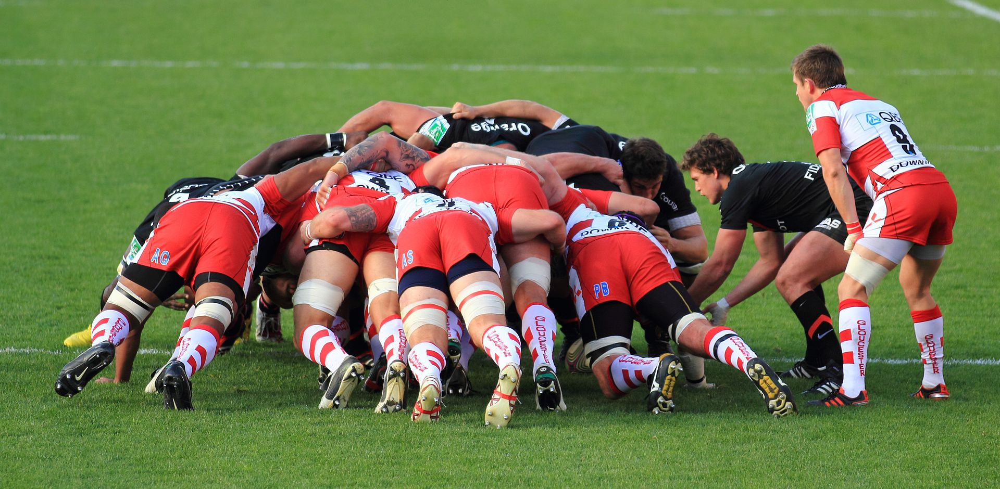

# Table of Contents

-   [What're you going to learn today?](#org48db881)
-   [Who am I?](#org30d5001)
    -   [Science](#org629d645)
    -   [Industry](#org7a66938)
    -   [Teaching](#org2704387)
    -   [Pleasure](#orgabd3c14)
-   [What are your expectations?](#org69bc08d)
-   [Which topics will we cover?](#orga838373)
    -   [Introduction to data science](#org3032294)
    -   [Introduction to R programming](#org89b6b53)
    -   [Visualization using R](#org7a7e751)
    -   [FasteR approach](#org37fc511)
    -   [Schedule](#orgd15f2a6)
-   [How will we do it?](#org3f1fd9b)
    -   [Classroom sessions](#orge541b68)
    -   [Lecture scripts with exercises (GitHub)](#org3d1390e)
    -   [Reading assignments](#org3f5c505)
    -   [Video lectures (YouTube)](#org19fda28)
    -   [Online assignments (DataCamp)](#orga907f06)
    -   [Team EDA project](#orgf5a1ba8)
    -   [Agile project management](#orgd3038be)
    -   [Tests and final exam](#org5f0908b)
    -   [Podcasts and feeds](#org924a0e4)
    -   [Summary of course activities](#org957891a)
-   [What do you have to do to pass?](#org6205b47)
    -   [DataCamp assignments (> 50%)](#orgeaced6d)
    -   [Team project (> 50%)](#org378da96)
        -   [What is a team project?](#org8387a40)
        -   [Do you have project examples?](#org28e6e3d)
        -   [Can I do a project as an absolute beginner?](#orgf578283)
    -   [Final exam (> 50%)](#org0e13b1d)
-   [What's next?](#org2b36bc3)
    -   [Your challenges](#org3374039)
-   [Any questions?](#org496e4a2)

# What're you going to learn today?

-   Who is your lecturer?
-   Who are you and what do you want?
-   Which topics will we cover?
-   How will we do it?
-   What do you have to do to pass?
-   What's next?

# Who am I?

## Science

-   Development of WWW
-   PhD theoretical particle physics
-   60 research publications
-   Assoc. Ed. Int. J. of Data Science
-   Ed. Board Int. J. of Big Data Mgmt.
-   Scientific member [d-cube@Berlin](https://www.hwr-berlin.de/en/research/research-centres-and-institutes/)

## Industry

-   Executive at Accenture & Shell
-   Coach and consultant
-   Certified psychotherapist
-   Startup mentor

## Teaching

-   Business informatics [@HWR Berlin](https://www.hwr-berlin.de/en/)
-   Visiting professor of data science @Lyon
-   Adviser for [CPU @LA](https://catholicpolytechnic.org/)
-   Internship supervision

## Pleasure

-   Playing: Assassin's Creed Valhalla
-   Reading: Bernard Cornwell, The Burning Land
-   Watching: Person of Interest

# [What are your expectations?](https://ideaboardz.com/for/Your%20expectations%2Fconcerns/3943208)

-   What do you want to learn here?
-   What would you like to avoid?
-   What did you take away from another course?
-   What did you really not like in another course?

# Which topics will we cover?

## Introduction to data science

Source: [datacamp.com](https://www.datacamp.com/community/blog/2021-data-trends)

## Introduction to R programming

Source: [RStudio](https://www.rstudio.com/)

## Visualization using R

Source: [Thomas Lin Pedersen](https://github.com/thomasp85/gganimate/blob/master/man/figures/README-unnamed-chunk-4-1.gif)

## FasteR approach

-   Focus on data exploration (EDA)
-   Stay close to base R
-   Use real data sets
-   Compute interactively
-   Prepare for DSC201 (ML)

Image source: [unsplash](https://unsplash.com/photos/SCtlFdgTw1A)

## Schedule

# How will we do it?

## Classroom sessions

## Lecture scripts with exercises ([GitHub](https://moodle.hwr-berlin.de/mod/url/view.php?id=964815))

## Reading assignments

Norman Matloff (2020):

[fasteR: Fast Lane to Learning R!](https://github.com/matloff/fasteR)

-   Davies, [The Book of R](https://nostarch.com/bookofr), NoStarch Press (2016)
-   Irizarry, [Introduction to Data Science](https://rafalab.github.io/dsbook/) (2020)

## Video lectures ([YouTube](https://youtube.com/playlist?list=PL6SfZh1-kWXl3_YDc-8SS5EuG4h1aILHz))

## Online assignments ([DataCamp](https://www.datacamp.com/enterprise/introduction-to-data-science-master-accounting-program/teams/504092-bpm/assignments))

-   [Register at DataCamp](https://moodle.hwr-berlin.de/mod/url/view.php?id=964817)

## Team EDA project

## Agile project management

## Tests and final exam

## Podcasts and feeds

## Summary of course activities

-   Weekly classroom meetings
-   Lecture scripts (GitHub)
-   Reading assignments (Online)
-   Video lectures (YouTube)
-   Online assignments (DataCamp)
-   Team EDA projects (Sprints)
-   Tests and final exam
-   Podcasts and feeds

# What do you have to do to pass?

## DataCamp assignments (> 50%)

Complete 12 of 24 assignments

## Team project (> 50%)

Present on Nov 30 or Dec 2

### What is a team project?

-   Description of the dataset
-   Introduction of the problem statement
-   Description of the methods used
-   Visualization of the data (plots!)
-   Analysis of the plots
-   Limitations of own analysis
-   References

### Do you have project examples?

-   Examples on Kaggle ([example](https://www.kaggle.com/ekrembayar/election-2016-trump-clinton-spatial-visualization))
-   Examples on data science blogs ([example](https://towardsdatascience.com/how-much-is-a-data-scientist-worth-in-2020-34d5903b606b))
-   Translate from Python to R ([example](https://theartandscienceofdata.wordpress.com/2021/02/20/funniest-friends/))
-   Extend someone else's EDA ([example](https://towardsdatascience.com/what-matters-in-speed-dating-34d29102f6cb))
-   Document an R package ([example](https://www.rdocumentation.org/packages/ggplot2/versions/3.3.3))
-   Use your own data ([example](http://adomingues.github.io/2020/11/25/visual-cv/))

### Can I do a project as an absolute beginner?

-   Keep It Simply Scientific (IMRaD)
-   Look at examples (e.g. [bookmarks](https://github.com/birkenkrahe/ds101/blob/master/ds_bookmarks.md#orgd1a5760))
-   Create data set (e.g. productivity)
-   Researchers are beginners

## Final exam (> 50%)

Final exam: date TBD

# What's next?

## Your challenges

<table border="2" cellspacing="0" cellpadding="6" rules="groups" frame="hsides">

<colgroup>
<col  class="org-left" />

<col  class="org-left" />
</colgroup>
<thead>
<tr>
<th scope="col" class="org-left">What?</th>
<th scope="col" class="org-left">When?</th>
</tr>
</thead>

<tbody>
<tr>
<td class="org-left">[Register with DataCamp](https://moodle.hwr-berlin.de/mod/url/view.php?id=964817)</td>
<td class="org-left">Today</td>
</tr>

<tr>
<td class="org-left">[Complete test challenge](https://kahoot.it/challenge/07621562?challenge-id=32bfe8b2-c872-4689-82a0-cfbbfd74c311_1617960639760)\*</td>
<td class="org-left">Aug 19</td>
</tr>

<tr>
<td class="org-left">[Complete DataCamp assignment](https://learn.datacamp.com/courses/data-science-for-business)\*</td>
<td class="org-left">Aug 24</td>
</tr>

<tr>
<td class="org-left">Set up [project](https://moodle.hwr-berlin.de/mod/book/view.php?id=939064&chapterid=7696) (2-3 ppl)\*</td>
<td class="org-left">Sep 2</td>
</tr>

<tr>
<td class="org-left">Check FAQs</td>
<td class="org-left">n.d.</td>
</tr>

<tr>
<td class="org-left">Ask questions (class/[forum](https://moodle.hwr-berlin.de/mod/forum/view.php?id=964813))</td>
<td class="org-left">n.d.</td>
</tr>
</tbody>
</table>

*\*) do this every week until December*

# Any questions?

A PDF of this presentation is available.

