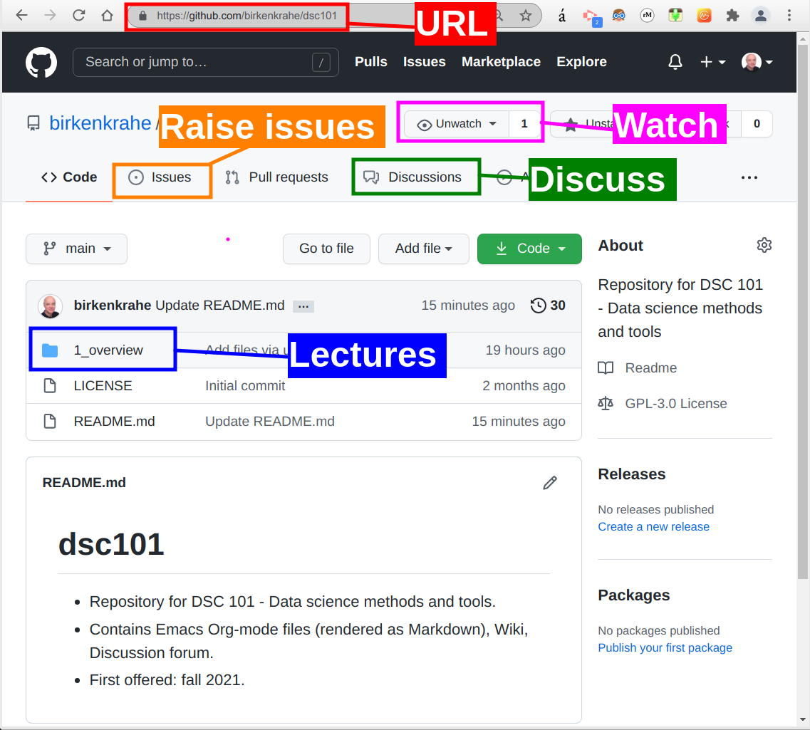
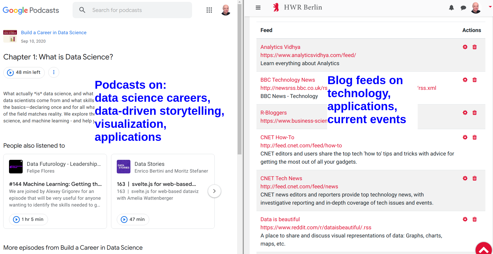

# Table of Contents

-   [What're you going to learn today?](#org9a0ffc4)
-   [Who am I?](#org8da0e25)
    -   [Science](#orgc8b4a52)
    -   [Industry](#org042dcbe)
    -   [Teaching](#org7baffb7)
    -   [Pleasure](#org538b182)
-   [What are your expectations?](#org073cf37)
-   [Which topics will we cover?](#org5db910d)
    -   [Introduction to data science](#orgcd3043b)
    -   [Introduction to R programming](#org7a41a1a)
    -   [Visualization using R](#orgee1c076)
    -   [FasteR approach](#org089ea9d)
    -   [Schedule (see Syllabus)](#orgf3a3b90)
-   [How will we do it?](#org55c6124)
    -   [Classroom sessions](#orge0f30b6)
    -   [Lecture scripts with exercises (GitHub)](#org2ad8c92)
    -   [Reading suggestions](#org1dcbfcf)
    -   [Video lectures (YouTube)](#org1d7916b)
    -   [Online assignments (DataCamp)](#org236fe0d)
    -   [Team EDA project](#org1f2e64a)
    -   [Agile project management](#org3a68e2b)
    -   [Tests and final exam](#orgba64c0f)
    -   [Podcasts and feeds](#orgabce4d3)
    -   [Summary of course activities](#orgb10e983)
-   [What do you have to do to pass?](#org9bc449b)
    -   [DataCamp assignments (> 50%)](#org216d13e)
    -   [Team project (> 50%)](#org38b7223)
        -   [What is a team project?](#org00b7b89)
        -   [Do you have project examples?](#org94e0e92)
        -   [Can I do a project as an absolute beginner?](#org51ccfcd)
    -   [Final exam (> 50%)](#org5d774a5)
-   [What's next?](#org9797687)
    -   [In the course](#org7eddec0)
    -   [Your challenges](#org2794cec)
-   [Any questions?](#org3bed86b)

# What're you going to learn today?

-   Who is your lecturer?
-   Who are you and what do you want?
-   Which topics will we cover?
-   How will we do it?
-   What do you have to do to pass?
-   What's next?

# Who am I?

## Science

-   Development of WWW
-   PhD theoretical particle physics
-   60 research publications
-   Assoc. Ed. Int. J. of Data Science
-   Ed. Board Int. J. of Big Data Mgmt.
-   Scientific member [d-cube@Berlin](https://www.hwr-berlin.de/en/research/research-centres-and-institutes/)

## Industry

-   Executive at Accenture & Shell
-   Coach and consultant
-   Certified psychotherapist
-   Startup mentor

## Teaching

-   Business informatics [@HWR Berlin](https://www.hwr-berlin.de/en/)
-   Visiting professor of data science @Lyon
-   Adviser for [CPU @LA](https://catholicpolytechnic.org/)
-   Internship supervision

## Pleasure

-   Playing: [Assassin's Creed Valhalla](https://en.wikipedia.org/wiki/Assassin%27s_Creed_Valhalla) (2020)
-   Reading: [Waugh, Sword of Honour](https://en.wikipedia.org/wiki/Sword_of_Honour) (1952-1961)
-   Watching: [The Middle](https://en.wikipedia.org/wiki/The_Middle_(TV_series)) (2009-2018)

# [What are your expectations?](https://ideaboardz.com/for/Your%20expectations%2Fconcerns/3943208)

-   What do you want to learn here?
-   What would you like to avoid?
-   What did you take away from another course?
-   What did you really not like in another course?

# Which topics will we cover?

## Introduction to data science

Source: [datacamp.com](https://www.datacamp.com/community/blog/2021-data-trends)

## Introduction to R programming

Source: [RStudio](https://www.rstudio.com/)

## Visualization using R

Source: [Thomas Lin Pedersen](https://github.com/thomasp85/gganimate/blob/master/man/figures/README-unnamed-chunk-4-1.gif)

## FasteR approach

-   Focus on data exploration (EDA)
-   Stay close to base R
-   Use real data sets
-   Compute interactively
-   Prepare for DSC201 (ML)

Image source: [unsplash](https://unsplash.com/photos/SCtlFdgTw1A)

## Schedule (see [Syllabus](https://github.com/birkenkrahe/dsc101/blob/main/syllabus.md))

# How will we do it?

## Classroom sessions

## Lecture scripts with exercises ([GitHub](https://github.com/birkenkrahe/dsc101))

## Reading suggestions

-   Matloff: [fasteR: Fast Lane to Learning R!](https://github.com/matloff/fasteR) (2021)
-   Matloff: [The Art of R Programming](https://archive.org/details/Norman_Matloff___The_Art_of_R_Programming) (2011)

-   Matloff TARP available for free from the Internet Archive
-   Davies, [The Book of R](https://nostarch.com/bookofr), NoStarch Press (2016)
-   Irizarry, [Introduction to Data Science](https://rafalab.github.io/dsbook/) (2020)

## Video lectures ([YouTube](https://youtube.com/playlist?list=PL6SfZh1-kWXl3_YDc-8SS5EuG4h1aILHz))

## Online assignments ([DataCamp](https://app.datacamp.com/groups/data-science-methods-and-tools/assignments))

-   [Register at DataCamp](https://www.datacamp.com/groups/shared_links/84ae67f173ce6ab5a3eb63c5a552b7a6ca19f30331cbfb1380a0de328c21827d) today!

## Team EDA project

## Agile project management

## Tests and final exam

## Podcasts and feeds

Shared via GitHub / Schoology

## Summary of course activities

-   Twice weekly classroom meetings
-   Lecture scripts (GitHub)
-   Reading assignments (Online)
-   Video lectures (YouTube)
-   **Online assignments** (DataCamp)
-   **Team EDA projects** (Sprints)
-   **Tests and final exam**
-   Podcasts and feeds

# What do you have to do to pass?

## DataCamp assignments (> 50%)

Complete at least 8 of 15 assignments

## Team project (> 50%)

Present on Nov 30 or Dec 2

### What is a team project?

-   Description of the dataset
-   Introduction of the problem statement
-   Description of the methods used
-   Visualization of the data (plots!)
-   Analysis of the plots
-   Limitations of own analysis
-   References

### Do you have project examples?

-   Examples on Kaggle ([example](https://www.kaggle.com/ekrembayar/election-2016-trump-clinton-spatial-visualization))
-   Examples on data science blogs ([example](https://rweekly.org/))
-   Translate from Python to R ([example](https://theartandscienceofdata.wordpress.com/2021/02/20/funniest-friends/))
-   Extend someone else's EDA ([example](https://towardsdatascience.com/what-matters-in-speed-dating-34d29102f6cb))
-   Document an R package ([example](https://www.rdocumentation.org/packages/ggplot2/versions/3.3.3))
-   Use your own data ([example](http://adomingues.github.io/2020/11/25/visual-cv/))

### Can I do a project as an absolute beginner?

-   Keep It Simply Scientific ([IMRaD](https://youtu.be/dip7UwZ3wUM))
-   Look at examples (e.g. in my [bookmarks](https://github.com/birkenkrahe/ds101/blob/master/ds_bookmarks.md#orgd1a5760))
-   Create data set (e.g. your productivity)
-   Researchers are beginners

## Final exam (> 50%)

Final exam: date TBD

# What's next?

## In the course

-   Intro to Data science (Lecture)
-   Intro to DataCamp (Practice)
-   Intro to GitHub (Productivity)
-   Intro to R (Language)

## Your challenges

<table border="2" cellspacing="0" cellpadding="6" rules="groups" frame="hsides">

<colgroup>
<col  class="org-left" />

<col  class="org-left" />
</colgroup>
<thead>
<tr>
<th scope="col" class="org-left">What?</th>
<th scope="col" class="org-left">When?</th>
</tr>
</thead>

<tbody>
<tr>
<td class="org-left">Register at DataCamp</td>
<td class="org-left">Today</td>
</tr>

<tr>
<td class="org-left">Register at GitHub</td>
<td class="org-left">Today</td>
</tr>

<tr>
<td class="org-left">Complete test challenge</td>
<td class="org-left">Aug 24</td>
</tr>

<tr>
<td class="org-left">Complete DataCamp assignment</td>
<td class="org-left">Aug 24</td>
</tr>

<tr>
<td class="org-left">Set up team project (2-3 ppl)</td>
<td class="org-left">Sep 2</td>
</tr>

<tr>
<td class="org-left">Check FAQs x 2 in GitHub</td>
<td class="org-left">n.d.</td>
</tr>

<tr>
<td class="org-left">Ask questions (class/GitHub)</td>
<td class="org-left">n.d.</td>
</tr>
</tbody>
</table>

*\*) do this every week until December*

# Any questions?

[A copy of this presentation is available.](https://github.com/birkenkrahe/dsc101/tree/main/1_overview)

