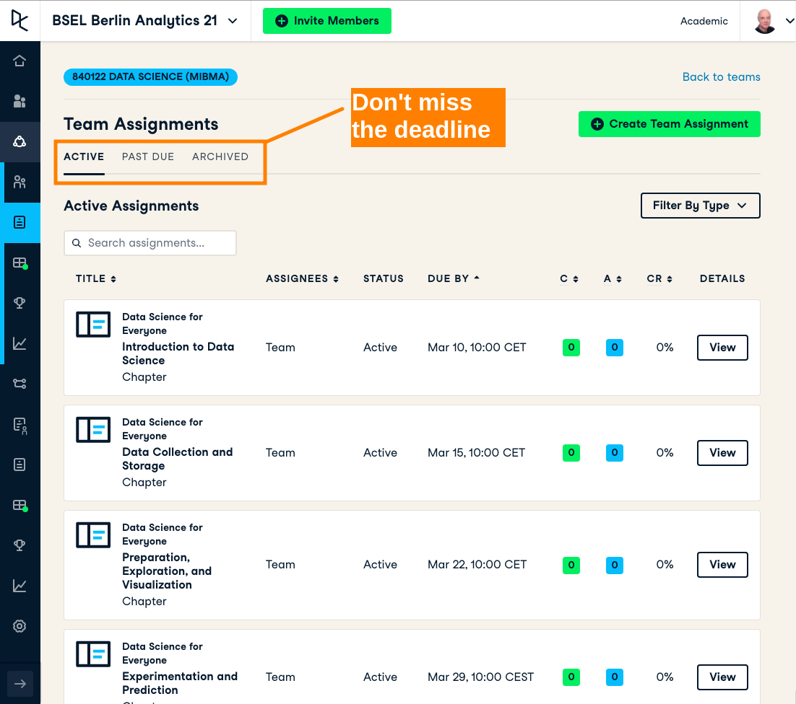

# Table of Contents

-   [What're you going to learn today?](#orge449725)
-   [Who am I?](#org19746c0)
    -   [Science](#org7417553)
    -   [Industry](#org140db8e)
    -   [Teaching](#org1f45322)
    -   [Pleasure](#orge8ecf57)
-   [What are your expectations?](#org56b5b48)
-   [Which topics will we cover?](#org5eadd5b)
    -   [Introduction to data science](#org5d1f2c6)
    -   [Introduction to R programming](#orgf9b11b4)
    -   [Visualization using R](#orgfcba582)
    -   [FasteR approach](#org12e2822)
    -   [Schedule](#org940f546)
-   [How will we do it?](#org56f223f)
    -   [Classroom sessions](#orgd5b77bf)
    -   [Lecture scripts with exercises (GitHub)](#org6beae14)
    -   [Reading assignments](#org1321bed)
    -   [Video lectures (YouTube)](#orge9439da)
    -   [Online assignments (DataCamp)](#orgec8beb5)
    -   [Team EDA project](#orge4ebeee)
    -   [Agile project management](#org6c97c1a)
    -   [Tests and final exam](#orgb878152)
    -   [Podcasts and feeds](#orgeac540a)
    -   [Summary of course activities](#org72b016d)
-   [What do you have to do to pass?](#org97ee5d2)
    -   [DataCamp assignments (> 50%)](#org955fb4e)
    -   [Team project (> 50%)](#orgd936960)
        -   [What is a team project?](#orgdc3aed2)
        -   [Do you have project examples?](#orgdc5fd13)
        -   [Can I do a project as an absolute beginner?](#orgd9f9f66)
    -   [Final exam (> 50%)](#orgd125978)
-   [What's next?](#orgc91a9a9)
    -   [In the course](#org2fbe0f4)
    -   [Your challenges](#org5d5a8fc)
-   [Any questions?](#org8a8cbbd)

# What're you going to learn today?

-   Who is your lecturer?
-   Who are you and what do you want?
-   Which topics will we cover?
-   How will we do it?
-   What do you have to do to pass?
-   What's next?

# Who am I?

## Science

-   Development of WWW
-   PhD theoretical particle physics
-   60 research publications
-   Assoc. Ed. Int. J. of Data Science
-   Ed. Board Int. J. of Big Data Mgmt.
-   Scientific member [d-cube@Berlin](https://www.hwr-berlin.de/en/research/research-centres-and-institutes/)

## Industry

-   Executive at Accenture & Shell
-   Coach and consultant
-   Certified psychotherapist
-   Startup mentor

## Teaching

-   Business informatics [@HWR Berlin](https://www.hwr-berlin.de/en/)
-   Visiting professor of data science @Lyon
-   Adviser for [CPU @LA](https://catholicpolytechnic.org/)
-   Internship supervision

## Pleasure

-   Playing: [Assassin's Creed Valhalla](https://en.wikipedia.org/wiki/Assassin%27s_Creed_Valhalla) (2020)
-   Reading: [Evelyn Waugh, Sword of Honour](https://en.wikipedia.org/wiki/Sword_of_Honour) (1952-1961)
-   Watching: [The Middle](https://en.wikipedia.org/wiki/The_Middle_(TV_series)) (2009-2018)

# [What are your expectations?](https://ideaboardz.com/for/Your%20expectations%2Fconcerns/3943208)

-   What do you want to learn here?
-   What would you like to avoid?
-   What did you take away from another course?
-   What did you really not like in another course?

# Which topics will we cover?

## Introduction to data science

Source: [datacamp.com](https://www.datacamp.com/community/blog/2021-data-trends)

## Introduction to R programming

Source: [RStudio](https://www.rstudio.com/)

## Visualization using R

Source: [Thomas Lin Pedersen](https://github.com/thomasp85/gganimate/blob/master/man/figures/README-unnamed-chunk-4-1.gif)

## FasteR approach

-   Focus on data exploration (EDA)
-   Stay close to base R
-   Use real data sets
-   Compute interactively
-   Prepare for DSC201 (ML)

Image source: [unsplash](https://unsplash.com/photos/SCtlFdgTw1A)

## Schedule

# How will we do it?

## Classroom sessions

## Lecture scripts with exercises ([GitHub](https://github.com/birkenkrahe/dsc101))

## Reading assignments

Norman Matloff (2020):

[fasteR: Fast Lane to Learning R!](https://github.com/matloff/fasteR)

-   Davies, [The Book of R](https://nostarch.com/bookofr), NoStarch Press (2016)
-   Irizarry, [Introduction to Data Science](https://rafalab.github.io/dsbook/) (2020)

## Video lectures ([YouTube](https://youtube.com/playlist?list=PL6SfZh1-kWXl3_YDc-8SS5EuG4h1aILHz))

## Online assignments ([DataCamp](https://www.datacamp.com/enterprise/introduction-to-data-science-master-accounting-program/teams/504092-bpm/assignments))

-   [Register at DataCamp](https://moodle.hwr-berlin.de/mod/url/view.php?id=964817)

## Team EDA project

## Agile project management

## Tests and final exam

## Podcasts and feeds

## Summary of course activities

-   Weekly classroom meetings
-   Lecture scripts (GitHub)
-   Reading assignments (Online)
-   Video lectures (YouTube)
-   Online assignments (DataCamp)
-   Team EDA projects (Sprints)
-   Tests and final exam
-   Podcasts and feeds

# What do you have to do to pass?

## DataCamp assignments (> 50%)

Complete 12 of 24 assignments

## Team project (> 50%)

Present on Nov 30 or Dec 2

### What is a team project?

-   Description of the dataset
-   Introduction of the problem statement
-   Description of the methods used
-   Visualization of the data (plots!)
-   Analysis of the plots
-   Limitations of own analysis
-   References

### Do you have project examples?

-   Examples on Kaggle ([example](https://www.kaggle.com/ekrembayar/election-2016-trump-clinton-spatial-visualization))
-   Examples on data science blogs ([example](https://towardsdatascience.com/how-much-is-a-data-scientist-worth-in-2020-34d5903b606b))
-   Translate from Python to R ([example](https://theartandscienceofdata.wordpress.com/2021/02/20/funniest-friends/))
-   Extend someone else's EDA ([example](https://towardsdatascience.com/what-matters-in-speed-dating-34d29102f6cb))
-   Document an R package ([example](https://www.rdocumentation.org/packages/ggplot2/versions/3.3.3))
-   Use your own data ([example](http://adomingues.github.io/2020/11/25/visual-cv/))

### Can I do a project as an absolute beginner?

-   Keep It Simply Scientific (IMRaD)
-   Look at examples (e.g. [bookmarks](https://github.com/birkenkrahe/ds101/blob/master/ds_bookmarks.md#orgd1a5760))
-   Create data set (e.g. productivity)
-   Researchers are beginners

## Final exam (> 50%)

Final exam: date TBD

# What's next?

## In the course

-   Intro to Data science (Lecture)
-   Intro to DataCamp (Practice)
-   Intro to GitHub (Productivity)
-   Intro to R (Language)

## Your challenges

<table border="2" cellspacing="0" cellpadding="6" rules="groups" frame="hsides">

<colgroup>
<col  class="org-left" />

<col  class="org-left" />
</colgroup>
<thead>
<tr>
<th scope="col" class="org-left">What?</th>
<th scope="col" class="org-left">When?</th>
</tr>
</thead>

<tbody>
<tr>
<td class="org-left">Register at DataCamp</td>
<td class="org-left">Today</td>
</tr>

<tr>
<td class="org-left">Register at GitHub</td>
<td class="org-left">Today</td>
</tr>

<tr>
<td class="org-left">Complete test challenge\*</td>
<td class="org-left">Aug 19</td>
</tr>

<tr>
<td class="org-left">Complete DataCamp assignment\*</td>
<td class="org-left">Aug 24</td>
</tr>

<tr>
<td class="org-left">Set up team project (2-3 ppl)\*</td>
<td class="org-left">Sep 2</td>
</tr>

<tr>
<td class="org-left">Check FAQs<a id="fnr.1" class="footref" href="#fn.1">1</a></td>
<td class="org-left">n.d.</td>
</tr>

<tr>
<td class="org-left">Ask questions (class/GitHub)</td>
<td class="org-left">n.d.</td>
</tr>
</tbody>
</table>

*\*) do this every week until December*

# Any questions?

A PDF of this presentation is available.

# Footnotes

<a id="fn.1" href="#fnr.1">1</a> There is a FAQ for all my courses in this repo, and a FAQ for
this particular course in the current repo.
