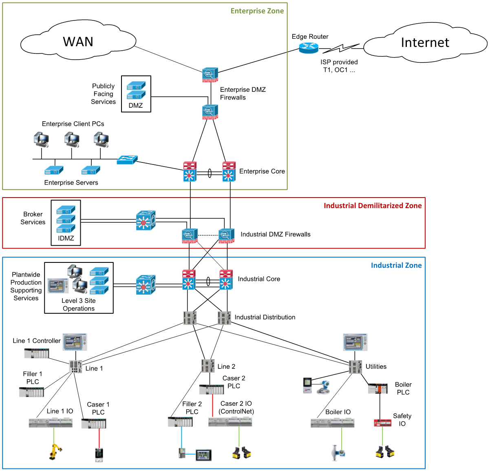
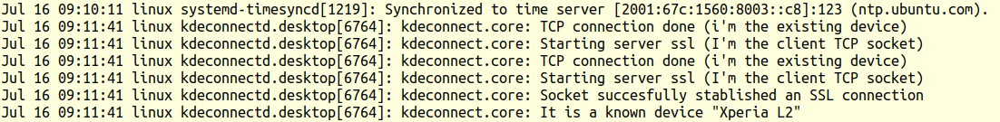

# Table of Contents

-   [You are like Pythagoras](#org82e08f7)
-   [What will you learn?](#orge944742)
-   [How popular is data science?](#orgf79050e)
    -   [Ways to explore popularity](#org1fc8519)
    -   [Worldwide searches 2004-2021](#org7a96ec0)
    -   [The definition of sexy](#orgadc6447)
    -   [Popularity contest](#org785ab2e)
    -   [The winner is&#x2026;](#org6f3b223)
-   [What are data science skills?](#orgf88e71b)
    -   [What about you?](#org87cbfed)
    -   [What are technical data science skills?](#orgcb12b84)
    -   [What is frankenstein made of?](#orgf8d11a2)
    -   [What about you?](#org63493ac)
    -   [What do metaphors do?](#org083feda)
-   [What's the (US) job market for data scientists like?](#orgc8bb175)
    -   [Job profiles (DataCamp)](#org6f1c517)
-   [What are data science problems?](#org670b49c)
    -   [Data science applications](#org0f31c18)
    -   [A real world problem](#org8738913)
    -   [Time series analysis & text mining](#org6b02b05)
-   [What is the data science process?](#orga05b61d)
    -   [Problem-centered process](#orgf6ce79d)
    -   [EDA-centric process model](#org8b5fc89)
    -   [Data science workflow](#org0d56766)
-   [Concept summary](#orge7f9eff)
-   [R Demo - visualization example](#org962ec4c)
-   [Code summary](#org6fc049d)
-   [What's next?](#org90f4e56)
-   [Thank you! Questions?](#org7613f50)
-   [References](#orgc798699)
-   ["Your tuRn" (hints and solutions)](#orgac9684b)
    -   [Popularity  ](#orgf4df868)
    -   [Skills ](#org533c491)
    -   [Software ](#org4ba6ef7)
    -   [Your brain ](#org9e12551)
    -   [Frankenstein ](#org9fb1c18)
    -   [Job market ](#org36b9f89)
    -   [Decisions ](#orgce1de5e)
    -   [Process ](#org945e345)
    -   [Summary ](#orgfe830a3)

# You are like Pythagoras

Pythagoras of Samos was a Greek philosopher who lived around 500
BC. He and his followers conceived of nature as a structured system
of numbers. That was an exciting time in the history of science -
before anyone called it science! With numbers out in the open as
important entities, it was now possible to make all kinds of
exciting discoveries: like harmony in music, or the so-called
Pythagorean theorem (\(a^2+b^2=c^2\)) and many other [facts about
right-angled triangles](http://www.maths.surrey.ac.uk/hosted-sites/R.Knott/Pythag/pythag.html)

So why are you like Pythagoras? Simply because data science isn't
all that old - it became popular less than 10 years ago. Though it
is not a foundation science (like math or physics) but an
interdisciplinary field, this is an exciting moment in history to
learn about it: you can practically not help yourself making
interesting discoveries!  Something like this doesn't come along all
the time (actually, in my life time, there's only one other event
like it, the development of the World-Wide Web).

# What will you learn?

-   How and why data science is so popular

-   What skills you need to do data science

-   Which problems data science can solve

-   What data scientists do all the time

In this lesson, I am giving an oveRview<a id="fnr.1" class="footref" href="#fn.1">1</a> of several aspects of
data science. Though young, it is a field both ill-defined and (or
perhaps because of it) vast and hard to pin down. This outline will
be applied rather than scholarly, focusing on applications and
practice rather than concepts or theory.

In its name, "data science" carries both aspects of science and
craft: the 'science' part is responsible for the modus operandi,
which is informed by statistics and math, systematic and logically
rigorous. The 'data' part relates mostly to craft: the ability to
extract insights from data using computing tools. Most data
scientists are more occupied by and with the craft part than with
the science part (cp. [Kozyrkov 2018](#orgb0010a5)).

Hence, data science so far is a typical support science. It supports
other, more established disciplines in the natural and in the social
sciences. Prominent examples are: economics, genomics, and
epidemiology.

The need to use the data "to tell a story" sets data science apart
from both traditional data craft and science. It is the reason why
visualization techniques and theory ("grammar of graphics",
cp. [Sarkar 2018](#orgbcb27d0)) play such an important role.

I would argue that data science is most successful when supporting
fields that themselves are interdisciplinary and therefore need a
higher degree of communication across different cultures of science
and practice. This is the quasi-definition that I came up with while
preparing these notes:

[RAW] **DATA** + [CODE] + **SCIENCE** [METHODS] = **VALUE**

Why? Because data always come in "raw" form and have to be wrestled
with. To do this, you need to be able to code (a little anyway). But
in order to achieve the main goal, namely add value,
process-oriented science has to come in, most importantly through
systematic methods and the accompanying processes, to validate
insights and help communicate results. Well, so far, so good.

In the following lecture, I will focus on four aspects of data
science: the popularity it currently enjoys (and has enjoyed for the
past 10 years), the skills required to "do data science", and the
processes or activities involved in doing it. We will look at each
of these with some examples.

At the end of each chapter, you'll find a quick challenge ("youR
tuRn"<a id="fnr.2" class="footref" href="#fn.2">2</a>) - this is usually just a question related to the
text. Sample answers and hints to challenges are gathered [at the end
of the document.](#orgfab17b5)

# How popular is data science?

> How would you try to find out?

## Ways to explore popularity

-   Search (how?)
-   Find relevant models (how?)
-   Generate primary data (how?)
-   Use secondary data (instead of?)

> Any issues with these methods?

(1) Search - where? How?

-   Google (Scholar) - disadvantage of Google searches?
-   arxiv.org
-   data science blogs (R-Blogger, Towards Data Science, Analytics
    Vidhya, R Weekly, DataCamp)
    (2) Find relevant models - what is that?
    
    -   Metaphors are models
    -   Mathematical model may not exist
    -   Example for such a model
    
    (3) Generate primary data
    
    -   Which measures are used?
    -   Which methods are used?
    
    (4) Look secondary data - public? Valid? How do you validate?
    
    Example: social networking analysis - Predicting Tie Strength
    (2009). Paper: <https://1drv.ms/b/s!AhEvK3qWokrvqz6uRFcluk1LEOW5>
    
    This paper uses a model to distinguish between weak and strong
    ties (with over 85% accuracy) based on a parametrization (=
    features to establish splitting the data) and a linear model (=
    assumption that the predictive variables are linearly
    correlated). Data science is used to address questions hidden in
    the data, such as how users relate to one another in social
    media, how they behave, perhaps even why they do what they do (=
    statistical inference).

## Worldwide searches 2004-2021

In the graph (figure [54](#orgd1c3cbe)) from trends.google.com, "numbers
represent search interest relative to the highest point on the
chart for the given region [worldwide] and time [since logging
trends in 2004]." The trend increased is noticeable. It peaked in
September 2020 ([Source](https://trends.google.com/trends/explore?date=all&q=data%20science,software%20engineering,business%20intelligence,big%20data)).

In October 2012, almost 10 years ago, Davenport and Patil published
"Data Scientist: The Sexiest Job of the 21st Century" and put the
term on the map.

**What has changed since 2012?**

> How would you explain this curve?

## The definition of sexy

> »The best data scientists are product and process innovators and
> sometimes, developers of new data-discovery tools.
> That is the definition of sexy.«
> 
> Gil Press ([Forbes, 09/27/12](https://www.forbes.com/sites/gilpress/2012/09/27/data-scientists-the-definition-of-sexy/))

## Popularity contest

> 
> 
> Which one is most searched:
> 
> 1.  Big data?
> 2.  Business intelligence?
> 3.  Software engineering?
> 4.  Data science?

Notice that this list amounts to a visualization, too, because it
suggests an ordering, which is supported by the language: "big
data" sounds like it should be at the top. In fact, "data science"
takes the top spot, and both BI and Software Engineering were a lot
more popular in the past.

## The winner is&#x2026;

> How do you like the visualization?

1.  Bar chart (averages) difficult to read (percentages missing)

2.  List follows the search order, not the results

3.  Grid lines (vertical lines) could improve reading

# What are data science skills?

> Can you give some examples?

The three skill areas in figure [60](#org3e8c911) from [Robinson/Nolis (2020)](#org186d5f9)
give rise to different tasks and problem settings:

<table border="2" cellspacing="0" cellpadding="6" rules="groups" frame="hsides">

<colgroup>
<col  class="org-left" />

<col  class="org-left" />

<col  class="org-left" />

<col  class="org-left" />
</colgroup>
<thead>
<tr>
<th scope="col" class="org-left">Skill</th>
<th scope="col" class="org-left">Sample area</th>
<th scope="col" class="org-left">Sample activity</th>
<th scope="col" class="org-left">Sample analysis</th>
</tr>
</thead>

<tbody>
<tr>
<td class="org-left">Domain</td>
<td class="org-left">Marketing</td>
<td class="org-left">Analyze customer data</td>
<td class="org-left">What do customers like?</td>
</tr>

<tr>
<td class="org-left">knowledge</td>
<td class="org-left">Education</td>
<td class="org-left">Learner data</td>
<td class="org-left">How did students learn?</td>
</tr>

<tr>
<td class="org-left">&#xa0;</td>
<td class="org-left">Finance</td>
<td class="org-left">Investment data</td>
<td class="org-left">Which stock performed?</td>
</tr>
</tbody>

<tbody>
<tr>
<td class="org-left">Coding &</td>
<td class="org-left">R, Python, SQL</td>
<td class="org-left">Analzye/automate/query</td>
<td class="org-left">Count customers by type</td>
</tr>

<tr>
<td class="org-left">databases</td>
<td class="org-left">Cloud computing</td>
<td class="org-left">Share data and code</td>
<td class="org-left">Work in virtual teams</td>
</tr>

<tr>
<td class="org-left">&#xa0;</td>
<td class="org-left">RStudio, Emacs</td>
<td class="org-left">Improve your workflow</td>
<td class="org-left">Create a notebook<a id="fnr.3" class="footref" href="#fn.3">3</a></td>
</tr>

<tr>
<td class="org-left">&#xa0;</td>
<td class="org-left">Package creation</td>
<td class="org-left">Write new functions</td>
<td class="org-left">Distribute package</td>
</tr>
</tbody>

<tbody>
<tr>
<td class="org-left">Maths &</td>
<td class="org-left">Data structure</td>
<td class="org-left">Data wrangling</td>
<td class="org-left">Check data [tidyness](https://rafalab.github.io/dsbook/tidyverse.html)</td>
</tr>

<tr>
<td class="org-left">stats</td>
<td class="org-left">Model building</td>
<td class="org-left">Linear [regression](https://rafalab.github.io/dsbook/regression.html)</td>
<td class="org-left">Fit line graph to data</td>
</tr>

<tr>
<td class="org-left">&#xa0;</td>
<td class="org-left">Distribution</td>
<td class="org-left">Check significance</td>
<td class="org-left">Apply t-test<a id="fnr.4" class="footref" href="#fn.4">4</a></td>
</tr>
</tbody>
</table>

Between two of these areas each are application areas:

1.  Domain knowledge and statistics support decision science. See
    [infographic](https://medium.com/@ibobriakov/data-science-vs-decision-science-infographic-7ad6e16698d) (source: [Bobriakov 2019](#org18506a4)).

2.  Data analytics are the result of applying database programming
    (e.g. with SQL) to domain knowledge problems(this is also
    sometimes called 'business intelligence' or BI).

3.  Programming, maths and statistics give rise to various machine
    learning (ML) techniques concerned in particular with prediction
    and pattern recognition.

## What about you?

<table border="2" cellspacing="0" cellpadding="6" rules="groups" frame="hsides">

<colgroup>
<col  class="org-left" />
</colgroup>
<tbody>
<tr>
<td class="org-left">Kanban: [What are your skills?](https://ideaboardz.com/for/What%20are%20your%20skills%3F/3746720)</td>
</tr>

<tr>
<td class="org-left"></td>
</tr>

<tr>
<td class="org-left">Compare: ["My IT skill stack"](https://1drv.ms/b/s!AhEvK3qWokrvhPhyO8vS3nRXWah9jA)<a id="fnr.5" class="footref" href="#fn.5">5</a></td>
</tr>
</tbody>
</table>

1.  Problem solving skills:
    -   Understand the problem: the conditions, the unknowns, the
        data. Of these, I am particularly good with data.
    -   Design a plan of attack (e.g. by modeling - abstracting from
        the details to identify one or more routes or options)
    -   Carry out the plan of attack: this is execution. Probably my
        least favorite part (often, when I see the solution path, I
        get bored). But I can do it, and it's satisfying to finish
        something.
    -   Look back, review and discuss your solution. I am especially
        good at this type of postmortem analysis - it's probably what
        I use most when it comes to teaching stuff.
2.  Computational thinking skills
    -   10 programming languages - recommended: SQL and R
3.  Data literacy skills
    -   Wikipedia definition is not bad: "Ability to understand,
        create, and communicate data as information." (I.e. structured
        data)
    -   Use of visualization and storytelling techniques
    -   Business process modeling
4.  Communication skills
    -   team / leadership experience
5.  Tool skills
    -   I love tools
    -   In my courses usually use about 20 different IT tools

## What are technical data science skills?

> Have you heard of any of these?

Tip: when you come across products you don't know, make it a habit
to look them up - knowing the names and what they stand for will
help you anchor yourself in anything you read, and the most
important products, which are most talked about, are often talked
about for a reason - e.g. because they represent an innovation
and/or an advantage. By knowing the products, you can also learn
something about the innovation. This dependency on products also
shows that both computer and data science are crafts.

<table border="2" cellspacing="0" cellpadding="6" rules="groups" frame="hsides">

<colgroup>
<col  class="org-left" />

<col  class="org-left" />

<col  class="org-left" />

<col  class="org-left" />
</colgroup>
<tbody>
<tr>
<td class="org-left">D3.js</td>
<td class="org-left">Visualization</td>
<td class="org-left">Apache Hadoop</td>
<td class="org-left">distributed computing</td>
</tr>

<tr>
<td class="org-left">Apache Spark</td>
<td class="org-left">Analytics engine</td>
<td class="org-left">MapReduce</td>
<td class="org-left">Google scalability</td>
</tr>

<tr>
<td class="org-left">Apache Pig</td>
<td class="org-left">Analytics platform</td>
<td class="org-left">NoSQL</td>
<td class="org-left">Unstructured big data</td>
</tr>

<tr>
<td class="org-left">Tableau</td>
<td class="org-left">Visualization</td>
<td class="org-left">iPython nb</td>
<td class="org-left">Literate Programming</td>
</tr>

<tr>
<td class="org-left">GitHub</td>
<td class="org-left">Version control</td>
<td class="org-left">&#xa0;</td>
<td class="org-left">&#xa0;</td>
</tr>
</tbody>
</table>

## What is frankenstein made of?

Source: [datasciencecentral.com](https://st12.ning.com/topology/rest/1.0/file/get/2808339698?profile=RESIZE_1024x1024)

"Frankenstein's monster" (based on the novel by "Frankenstein, or
The Modern Prometheus", by Mary Shelley, 1818) is used in
figure [88](#org7ed4ada) as a metaphor for a working data scientist. it
is a rich metaphor with many connotations.

-   "Eyes": experience with detecting data patterns. to do this
    actually with your eyes is unlikely - you need some tools for
    that, but you also need experience to know which tools will
    work. example: `head(dataset)` only prints the first 6 rows of a
    dataset giving you an idea of the type of data in the dataset.
-   "Heart": passion for and creativity with data. "passion" is
    perhaps more relevant for the data's origin and for what you can
    do with well interpreted data - namely change the world! example:
    hans rosling's gapminder animations (and his passionate
    storytelling, demonstrated e.g. in Hans Rosling's TED videos.
-   "Hands": domain knowledge gained by working in an industry for
    years, supported by activity in communities like [kaggle](https://www.infoworld.com/article/3564164/kaggle-where-data-scientists-learn-and-compete.html) (owned by
    google since 2017), which hosts datasets, notebooks and ml
    competitions.
-   "Brain": analytical mindset and knowledge of analysis tools
    (none of the tools mentioned here, hadoop, spark, [hive](https://hive.apache.org/) - a data
    warehouse - or [sas](https://www.sas.com/) - another statistical analysis workbench - are
    necessary - they are merely nice to know). how do you know that
    you have this kind of brain? e.g. if you enjoy getting
    quantitative (number-based) answers and if you like visualizations
    of complex or complicated data (like the gapminder data). also, if
    you like programming or maths, you've likely got such a brain.
-   "Mouth": communication with colleagues - but not only. in
    fact, especially being able to communicate with people who are not
    your colleagues (so they are perhaps very different from you) is
    key. this is another way of saying that you need to be able to
    "tell a story" after data analysis (e.g. [Prevos 2020](#org2c35eb3)).
-   "Feet": data science is a very fast-moving technology field,
    especially its "machine learning" offshoot (which is not part of
    this course) - cp. [Kozyrkov 2019](#org3842df2). you need to keep on top of the available
    information. at the same time, there is too much to take in and
    digest - this means that it is very important to have a sound
    understanding of the foundations of data science.

## What about you?

> 
> 
> <table border="2" cellspacing="0" cellpadding="6" rules="groups" frame="hsides">
> 
> 
> <colgroup>
> <col  class="org-left" />
> </colgroup>
> <tbody>
> <tr>
> <td class="org-left">Do you have a "brain for numbers"? Do you prefer people or stories?</td>
> </tr>
> 
> 
> <tr>
> <td class="org-left"></td>
> </tr>
> </tbody>
> </table>

**&#x2026;youR tuRn:** What if you don't have a brain for numbers, can you
still do data science? What if numbers don't turn you on but
instead put you to sleep?  What if graphs scare you because you
suspect that difficult mathematics is necessary to understand the
graph and what's behind it? What if you like novels but don't care
for manuals - what if you don't even like computers? Can you still
have a "brain for data science" like Dr. Frankenstein's monster
here? [(Hint)](#org512b72f)

## What do metaphors do?

> Metaphors are models.

**&#x2026;youR tuRn:** What are the connotations of using "Frankenstein's
monster" as a metaphor for "data scientist"? Metaphors are
especially important when definitions are not easily forthcoming,
are confused or not standardized (all of which is the case for data
science). Metaphors are a type of model. [(Hints)](#orgcc2fe54)

# What's the (US) job market for data scientists like?

> Challenge: search a job portal for "data scientist".

The value of statistics like shown in figure [102](#org3c6e390) depends on the
exact definitions of the job, on the ability of business to recruit
exactly for what they want etc. I have personally not spoken to any
recruiter about this - I only read career-related blogs and looked
at statistics like these (published by [Berkeley School of
Information 2020](https://ischoolonline.berkeley.edu/data-science/), a site that is interested in attracting data
science students, therefore highly biased). However, as a rule, you
can never go wrong with growing your skill stack, especially with
regard to STEM skills, and within these especially with regard to
your ability to analyse data quantitatively - which is what data
science boils down to. For more details on "data science careers",
see [Robinson/Nolis (2020)](#org186d5f9).

Mathematics, especially statistics, programming and databases are
the skill-based disciplines that you need to master. Having said
that: "mastering" could easily take not one, but several life times,
and you need to begin somewhere. If you do this in earnest, you'll
soon find that you start learning faster and faster the more
connections with what you already know you can make.] Here is a
(free) book called, incidentally, "[Foundations of Data Science](https://www.cs.cornell.edu/jeh/book.pdf)"
([Blum et al 2015, 466 p.](#org2ae0695)). It includes some geometry, graph theory,
linear algebra, markov chains, and a variety of algorithms for
"massive data problems" like streaming, sketching and sampling

## Job profiles (DataCamp)

> Who would you rather be?

Introductory DataCamp courses on data science "for everyone" (that
is, without being tied to one of the three dominant languages -
Python, R, or SQL), contain a job profile section to help users
find their professional data science niche.

The figure [106](#org114e0ab) shows four such profiles from a 2020
course. What is notably missing here is the maths and/or CS or
software engineering knowledge required or desirable to fill these
roles. But there are also people who say that you best come to a
firm as a general-purpose computer scientist and then learn any of
these on the job depending on the needs and the available
experience.

# What are data science problems?

Source: Cassie Kozyrkov ([@quaesita](https://twitter.com/quaesita))

The cartoon in figure [110](#orgc3864ff) is by Google's head of "decision
intelligence", [Cassie Kozyrkov (2018)](#org3842df2). She has a specific,
business- and decision-oriented idea of the purpose of data
science, which I share: data science is there to help you make
decisions. The option tree shown distinguishes three sub-fields of
data science: data analytics, statistics and machine learning. It
asks if you're "making decisions" at the start (many, few, hardly
any), it quickly focuses on the type of data (few vs big) and the
'uncertainty' and 'importance' of the decisions. This is still a
data-centric, not a decision-centric taxonomy. A focus on the
latter would allow for many more options (e.g. strategic
vs. tactical, organizational vs. managerial, routine
vs. exceptional decisions etc.) Hence, for decision science, this
kind of breakdown is not very useful.

The dominance of "big data" has also been doubted, especially when
it comes to making (business) decisions. "Small [not big] data"
([Saklani, 2017](#org0ee09d1)) and "thick [qualitative, descriptive] data" may be
just as good depending on what you want to know. The article by
[Chiu (2020)](#org4b8a01d) is a bit of a history hack (in the scholarly sense) but
it raises some good points.

Brandon Rohrer, [then] a data scientist at Microsoft, has addressed
this question in a 3-part series of short articles ([Rohrer, 2015a,
2015b, 2015c](#orgbc6fcea)). His examples are a more specific, especially because
he also says which family of algorithms match which type of
data-related question. It is too early for us to discuss his
taxonomy but at the end of the course, you should have a better
idea about what you can do with data science tools.

**&#x2026;youR tuRn:** Think about any decision you make - what are the
steps you go through? Do they amount to a "data science adventure"
as shown in the figure [110](#orgc3864ff) - why (or why not)? [(Hint)](#org8cc53fa)

See also my remarks in the wiki on GitHub (in a footnote):
<https://github.com/birkenkrahe/dsc101/wiki/Data-science-process>

## Data science applications

Source: [data-flair.training](https://data-flair.training/blogs/data-science-applications/)

## A real world problem

Source: [Industrial Cybersecurity (2017)](https://hackerman.info/)

Here is a real world problem worthy of data science, and also well
suited to R: efficiently securing critical infrastructure systems,
generally considered essential to the survival of Western
civilization - cp. "Live Free or Die Hard" (2007)

As you can see from the diagram, which shows a properly designed
(according to the book's author) Industrial Control System, such a
system is insanely complicated.

## Time series analysis & text mining

Source: Linux `/var/log/syslog` event log

All system components continuously write data protocols in the form
of simple event logs, which you can view easily on Linux systems
[e.g. on Ubuntu](https://ubuntu.com/tutorials/viewing-and-monitoring-log-files#1-overview). Check available system logs with `ls -la
   /var/log/`. Figure [124](#org9d81c5b) shows a sample section from my
computer's system log in `/var/log/syslog`.

This excerpt shows how and when the computer clock was set remotely,
and the starting of various servers and one socket where my mobile
phone ("Xperia L2") was connected.

The language we're about to use in this course (and in the follow
up course on machine learning), R, is well suited for rapid
interactive exploration of datasets such as this one. The two
immediately relevant problem areas are "text mining" (notice that
all system files are human-readable to aid debugging), and "time
series analysis" (event logs are time series).

Text mining is considered a part of "Natural Language Processing",
and Time Series Analysis is also really important in finance,
e.g. when analysing portfolio performance.

A separate technique (not immediately part of an R programming
course) is "process mining".

# What is the data science process?

Source: [Birkenkrahe (2021)](https://github.com/birkenkrahe/dsc101/blob/main/wiki/talk_presentation.pdf)

See [course wiki on GitHub](https://github.com/birkenkrahe/dsc101/wiki/Data-science-process) for some background on this model.

## Problem-centered process

Source: [Birkenkrahe (2021)](https://github.com/birkenkrahe/dsc101/blob/main/wiki/talk_presentation.pdf)

See [course wiki on GitHub](https://github.com/birkenkrahe/dsc101/wiki/Data-science-process) for some background on this model.

## EDA-centric process model

Source: [Wickham/Grolemund (2017)](https://r4ds.had.co.nz/index.html)

> ([Interactive BPMN version](https://h5p.org/node/910614))

Figure [134](#org428be59) shows a process that begins with raw data. Such data are
usually not formatted as "tidy" data, i.e. "each row represents one
observation and columns represent the different variables available
for each of these observations" ([Irizarry 2020](#org4f44ebe)). This is also the
tabular format, which is usual for storing data in relational
databases for analysis with SQL.

Once we have tidy data, an (often repeated) sub-process begins:
"transform" refers to any operation on the dataset that helps us
understand the data better. Depending on the size of the data
tables, we will use different methods of visualization to make
underlying structure visible. But visualization does not always have
to be graphical. Let's look at three examples in the next section.

## Data science workflow

Source: [Data science for everyone](https://learn.datacamp.com/courses/data-science-for-everyone) (DataCamp)

# Concept summary

-   Data science is used for decision support, process analytics and
    machine learning.
-   Data science makes use of domain knowledge - experience in a
    particular field of business.
-   The job market for data science is good.
-   The data science process includes modeling, visualizing, and
    communicating data analysis results.

> Read the seminal article by [Davenport/Patil (2012)](https://hbr.org/2012/10/data-scientist-the-sexiest-job-of-the-21st-century).

# R Demo - visualization example

[`mtcars`: Motor Trend Car Road Tests](https://www.rdocumentation.org/packages/datasets/versions/3.6.2/topics/mtcars)

You can type along if you already have R installed (next week)

-   `data(mtcars)`
-   `?mtcars`
-   `head(mtcars)`
-   `rownames(mtcars)`
-   `str(mtcars)`
-   `colnames(mtcars)`
-   <https://www.rdocumentation.org/packages/datasets/versions/3.6.2/topics/mtcars>
-   `summary(mtcars)`
-   `plot()`
-   `lm()`
-   `abline()`

# Code summary

<table border="2" cellspacing="0" cellpadding="6" rules="groups" frame="hsides">

<colgroup>
<col  class="org-left" />

<col  class="org-left" />
</colgroup>
<tbody>
<tr>
<td class="org-left">`data()`</td>
<td class="org-left">import dataset</td>
</tr>

<tr>
<td class="org-left">`head()`</td>
<td class="org-left">print first few lines of dataset</td>
</tr>

<tr>
<td class="org-left">`str()`</td>
<td class="org-left">show dataset structure</td>
</tr>

<tr>
<td class="org-left">`summary()`</td>
<td class="org-left">print statistics overview of dataset</td>
</tr>

<tr>
<td class="org-left">`plot()`</td>
<td class="org-left">create scatterplot</td>
</tr>

<tr>
<td class="org-left">`lm()`</td>
<td class="org-left">fit linear [regression] model to data</td>
</tr>

<tr>
<td class="org-left">`abline()`</td>
<td class="org-left">add straight lines through a plot</td>
</tr>
</tbody>
</table>

R code examples:

We have already seen quite a bit of R code in the examples - the
why, what and how of R will be the subject of the next
lecture. You don't need to remember these now - we'll practice
them soon and often enough - but if you do, it might be helpful:

After hearing a lot of information, I find it sometimes necessary
to anchor myself again. You can do this now and test your basic
understanding of data science and brush up on your reading:

[**&#x2026;youR tuRn:**](#orgdff8f6c) Read the seminal article by [Davenport/Patil (2012)](#org4299226),
which put data science on the map for business practitioners. What
has changed since then (if anything)? Test their claims (e.g. "there
are no university programs offering degrees in data science" - is
this still true?). How would you measure the performance of a data
scientist? Has the understanding of data science and data scientist
("a hybrid of data hacker, analyst, communicator, and trusted
adviser") changed since then?|

# What's next?

<table border="2" cellspacing="0" cellpadding="6" rules="groups" frame="hsides">

<colgroup>
<col  class="org-left" />

<col  class="org-left" />
</colgroup>
<tbody>
<tr>
<td class="org-left">DataCamp assignment</td>
<td class="org-left">Data collection and storage</td>
</tr>

<tr>
<td class="org-left">Installing R</td>
<td class="org-left">[Try it yourself!](https://www.datacamp.com/community/tutorials/installing-R-windows-mac-ubuntu)</td>
</tr>

<tr>
<td class="org-left">First steps in R</td>
<td class="org-left">We'll do it together!</td>
</tr>

<tr>
<td class="org-left">Weekly test</td>
<td class="org-left">5-15 simple questions</td>
</tr>
</tbody>
</table>

# Thank you! Questions?

# References

1.   Blum A/Hopcroft J/Kannan R (4 Jan 2018). Foundations of Data
    Science - Cornell U. Online: [cornell.edu](https://www.cs.cornell.edu/jeh/book.pdf).
2.   Bobriakov I (16 Apr 2020). Data Science vs. Decision Science
    [Infographic]. Online: [medium.com/@bobriakov](https://medium.com/@ibobriakov/data-science-vs-decision-science-infographic-7ad6e16698d).
3.   Bolles R and Brooks K (2021). What color is your
    parachute? Online: <https://www.parachutebook.com/>
4.   Chiu J (17 Aug 2020). Why Data Doesn't Have to Be That
    Big. Online: [datacamp.com](https://www.datacamp.com/community/blog/small-and-thick-data).
5.   Davenport TH/Patil DJ (2012). Data Scientist:
    The Sexiest Job of the 21st Century. Online: [hbr.org](https://hbr.org/2012/10/data-scientist-the-sexiest-job-of-the-21st-century).
6.   Devlin K (1 Jan 2017). Number Sense: the most
    important mathematical concept in 21st Century K-12
    education. Online: [huffpost.com](https://www.huffpost.com/entry/number-sense-the-most-important-mathematical-concept_b_58695887e4b068764965c2e0).
7.   Gapminder Foundation (15 Dec 2014). DON'T
    PANIC - Hans Rosling showing the facts about population. Online:
    [youtube.com](https://youtu.be/FACK2knC08E)
8.   Grolemund G/Wickham H (2017). [R for Data Science](https://r4ds.had.co.nz/). O’Reilly.
9.   Irizarry R (2020). [Introduction to Data Science](https://rafalab.github.io/dsbook/). CRC Press.
10.  Kozyrkov C (10 Aug 2018). What on earth is data science?
    Online: [hackernoon.com](https://hackernoon.com/what-on-earth-is-data-science-eb1237d8cb37).
11.  Kozyrkov C (22 May 2019). Automated Inspiration. Online:
    Forbes.com]].
12.  Knuth D (1992). [Literate Programming](http://www.literateprogramming.com/knuthweb.pdf). Stanford,
    Center for the Study of Language and Information Lecture
    Notes 27.
13.  Myers A (28 Apr 2020). Data Science Notebooks - A
    Primer. Online: [medium.com/memory-leak](https://medium.com/memory-leak/data-science-notebooks-a-primer-4af256c8f5c6).
14.  Porras E M (18 Jul 2018). Linear Regression in
    R. Online: [datacamp.com](https://www.datacamp.com/community/tutorials/linear-regression-R).
15.  Prevos P (14 Aug 2020). Storytelling with Data:
    Visualising the Receding Sea Ice Sheets. Online:
    lucidmanager.org]].
16.  Robinson E/Nolis, J (2020). [Build a
    Career in Data Science](https://www.manning.com/books/build-a-career-in-data-science). Manning.
17.  Rohrer B (2015a). What Can Data Science Do
    For Me? Online: [microsoft.com](https://docs.microsoft.com/en-us/archive/blogs/machinelearning/what-can-data-science-do-for-me).
18. Rohrer B (2015b). What Types of Questions Can Data Science
    Answer? Online: [microsoft.com](https://docs.microsoft.com/en-us/archive/blogs/machinelearning/what-types-of-questions-can-data-science-answer).
19. Rohrer B (2015c). Which Algorithm Family Can Answer My Question?
    Online: [microsoft.com](https://docs.microsoft.com/en-us/archive/blogs/machinelearning/which-algorithm-family-can-answer-my-question).
20.  Saklani P (19 Jul 2017). Sometimes “Small Data” Is Enough to
    Create Smart Products. Online: [hbr.org](https://hbr.org/2017/07/sometimes-small-data-is-enough-to-create-smart-products).
21.  Sarkar DJ (12 Sept 2018). A Comprehensive Guide
    to the Grammar of Graphics for Effective Visualization of
    Multi-dimensional Data. Online: [towardsdatascience.com](https://towardsdatascience.com/a-comprehensive-guide-to-the-grammar-of-graphics-for-effective-visualization-of-multi-dimensional-1f92b4ed4149)
22.  Scherpereel CM (2006). Decision orders: A
    decision taxonomy. In: Management Decision 44(1):123-136.
23.  Wing JM (2 Jul 2019). The data life cycle. Harvard Data Science
    Review. Online: [hdsr.mitpress.mit.edu.](https://hdsr.mitpress.mit.edu/pub/577rq08d/release/3)

# "Your tuRn" (hints and solutions)

## Popularity  

Check out the seminal article by [Davenport/Patil 2012.](#org4299226) (At least)
one answer is in there.

## Skills 

Recently, an MBA student asked me these same questions and here is
my answer: "[My IT Skill Stack](https://1drv.ms/b/s!AhEvK3qWokrvhPhyO8vS3nRXWah9jA)". See also [Bolles and Brooks (2021)](#org2c7c0bf)

## Software 

-   [D3.js,](https://d3js.org/) a JavaScript library for manipulating documents based on
    data. D3 helps you bring data to life using HTML, SVG, and CSS.
-   [Apache Hadoop,](http://hadoop.apache.org/) a "software library framework that allows for the
    distributed processing of large data sets across clusters of
    computers using simple programming models. It is designed to scale
    up from single servers to thousands of machines, each offering
    local computation and storage. Rather than rely on hardware to
    deliver high-availability, the library itself is designed to detect
    and handle failures at the application layer, so delivering a
    highly-available service on top of a cluster of computers, each of
    which may be prone to failures." (Source: Apache.org)
-   [MapReduce](https://www.ibm.com/analytics/hadoop/mapreduce), "a programming paradigm that enables massive scalability
    across hundreds or thousands of servers in a Hadoop cluster. As the
    processing component, MapReduce is the heart of Apache Hadoop. The
    term "MapReduce" refers to two separate and distinct tasks that
    Hadoop programs perform. The first is the map job, which takes a
    set of data and converts it into another set of data, where
    individual elements are broken down into tuples (key/value
    pairs). The reduce job takes the output from a map as input and
    combines those data tuples into a smaller set of tuples. As the
    sequence of the name MapReduce implies, the reduce job is always
    performed after the map job."  Source: IBM. See also:
    [tutorialspoint](https://www.tutorialspoint.com/hadoop/hadoop_mapreduce.htm).
-   [Apache Spark](https://databricks.com/spark/about), "a lightning-fast unified analytics engine for big
    data and machine learning. It was originally developed at UC
    Berkeley in 2009." Source: databricks.
-   [NoSQL](https://aws.amazon.com/nosql/) "databases, purpose-built for specific data models and have
    flexible schemas for building modern applications. NoSQL databases
    are widely recognized for their ease of development, functionality,
    and performance at scale." Source: AWS.
-   [Apache Pig](https://pig.apache.org/), "a platform for analyzing large data sets that
    consists of a high-level language for expressing data analysis
    programs, coupled with infrastructure for evaluating these
    programs. The salient property of Pig programs is that their
    structure is amenable to substantial parallelization, which in
    turns enables them to handle very large data sets. At the present
    time, Pig's infrastructure layer consists of a compiler that
    produces sequences of Map-Reduce programs, for which large-scale
    parallel implementations already exist (e.g., the Hadoop
    subproject). Pig's language layer currently consists of a textual
    language called Pig Latin." Source: apache.org. [Tutorialspoint](https://www.tutorialspoint.com/apache_pig/index.htm).
-   [Tableau](https://www.tableau.com/) (owned by Salesforce), commercial interactive data
    visualization software (SQL-based dashboards). [Tableau public](https://public.tableau.com/en-us/s/).
-   [iPython notebook](http://ipython.org/notebook.html) (now "Jupyter Notebook"), a "interactive
    computational environment, in which you can combine code execution,
    rich text, mathematics, plots and rich media." Source:
    [jupyter.org](https://jupyter.org/). Part of the [Anaconda](https://www.anaconda.com/) distribution. See also: Google
    [Colaboratory](https://colab.research.google.com/notebooks/intro.ipynb) for a (free) cloud-based version.
-   [GitHub](https://github.com) (owned by Microsoft), "a website and cloud-based service
    that helps developers store and manage their code, as well as track
    and control changes to their code" (Source: [kinsta.com](https://kinsta.com/knowledgebase/what-is-github/)) centered on
    the open-source version control software [Git](https://git-scm.com/). There are many
    platforms like GitHub (e.g. GitLab, BitBucket, SourceForge).

Of these applications, only Git (not GitHub) is really absolutely
necessary for a professional data scientist working in teams. Though
a working knowledge of the principles behind all of them will be
very useful (especially if they come up in interviews). Hence, no
reason to be scared.

## Your brain 

Other terms for what we're talking about here are: "number sense"
(in maths education), or "computational thinking" (in computer
science) or, more recently, "data literacy". All of these are
relatively new concepts, so feel free to speculate and make up your
own mind! Cp. [Devlin 2017](#org93e0726)

## Frankenstein 

How do you feel about anything if doing it would turn you into a
monster? What kind of monster is Frankenstein (if you didn't read
the book or saw the film, I'll tell you: ugly but soulful, loveable
and capable of love, too)?  What is special about him as a monster
in mechanical terms?

## Job market 

Mathematics, especially statistics, programming and databases are
the skill-based disciplines that you need to master. Having said
that: "mastering" could easily take not one, but several life
times, and you need to begin somewhere. If you do this in earnest,
you'll soon find that you start learning faster and faster the more
connections with what you already know you can make.] Here is a
(free) book called, incidentally, "[Foundations of Data Science](https://www.cs.cornell.edu/jeh/book.pdf)"
([Blum et al 2015, 466 p.](#org2ae0695)). It includes some geometry, graph theory,
linear algebra, markov chains, and a variety of algorithms for
"massive data problems" like streaming, sketching and sampling.

## Decisions 

The figure (like the underlying article) targets business decisions
more than everyday decisions. For business decisions, taxonomies
exist, which are generally a lot more complicated than shown here,
see e.g. [Scherpereel 2006](#orgd114975).

## Process 

On the surface, Wing's "Data Life Cycle" (2019) has a few more
steps (and it is also not a "cycle") - it does not use the
artificial (technical) term "tidy" but instead terms that can more
easily be understood by practitioners outside of data
science. Modeling is not addressed by Wing but instead she puts
"management" at the center of the process, right between
data-centric and (business) process-centric categories. Another
related process model you may have heard of is the "[design
thinking" process](https://commons.wikimedia.org/wiki/File:Design_Thinking_process_in_the_Chapters_Dialogue_project.png), which plays an important role in innovation and
when solving so-called "[wicked problems](https://en.wikipedia.org/wiki/Wicked_problem)".

## Summary 

"The ability to write code" is still the "most basic, universal skill"
for a data scientist - which is why learning R is the focus of this
introductory course. There are many data science programs at
universities now - often offered as minors or as Masters programs for
people trained already in maths, computer science, or fields with
obvious and current data science applications (like biology). The
understanding of a data scientist as a hybrid professional has not
really changed sinc

# Footnotes

<a id="fn.1" href="#fnr.1">1</a> "oveRview" is a joke, not a mistake. Capitalizing the letter
"r" in a seemingly random fashion is a common in-joke in the R
community. Adding and/or capitalizing the letter "r" is also used to
name R software packages, as in: [`learnr`](https://blog.rstudio.com/2017/07/11/introducing-learnr/), [`magrittr`](https://cran.r-project.org/web/packages/magrittr/vignettes/magrittr.html), or [`fasteR`](https://github.com/matloff/fasteR).

<a id="fn.2" href="#fnr.2">2</a> Norman Matloff used this title for small challenges throughout
his excellent [short course on R](https://github.com/matloff/fasteR#firstr), and I have borrowed and "R-ified" it.

<a id="fn.3" href="#fnr.3">3</a> A data science notebook is a "literate programming"
artifact. This concept goes back to 1984 ([Knuth 1984](#org0ac41f1)). Today, there are
plenty of commercial notebook implementations for many different
programming languages (see [Myers 2020](#orgdd78d19) "primer").

<a id="fn.4" href="#fnr.4">4</a> "A t-test is a type of inferential statistic used to determine
if there is a significant difference between the means of two groups,
which may be related in certain features." ([Source](https://www.investopedia.com/terms/t/t-test.asp))

<a id="fn.5" href="#fnr.5">5</a> Written in August 2020 for students of an MA international
business program at the [Berlin Professional School](https://www.berlin-professional-school.de/en/).
