# 

-   Why are we using R?
-   Getting in/out of R
-   Installing R on Windows and Mac
-   R Packages and libraries

Inspiration and ideas especially from [Davies(2016)](#org1209edf) and other places
gratefully received (see [references](#orgc7bf860)). At the end of some sections,
you find challenges - things for you to think about or do
something. You find solutions and tips regarding these challenges in
a [section at the end of the document](#orgf276f11).

# Why we are using R

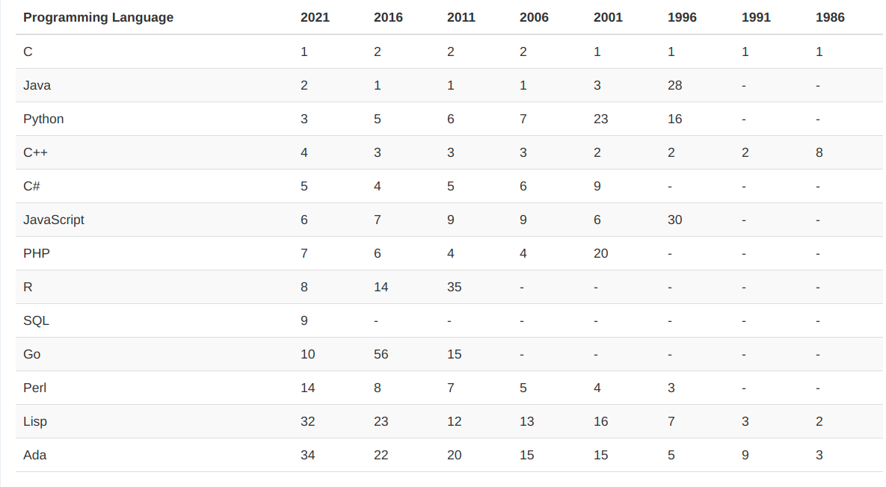

Source: [tiobe.com](https://www.tiobe.com/tiobe-index/)

[Check some of these out!](https://www.tiobe.com/tiobe-index/)

When it comes to "self-service" data analysis, three languages are
mentioned most often: R, Python and SQL. All three have their
relative merits and issues.

I chose R as the programming language for this introductory
course. The choice is partly **personal** and partly
**professional**. Personal: I like it and it's new for me (I only
began to learn it in early 2020), so I am still excited about
it. It's good if your instructor is excited about the material!
Professional: as business professionals, you don't want to have to
be programmers. At the same time, you need to be able to speak with
experts and do and extend your own analyses (not be restricted for
example by dashboards).

On a practical note, R has a very large, diverse user and developer
community. Unlike Python, many of the users do not have a technology
background. This means that the "world of R" is more easily
accessible if digital technologies and programming aren't your main
interests. The SQL community is probably even larger and even more
diverse (databases being a more general interest than even
statistical analysis), but the language SQL itself is hardly
extensible, very focused on querying and less on visualization.

In reality, as a data scientist, or even as a business practitioner
with serious, systematic data analytics interests, you need to know
all of these - R, SQL, and Python. Here, we'll start with R.

For a direct comparison of Python and R for data cleaning and
exploratory analysis with examples, see e.g. [Radecic (2020)](#org748013a), [Uprety
(2020)](#org4993964) and [Shotwell (2020)](#orgb4abaa7). To see how R outperforms Python, see
[Grogan (2020)](#org0a96af9). To see some equivalents of SQL in R, check ODSC
(2018). And for an overview of data science tools beyond Python, R,
and SQL, see [Gallatin (2018)](#org3307e1f). And here's a neat [infographic](https://www.datacamp.com/community/tutorials/r-or-python-for-data-analysis) from
datacamp comparing both for data analysis.

There are downsides to using R as well, of course, and it has been
called "hard to learn", too ([Muenchen 2017](#orgbaec632)), partly and
paradoxically because the language is so flexible and
extensible. Also, some innovations, like the Tidyverse, aren't
necessarily good for beginners ([Matloff 2019](#orge2ab658)).

Of course, there's also always an index - in this case the "TIOBE"
index of programming language popularity (based on the languages
people search for), see figure [6](#org187ce06). As you can see, R improved
its position in one year from 20th to 8th. That's by far the
strongest improvement of any language among the top 10. Still,
Python is three times more search-successful. Neither Python nor SQL
have changed their position compared to one year ago. The popularity
of R quite likely rides on the popularity of statistics due to the
interest in COVID-19 data analysis.

## Matloff's 10 Reasons

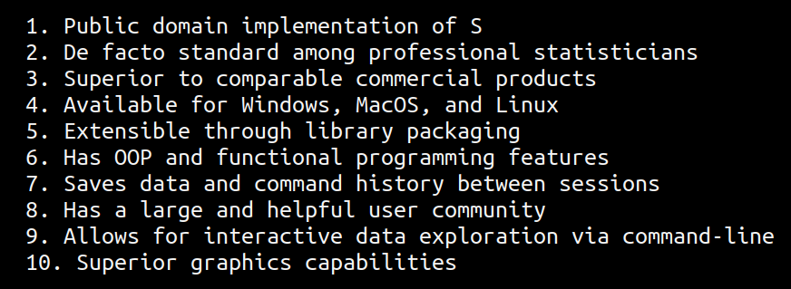

Source: [The Art of R Programming (2011)](https://nostarch.com/artofr.htm)

# Obtaining and installing R from CRAN

URL: <https://cran.r-project.org/mirrors.html>

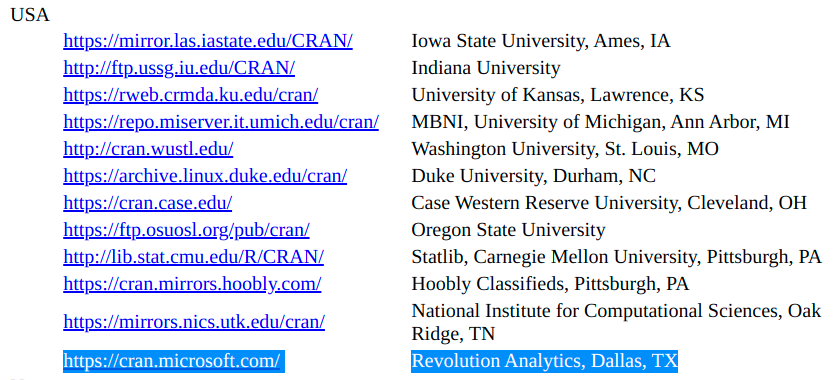

CRAN = Comprehensive R Archive Network

Download the installer for your operating system from your local
CRAN ("**Comprehensive R Archive Network**") mirror here:
<https://cran.r-project.org/mirrors.html>.

For example, if you are in Berlin, the Nürnberg server is closest:
<https://ftp.fau.de/cran/>.

**Challenge:** Which server would you use if you were in Russia?  Does
the download page for that server look any different? Check it out!
[(Hint)](#org3fea25c)

USA: notice that the TX server is at "revolutionanalytics.com",
which used to be another R IDE bought by Microsoft. Microsoft
embraced R so fiercely that they even started their own subset of
it, Microsoft R Open, which you can get from MRAN (Microsoft R
Application Network). **Can you discern the strategy here?** You can
get it by reading [this series of news flashes](https://cloudblogs.microsoft.com/sqlserver/2021/06/30/looking-to-the-future-for-r-in-azure-sql-and-sql-server/) from Microsoft.

**Which other open source related platforms are now Microsoft?**
Answer: GitHub

## How this looks in Windows

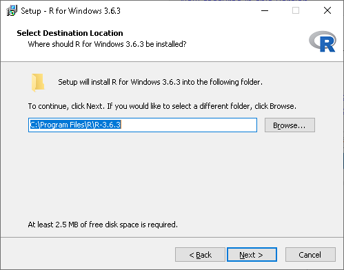

I tried this on a Lenovo laptop running Windows 10 and it worked:

1.  After opening the `R..win.exe` file, a popup asks you if you
    will let this pogram modify your hard disk. Say "yes" (why is
    this necessary?<a id="fnr.1" class="footref" href="#fn.1">1</a>)
2.  In the installation dialog, accept all settings and check the
    options for establishing a desktop shortcut and a quick launch
    icon.
3.  The location of your R program files will be `C:\Program
       Files\R`. Once the installation is finished, you should have an
    icon on your desktop named `Rx64 4.0.2` (or whatever your
    version is).
4.  Double click it to open the R console for the first time. At the
    `>` prompt, type `1+1` and `RETURN` to see if R can
    compute. Then type `demo(graphics)` and hit `RETURN` ("`Enter`")
    repeatedly to see a few R plots.
5.  I also switched from my integrated (default) graphics card to a
    "High Performance NVIDIA" graphics card (which I did not know I
    had!).
6.  To leave, type `q()` at the prompt or leave with the `File >
       Exit` graphical menu. When asked if you wish to save the
    workspace, say "no".
7.  When installing a program, a dialog was opened offering me to
    install packages in a local folder (accept this with "yes").
    
    See [this datacamp blog post (March 11, 2020)](https://www.datacamp.com/community/tutorials/installing-R-windows-mac-ubuntu) for installation
    instruction for Windows, MacOS X and Ubuntu (Linux).
    
    ---
    
    *(If you have other troubles with R + MacOS, let me know. I have a
    Mac available and may be able to figure something out.)*

## How this looks on a Mac

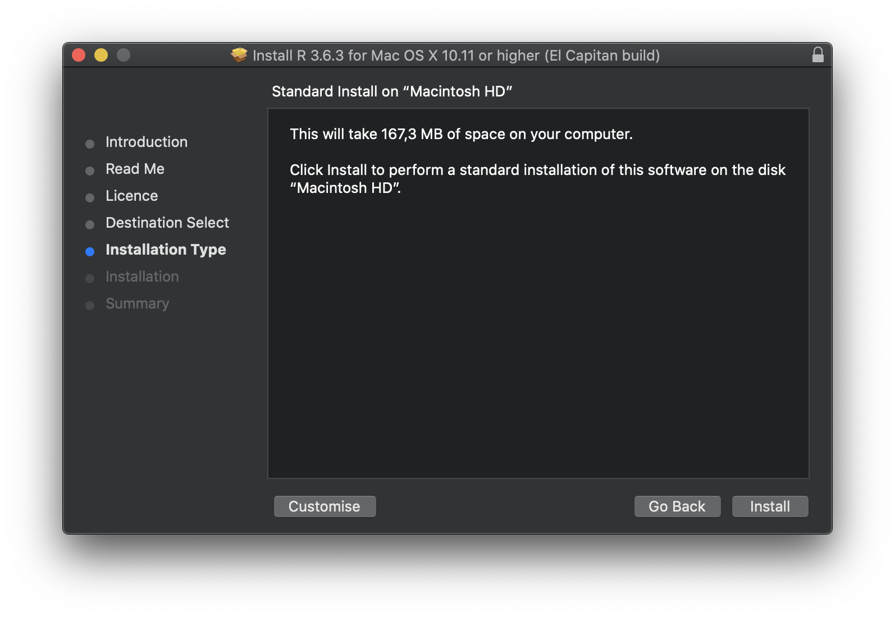

[    New installation & reconfiguration (2020)](https://www.verouden.net/post/2020/04/08/r-installation-macos/)

I did this on a MacMini (2014) running MacOS 10.13.6 without too
many problems (see below). Essentially the only problem occurred
when trying to install packages (discussed later) and I could fix it
easily by changing a system setting.

1.  To download and install R for MacOS, go to `r-project.org`, and

click on `CRAN` right below the `Download` headline. The CRAN
mirror page opens. Scroll down to find a German mirror site and
click to download the `.DMG` installer file, which will install
the program.

1.  There were system-level error messages though the program

installed alright. But I could not install CRAN packages because
of this error: `tar: Failed to set default locale`. This refers
to a problem with the `tar` unzip program. I checked
`stackoverflow.com` and found a fix that in turn directed me back
to a [CRAN helpfile](https://cran.r-project.org/bin/macosx/RMacOSX-FAQ.html#Internationalization-of-the-R_002eapp) with lots (too much, really) information for
Mac users.

1.  To fix the problem, close R, open a terminal and type: ~defaults

write org.R-project.R force.LANG enUS.UTF-8~. Then restart R and
the problem should have disappeared (it did for me and never came
back).

See also [this datacamp blog post (March 11, 2020)](https://www.datacamp.com/community/tutorials/installing-R-windows-mac-ubuntu) for installation
instruction for Windows, MacOS X and Ubuntu (Linux).

---

*(If you have other troubles with R + MacOS, let me know. I have a
Mac available and may be able to figure something out.)*

## Install R now

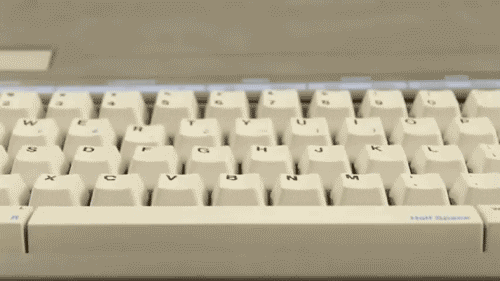

-   Windows people: help each other!
-   MacOS people: help each other!
-   Linux people: help each other!
-   Android/iOS people: bring your laptop

# Opening R for the first time

-   Go to <https://www.r-project.org>
-   Check FAQ and "related projects" pages

In this section, we open R for the first time and look at what
emerges. This won't be much but it's a start. Figure [57](#org50ade75)
shows the logo of the R project.

**Challenge:** go to the [project home page](https://www.r-project.org/). It's quite minimalist by
design. Have a look around, especially check out the [FAQ](http://cran.r-project.org/faqs.html) and the
"[related projects](https://www.r-project.org/other-projects.html)" page, which gives the shortest overview of a
number of R application areas. [(Hint)](#org7589ab3)

## Version and platform

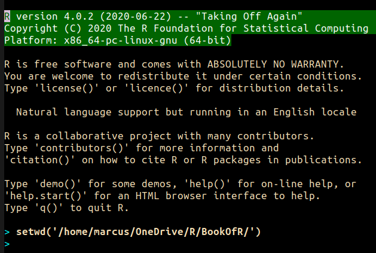

What type of bit-architecture do you have?

This is the first screen you see (figure [63](#orgd6de5eb)) after starting R
on the command-line. The highlighted section shows the current
(June 2020) version of Base-R, as the core R program is officially
called. Versions get their own names, like operating systems (my
Ubuntu Linux operating system e.g. has the version number 18.04-LTS
and the name "Bionic Beaver"). R 4.0.2 is also called "Taking Off
Again". Lastly, the platform of the operating system on which the R
program runs, is shown - a 64-bit version of Linux using the [x86
computer architecture](https://en.wikipedia.org/wiki/X86-64).

**Challenge:** what type of computer architecture does your computer
have (most importantly: 64-bit)? [(Hint)](#org1ac8a9d)

## Distribution license

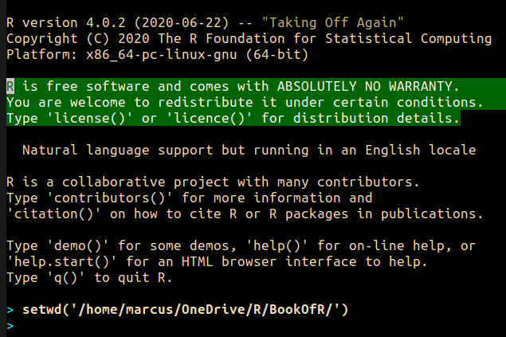

Type `license()`. What is "GNU"?

As you'll find out when following the instructions in figure
[67](#orga29869e) by entering `license()` at the prompt, the R software is
distributed "under the terms of the [GNU General Public License](https://www.gnu.org/licenses/quick-guide-gplv3.html)"
(GPL). Popular software also distributed under the GPL include the
Linux "kernel" (the core of the operating system), and the GNU
compiler collection. You may have heard of the term "open source",
which essentially means the same thing, though one may quibble (and
[people do, a lot](https://opensource.com/article/17/11/open-source-or-free-software)). What's important to remember: use of the GPL (=
making R "free software") has contributed enormously to the success
of this language.

**Challenge:** what is "GNU software" exactly? Which programs belong
to it? Are there any programs that you have used before? [(Hint)](#orgfd33b2f)

## The R project

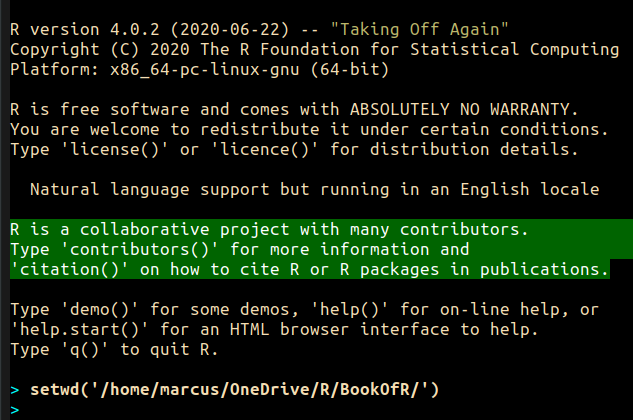

-   Enter `citation()`. Why cite software?
-   Enter `contributors()`. Who can contribute?

Behind R is a large project of volunteers (figure [71](#org861231f). At it
centre is the "R Core Group" of developers. Because R is part of
the "GNU suite" of programs, and because its predecessor was called
S, it is also sometimes called "GNU S". [Becker (2004)](#orgb6fb453) has written
an interesting historical account of S. When using R for analysis
in a thesis, a paper, an essay or a blog post, one should cite it
as a source. This is what the code `citation()` is for. Same goes
for specific packages (more on this later) like "`data.table`" that
are not part of Base-R. The citation alternatives may also prompt
you to check out [`LaTeX`](https://en.wikipedia.org/wiki/LaTeX) and [`BibTeX`](https://en.wikipedia.org/wiki/BibTeX), which are quasi-standards
for the professional (and beautiful!) formatting of scientific
papers.

**Challenge:** is there any connection between R and LaTeX? Or more
general between the programming language R und markup languages
(like HTML or LaTeX)? [(Hint)](#org2c06b7f)

## Demo and help

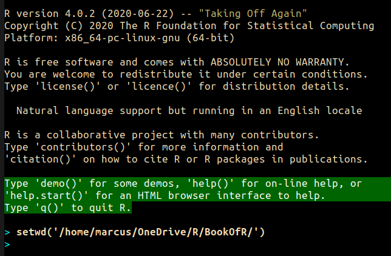

-   Enter `demo(graphics)` and marvel.
-   Enter `help.start()` - where is this page?

The section higlighted in figure [76](#org10f56db) suggests a few commands
that you ought to try for yourself:

`help()` is a function to get help for whatever you put in between
the brackets. A quick win is `help(help)`, or help about the help
function. The format of the help pages is borrowed from the [Unix
man[ual] pages](https://en.wikipedia.org/wiki/Man_page). An alternative to `help()` is `?` followed by the
term you need help with, e.g. `?help`, which is the same as
`help(help)` but much shorter. Lastly, `help.start()` opens a
browser window with help in HTML format. Very useful access to a
wealth of systematic information. If you don't know the exact name,
you can also search across all documentation using `help.search()`
or the shortcut `??`. Try entering `??cars` if you are looking for
datasets on cars. You'll find that there are four known datasets
with cars in different packages.

Via the dataset search, you can also find out that functions like
`help()` or `demo()` are part of the `utils` package - respective
functions are listed as `utils::[function]`. It contains all sorts
of functions for housekeeping and administration.

The R help system is however not written for beginners. Personally,
I more often go to textbooks or, preferably, to stackoverflow.com if
I have a question or need to remind myself of a command or a way of
doing things.

There are a few interactive demo programs available, too. You should
try `demo(graphics)` and marvel at the various possibilities of R to
create plots with your data. Notice how few lines of code are
sufficient to create great effects! The window that opens when you
execute the demo commands is the standard graphics output when using R
in command-line mode.

## Working directory

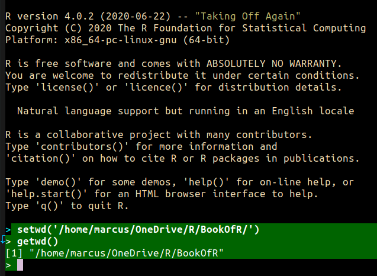

-   Enter `getwd()` ("get working dir")
-   Use `setwd()` to change directory

When you start R, you may be asked, which working directory you wish
to use. This is where all files created (e.g. plots) will be put and
where R will look first to load scripts with R commands for execution.

The [`setwd()`](https://www.rdocumentation.org/packages/base/versions/3.6.2/topics/getwd) command in figure [84](#org3d351ad) allows you to set any
directory as working directory. To check which one is used right
now, you can use [`getwd()`](https://www.rdocumentation.org/packages/base/versions/3.6.2/topics/getwd).

How you specify the path to the current working directory depends on
your operating system, e.g. `/home/marcus` for my home directory on
MacOS/Linux, or `C:\Users\Marcus` under Windows. Especially as a
Windows user, you should look at your file organisation - this will
pay off as soon as you use the terminal or command-line. The Bash
shell that I use on my Linux computer (and that most MacOS users
will use) is also available within Windows 10 [(Posey 2018](#org167ccc8)).

# R "prompt"

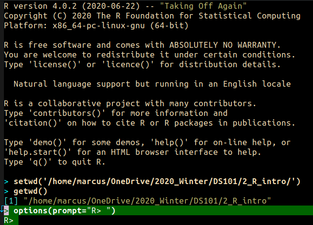

-   Change your prompt to your name
-   Change it back to `"> "`

Figure [90](#org30434f7) shows a new utility command, `options()`, that you
can use to change the identifying prompt at the beginning of the
command line. You don't have to do this but it's nice to know that
and how you can do it. One of the advantages of working on the
command-line is that you experience how you can adapt your working
environment to your personal needs - something that most graphical
environments do not allow you do to (at least not without a lot more
effort). Freedom of extensibility is the name of the command-line
game.

# Computing

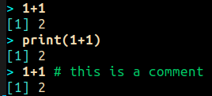

-   Compute "\(2\times2\)" and print it
-   Do it again with a comment (`#`)

One of the advantages of the interactive command-line is the ability
to perform arithmetic operations. In figure [94](#orgae097c2) we begin with
a simple addition. We'll do a lot more of this in the next
section. When you type the command and click `ENTER`, R responds by
printing out the result without the need to explicit instruct it
using a `print` command (though as you can see, this works as
well). You also see here that `#` is the R sign for a comment (which
is ignored upon execution). The ominous `[1]` at the beginning of
each output line indicates the number of columns printed. R does
this because it is strongest when manipulating tabular data - data
ordered in columns and rows.

# R packages

-   Contain functions and data sets
-   Must be installed and loaded for use
    
    

-   Can be created with relative ease
-   Default data sets: `?datasets`

## Install packages

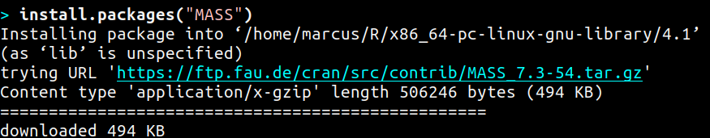

-   install package "`MASS`": enter `install.packages("MASS")`

R packages are collections of functions and datasets that are ready
for you to use. You only have to install them (from repositories
like CRAN), and load them (once they are installed) with
`library()`, as shown in figure [103](#orgb669dd1) for an already installed
package, `MASS`. The ability to create and use packages easily is
one of the main reasons for the popularity of R and an illustration
of its extensibility. Figure [103](#orgb669dd1) also shows the installation
of a package (`ks`) - or rather, only the beginning of the
installation output. Once downloaded, the package needs to be
compiled for your system, which, for large packages, can take
several minutes. A successful installation should end with
`Done([name])`, e.g. `Done(ks)` in the example. Packages are updated
regularly. To update your packages, you need to enter
`update.packages()`. For a short description of a package, use
`packageDescription("[name]"]`. To see all your installed packages,
use `installed.packages()` (this might result in a very long
list). For a listing of all functions and datasets in a package, use
`help(package="[name]")`, e.g. `help(package="MASS")`. To see all
built-in datasets (that come with base-R, the basic R program), enter
`data()`.

See [Alvarez 2019](#org355152d) for a beginner's guide on R packages.

## Check datasets

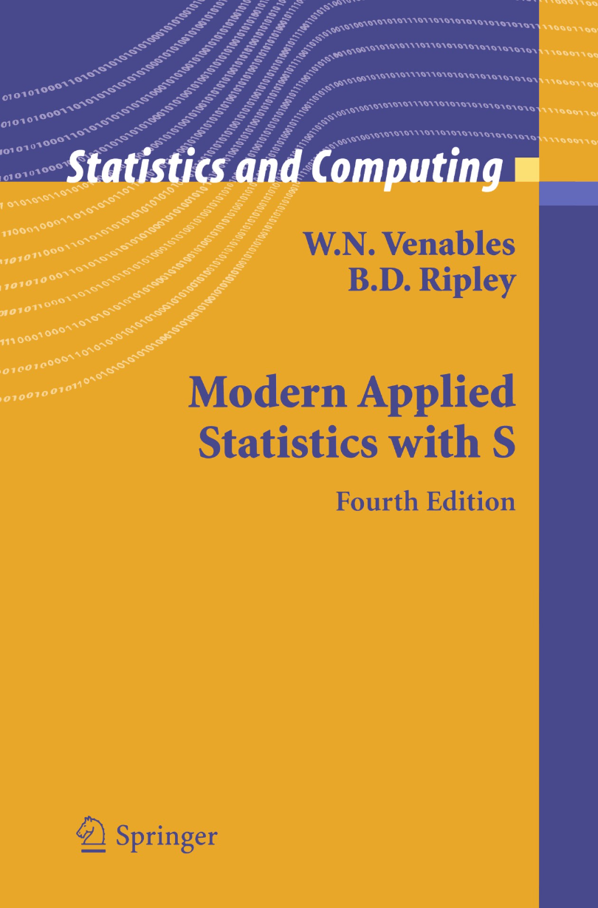

-   Which datasets are in `MASS`?
-   Enter `data(package="MASS")`
    
    

    
    
    "MASS" comes from the title of the book "Modern Applied
    Statistics with S" (freely available [via researchgate.net](https://www.researchgate.net/publication/224817420_Modern_Applied_Statistics_With_S)).
    
    Works for R and for its predecessor S.
    
    »S is a language and environment for data analysis originally
    developed at Bell Laboratories (of AT&T and now Lucent
    Technologies). It became the statisti-cian's calculator for the
    1990s, allowing easy access to the computing power and graphical
    capabilities of modem workstations and personal
    computers. Various implementations have been available, currently
    S-PLUS, a commercial system from the Insightful Corporation1 in
    Seattle, and R,2 an Open Source system writ-ten by a team of
    volunteers. Both can be run on Windows and a range of UNIX /
    Linux operating systems: R also runs on Macintoshes.«
    
    (PDF) Modern Applied Statistics With S. Available from:
    <https://www.researchgate.net/publication/224817420_Modern_Applied_Statistics_With_S>
    [accessed Jul 08 2021].
    
    

## Load package

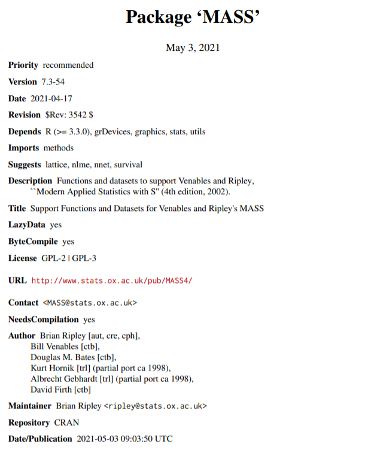

-   Load `MASS` in current R session
-   Enter `library(MASS)`
-   See [documentation](https://cran.r-project.org/package=MASS) @CRAN

## Load dataset

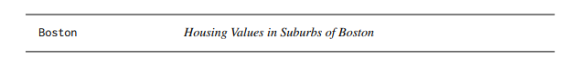

-   Load the data set "`Boston`"
-   What is in `MASS::Boston`?
-   There are [different ways](https://cran.r-project.org/web/packages/MASS/MASS.pdf) to find out!
    
    

    
    
    **Challenge:** how many variables (columns) and observations (rows)
    does the dataset `MASS::Boston` contain? [(Hint)](#orgd75b778)
    
    You can look information up with `?Boston` or look at the data
    directly using `str(Boston)`.
    
    There are more packages than (useful) names. To distinguish between
    functions or datasets with the same name in different packages, the
    `::` operator is used. Check with `??Boston` if another dataset or
    function with that name is installed. (Answer: no.)
    
    

## Explore dataset

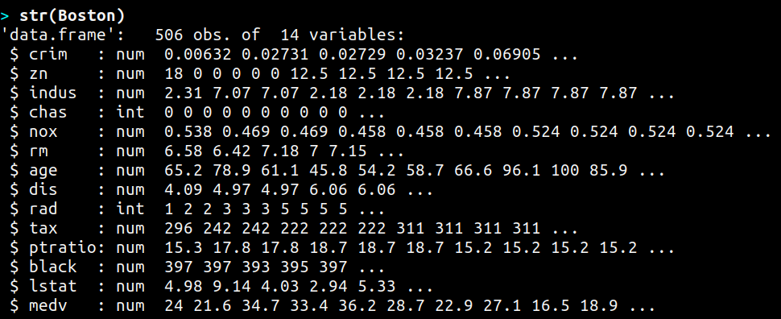

-   Print first/last lines: `head()` / `tail()`
-   Show structure: `str()`

# Leaving R

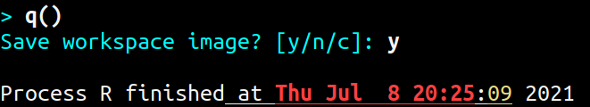

-   Leave R with `q()`
-   Save your workspace with `y`
-   Check which files were created!

To leave R, simply type `quit()` or `q()`. R will now ask you if
you wish to save your workspace. This includes all variables you
may have defined, datasets you may have loaded, and commands you
have typed. In your working directory, R has created files for
these, `.Rhistory` (which is readable) and `.RData` (which is not
readable). Within one R session, you can call all commands stored
in your history using the up and down arrow keys of your keyboard.

## Housekeeping

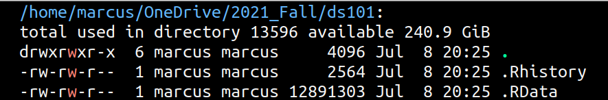

-   Saved R commands: `.Rhistory`
-   Saved R variables: `.RData`
-   R profile settings: `.Rprofile`
-   [Sample profiles](https://stackoverflow.com/questions/1189759/expert-r-users-whats-in-your-rprofile)

In your working directory, R has created files for these, `.Rhistory`
(which is readable) and `.RData` (which is not readable). Within one
R session, you can call all commands stored in your history using
the up and down arrow keys of your keyboard.

## Customize startup

-   Create a file `.Rprofile`:
    
        options(
        repos = c(CRAN = "https://ftp.fau.de/cran/")
        )

-   To check: restart R, re-install `MASS`

# The RStudio IDE

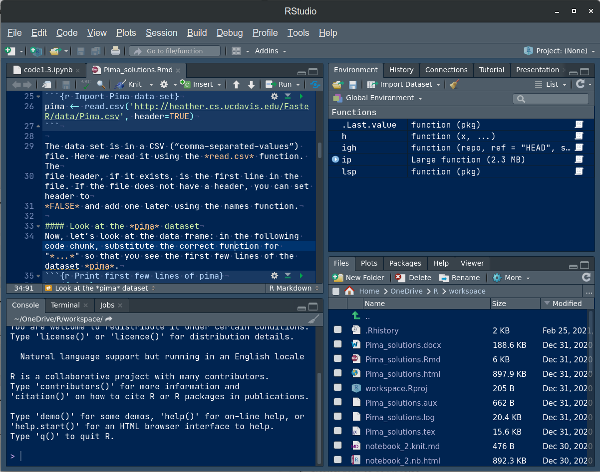

-   Use it at your own [peril](https://moodle.hwr-berlin.de/mod/book/view.php?id=939064&chapterid=8130)!
-   Give [Emacs](https://moodle.hwr-berlin.de/mod/book/view.php?id=939064&chapterid=7712) + ESS a chance!
-   Learn "stick shift" first (=CLI)

# Concept Summary

-   R is an easy to **learn** language to quickly and interactively
    analyse datasets. R is especially strong on visualization.
-   R can be downloaded from `r-project.org` and installed on your
    computer.
-   There is plenty of **help** on R available from within the program, or
    on the Internet using the wider community of practitioners.
-   When you open R, you establish a working **environment**, which
    includes packages, functions and variables.

# Code summary i

<table border="2" cellspacing="0" cellpadding="6" rules="groups" frame="hsides">

<colgroup>
<col  class="org-left" />

<col  class="org-left" />
</colgroup>
<tbody>
<tr>
<td class="org-left">`license()`, `licence()`</td>
<td class="org-left">License info</td>
</tr>

<tr>
<td class="org-left">`help()`, `?help`, `??cars`</td>
<td class="org-left">get help</td>
</tr>

<tr>
<td class="org-left">`demo()`</td>
<td class="org-left">R demos</td>
</tr>

<tr>
<td class="org-left">`getwd()`, `setwd()`</td>
<td class="org-left">get/set working dir</td>
</tr>

<tr>
<td class="org-left">`options(prompt=)`</td>
<td class="org-left">set prompt</td>
</tr>

<tr>
<td class="org-left">`print(1+1)`</td>
<td class="org-left">result of `1+1`</td>
</tr>

<tr>
<td class="org-left">`quit()`, `q()`</td>
<td class="org-left">leave R</td>
</tr>

<tr>
<td class="org-left">`# ...`</td>
<td class="org-left">comment</td>
</tr>
</tbody>
</table>

# Code summary ii

<table border="2" cellspacing="0" cellpadding="6" rules="groups" frame="hsides">

<colgroup>
<col  class="org-left" />

<col  class="org-left" />
</colgroup>
<tbody>
<tr>
<td class="org-left">`library("MASS")`</td>
<td class="org-left">load</td>
</tr>

<tr>
<td class="org-left">`install.packages("MASS")`</td>
<td class="org-left">install</td>
</tr>

<tr>
<td class="org-left">`installed.packages()`</td>
<td class="org-left">list all packages</td>
</tr>

<tr>
<td class="org-left">`update.packages()`</td>
<td class="org-left">update</td>
</tr>

<tr>
<td class="org-left">`packageDescription("MASS")`</td>
<td class="org-left">describe</td>
</tr>

<tr>
<td class="org-left">`help(package="MASS")`</td>
<td class="org-left">show</td>
</tr>

<tr>
<td class="org-left">`data()`</td>
<td class="org-left">built-in datasets</td>
</tr>
</tbody>
</table>

# What next?

## What now? read!

-   Read frequently and widely
-   Go both deep and stay shallow

You've seen that I don't just cite peer-reviewed papers but blog
posts, too. The truth is that I have personally learnt a lot more
from them than from scientific papers. However, this is partly a
function of my experience and skill. Without these, it might be hard
to distinguish what's good and bad - just like when you google any
topic you don't know anything about yet. But even if you're a bloody
beginner, I recommend reading widely and both deeply (with a lot of
focus, e.g. when looking up terms, repeating analyses and retyping
code) and shallowly (skimming articles, reading comments), because
you build an associative network of terms, arguments and
practices. I follow a bunch of data science experts on [Twitter](https://twitter.com/birkenkrahe) for
the same reason. If you do this for any topic that is being
discussed on a factual (rather than an overly political or
emotional) basis, you'll learn more faster<a id="fnr.2" class="footref" href="#fn.2">2</a>.

For example: take a look at "[R Weekly](https://rweekly.org/)" for a weekly, curated
collection of articles from the R community. This will give you an
idea of the spread of information.

## What now? play!

[Data Scientists Should Learn Through Play](https://drkeithmcnulty.com/2020/06/23/data-scientists-should-learn-through-play/)

To understand why you should play (see figure [160](#org9dfce0d)), check the
article by an active blogger and professional in the R-blogosphere,
Keith McNulty, who leads data science at the global strategy
consulting firm McKinsey & Co. He argues that "learning through
playing around" with the software is a good way to learn ([McNulty
2020](#org27bc04f)) - I agree. Though I am often distracted by having to create
teaching material for you, playing around on or off the
command-line, looking at interesting data and combing through them
using the analytical tools R offers, or checking other people's
plots or inferences, is the most fun way of learning R. There's
nothing wrong with reading or working through a course, watching
teaching videos, of course, either.

## What's the next topic?

Arithmetic with R

# Thank you! Questions?

# References

-    Adolfo Alvarez (25 Mar 2019). R Packages: A Beginner's
    Guide. Online: [datacamp.com](https://www.datacamp.com/community/tutorials/r-packages-guide).
-    Robert Becker (2004). A Brief History of S. Online:
    [sas.waterloo.ca](http://sas.uwaterloo.ca/~rwoldfor/software/R-code/historyOfS.pdf).
-    Tilman M. Davies (2016). [The Book of R. No Starch Press.](https://nostarch.com/bookofr)
-    Kyle Gallatin (1 Nov 2018). Some Important Data
    Science Tools that aren’t Python, R, SQL or Math. Online:
    [towardsdatascience.com](https://towardsdatascience.com/some-important-data-science-tools-that-arent-python-r-sql-or-math-96a109fa56d).
-    Michael Grogan (23 Jul 2020). How R Still Excels
    Compared To Python. Online: [towardsdatascience.com.](https://towardsdatascience.com/ways-r-still-excels-compared-to-python-34835e6071ee)
-    Knuth D (1992). [Literate Programming](http://www.literateprogramming.com/knuthweb.pdf). Stanford, Center
    for the Study of Language and Information Lecture Notes 27.
-    Norman Matloff (2019). TidyverseSceptic. Online:
    [github.com](https://github.com/matloff/TidyverseSkeptic).
-    Keith McNulty (23 Jun 2020). Data Scientists Should
    Learn Through Play. Online: [drkeithmcnulty.com](https://drkeithmcnulty.com/2020/06/23/data-scientists-should-learn-through-play/).
-    Robert A. Muenchen (2017). Why R is Hard to
    Learn. Online: [r4stats.com](http://r4stats.com/articles/why-r-is-hard-to-learn/).
-    Brien Posey (5 Feb 2018). How To Navigate the File
    System in Windows 10's Bash Shell. Online: [redmondmag.com](https://redmondmag.com/articles/2018/02/05/navigate-bash-file-system.aspx).
-    Dario Radecic (10 Sept 2020). Trying R for the First
    Time. Online: [towardsdatascience.com](https://towardsdatascience.com/ive-tried-r-for-the-first-time-how-bad-was-it-ba344f22e90b).
-    Gordon Shotwell (30 Dec 2019). Why I use R. Online:
    [blog.shotwell.ca](https://blog.shotwell.ca/posts/why_i_use_r/).
-    Sagar Uprety (23 Jul 2020). Data Cleaning and
    Exploratory Analysis in Python and R. Online: [towardsdatascience.com](https://towardsdatascience.com/data-cleaning-and-exploratory-analysis-in-python-and-r-608de56124e2).
-    Yuleng Zeng (28 Aug 2018). An Introduction to R and
    LaTeX. Online: [bookdown.org](https://bookdown.org/Yuleng/introrlatex/).

# Solutions to the challenges

## Download from CRAN

 [Mirror sites](https://en.wikipedia.org/wiki/Mirror_site) are called that way because they are actual
identical copies of the original site. The quality of the cloned
page is monitored. [The result looks interesting](https://cran.r-project.org/mirmon_report.html) (to me). You can
see how well maintained a particular mirror site is.

## Opening R for the first time

 The projects listed here (by no means a complete
list!) are divided in applications and infrastructure
projects. **Applications** of R include bioinformatics (e.g. in the
medical sciences or in genomics), geospatial statistics (anything
related to maps), and finance (R is strong with this
one!). **Infrastructure** includes incorporation of R in Wikis (like
Wikipedia) - for example to generate plots on the fly - and ESS
("Emacs Speaks Statistics"), which is the interface to the
extensible text editor that I'm using (e.g. to create all
documentation for this course - essentially from one text file). An
alternative to ESS is the highly popular IDE (Integrated
Development Environment) RStudio. We will not be using it in this
course but I encourage you to check it out, try it and see if you
like it, especially if my teaching tempo is too slow for you!

## Version and platform

 See here to find out details of your CPU and computer architecture
for [Windows](https://www.howtogeek.com/413942/how-to-see-what-cpu-is-in-your-pc-and-how-fast-it-is/) or [MacOS](https://www.macworld.com/article/3393161/how-to-check-if-mac-software-is-32-or-64-bit.html).

## Distribution license

 Go to [GNU Software](https://www.gnu.org/software/software.html) to see a list of all programs
distributed under the GPL. These programs constitute the GNU system
of free software. Looking through the list, I noticed the following
programs that I have used: Chess (chess game implementation), Emacs
(extensible text editor that I am using in this very moment), Gimp
(image manipulation), Gnome (desktop for my operating system,
Ubuntu Linux), and so on&#x2026;425 programs are listed here alone (29
Aug 2020).

## The R Project

 There is no special connection between LaTeX and R,
except that both are free software programs, one for formatting
(especially when mathematical formulas need to be presented), the
other one for statistical calculations and visualisation. However,
to communicate data analysis results and to make the analysis
process itself reproducible, a combination between these two goals
(formatting/programming) is desirable. This is exactly what
"literate programming" ([Knuth 1984](#orgc894a7d)) does. There is also a program called "R
Markdown" to create documents that enables you e.g.  to created
HTML, PDF, ePUB and Kindle books with only one source. You can find
examples at [bookdown.org](https://bookdown.org/). See also [Zeng (2018)](#org7bd0acd) for a brief
introduction to both R and LateX - sufficient to get started -
written apparently as a minimal example for bookdown. For LaTeX
there are also cloud editors like [overleaf.com](https://www.overleaf.com/).

## R Packages

 You can directly search for this dataset - I usually
take the search string "`r doc [name]`, in this case `r doc MASS
   boston`, which gets me straight [to this page](https://www.rdocumentation.org/packages/MASS/versions/7.3-52/topics/Boston). At the top, you can
read that "The `Boston` data frame has 506 rows and 14
columns". There's also an R Notebook, which shows various aspects
of this dataset.

Another way to find the answer is by using the command `str()` that
you already know: `str(Boston` contains the answer in the first
line - as long as `MASS` has been loaded. (Check out what happens
if not by closing the R session with `q()` (don't save the
workspace) and reopening it again.

The simplest way is to type `help(Boston)` (again, only after
loading the `MASS` package).

# Footnotes

<a id="fn.1" href="#fnr.1">1</a> To open the R console, and direct plots to the correct device,
the R program needs to be "plugged into" your operating system, as it
were. You could still run it otherwise but e.g. you'd have to always
type the exact program path.

<a id="fn.2" href="#fnr.2">2</a> Data science is a mixed affair when it comes to this last tip:
because of the importance of statistics and models for COVID-19,
public discussions e.g. on Twitter are often instantly politicized and
emotionally charged. However, to be able to navigate these waters and
still extract the common good, is an important ability that is, for
me, also part of "data literacy". Learning how to read and discern
different views, focus on facts and problem-solving, while not
ignoring the wider problem setting, is my working definition of the
scientific method.
