# WHAT WILL YOU LEARN?

-   Perform basic numerical operations
-   Translate complex mathematical formulas
-   Use logarithms and exponentials
-   Brush up on mathematical E-notation
-   Know R's special numbers
-   Understand logical values and operators

**Sources:** Some material for this lesson comes from [Davies (2016)](#org3fa4e6c)
and [Matloff (2020)](#orge946f2e). These and other sources have been important to
me in preparing the course. Check them out for a more systematic
treatment of R. There is also a more philosophical, personal view on
my use of sources [in the Wiki](https://github.com/birkenkrahe/ds101/wiki/Why-R,-my-path,-DataCamp) for the 2020 version of this course.

**What is this?** When we say "Arithmetic", we don't mean that
we "study" numbers but that we use them to perform
computations. After this section, you'll be able to perform any
arithmetic operation using R.

We will look at operators first, then at simple but important
functions that occur again and again, especially in statistics.

**How can you learn better?** This presentation consists mostly of text and
code chunks. Because this is dry stuff, I urge you (both if you hear
this in class, and if you work through this on your own) to open an
R session on the side and type along - this will build muscle memory
and keep you entertained, too! Another trick, which you will find in
[Matloff's text](#orge946f2e), is to make your own little exercises by varying the
instructions.

# ARITHMETIC OPERATORS

1.  Parentheses: `()`
2.  Exponentiation: `^` or `**`
3.  Multiplication: `*`
4.  Division: `/`
5.  Addition: `+`
6.  Subtraction: `-`

In R, standard mathematical rules apply. The order of operators is
as usual - left to right, parentheses, exponents, multiplication,
division, addition, subtraction (PEMDAS = Please Excuse My Dear
Aunt Sally) mnemonic).

The operators `^` and `**` for exponentiation are identical, though
`^` is more common. You can check that in the R console with the
`identical` function - the result should be `TRUE` (this is a truth
or Boolean value - more on this below) - see figure

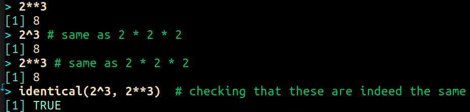

## Formula translator I

-   What is the result of this expression?
-   Compute in your head first
-   Then check in the R console

**Challenge:**
What's the result of the following expression?

\begin{equation}
\label{eqn:1}
  24+6/3\times5\times2^3-9
\end{equation}

Compute (\ref{eqn:1}) in your head first, then in the R console!

Let's look at more complicated expressions than this one.

## FORMULA TRANSLATOR I

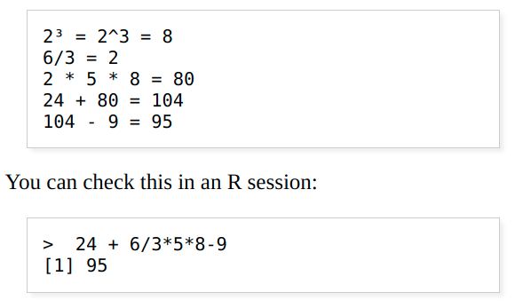

-   Remember the PEMDAS order
-   Instead of `^` you can use `**`

## FORMULA TRANSLATOR II

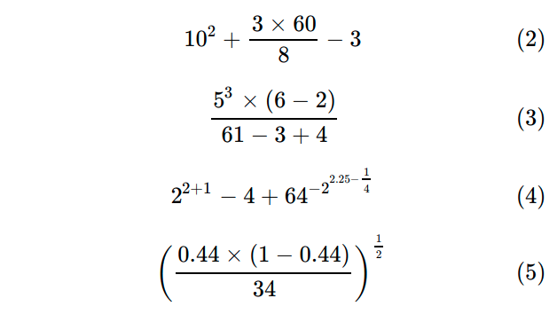

-   Compute the expressions (2)-(5)
-   Use the R console

\begin{equation}
\label{eqn:2}
10^2 + \frac{3 \times 60}{8} - 3
\end{equation}

\begin{equation}
\label{eqn:3}
\frac{5^3 \times \left(6-2\right)}{61-3+4}
\end{equation}

\begin{equation}
\label{eqn:4}
2^{2+1}-4+64^{-2^{2.25-\frac{1}{4}}}
\end{equation}

\begin{equation}
\label{eqn:5}
\left(\frac{0.44 \times\left(1-0.44\right)}{34}\right)^\frac{1}{2}
\end{equation}

**Challenge**: compute the expressions in the equations
(\ref{eqn:2}) &#x2013; (\ref{eqn:5}) using R.

Even if you don't code functions yourself, you may need to know
these things if you have to check someone else's function, e.g. when
the return values seem strange to you.

## Formula Translator II

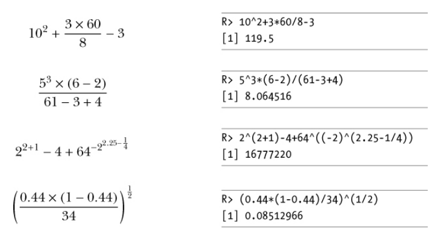

-   You need parentheses in the exponent
-   \(-2\) is interpreted as `-1 * 2`
-   What does `(-1)^(1/2)` return?

When you use R, you'll often have to translate a formula into
code. Consider the formulas (\ref{eqn:2}) &#x2013; (\ref{eqn:5}),
which seem pretty complicated: the only trick here is that you
often need to use parentheses, e.g. around calculations in the
exponent, or when calculating with negative numbers in
eq. (\ref{eqn:4}), because the number \(-2\) e.g. is interpreted by R
as the operation `-1 * 2`.

Complex numbers? Last term, Lea S. solved my personal puzzle
(thanks!), the "`NaN`" result, which is also "[The Math Problem That
Broke the Westworld Simulation](https://www.menshealth.com/entertainment/a31782879/square-root-negative-one-westworld/)" (the 2019 AI TV
mini-series). Basically, R will hand you a "Not A Number" whenever
you try to, e.g. take the square root of a negative number (try
`sqrt(-1)` or `(-1)^(1/2))`. We won't need complex numbers in this
course, but (of course) there are functions to handle them ([see
here](https://stat.ethz.ch/R-manual/R-devel/library/base/html/complex.html)).

# Mathematical functions

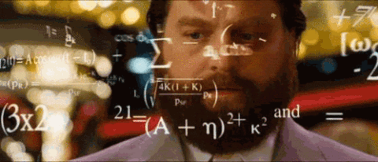

<table border="2" cellspacing="0" cellpadding="6" rules="groups" frame="hsides">

<colgroup>
<col  class="org-left" />
</colgroup>
<tbody>
<tr>
<td class="org-left">`?sqrt`</td>
</tr>

<tr>
<td class="org-left">`?log10`</td>
</tr>

<tr>
<td class="org-left">`?exp`</td>
</tr>

<tr>
<td class="org-left">`?pi`</td>
</tr>
</tbody>
</table>

## LOGARITHMIC Transformation

 and with (right) logarithmic transformation (Source: [R Graph Gallery](https://www.r-graph-gallery.com/line-plot-log-scale.html))")

See also: [The Economist/Off The Charts 04/20/2021](https://view.e.economist.com/?qs=d55c97a1de83b95ad1aa9d756a88fafe97cb7fc75d8e405bd20caf999b5f482d71a7106eb82724938a8ff8a420c219a05b9b132f0e969760ea83e57c2668331e133e24432173498d2cd548123781e419)

It is often necessary to transform numerical data, e.g. transforming
data using the logarithm leading e.g. from the left to the right
graph in the figure. As you can see, this transformation
leads to a compression of the `y`-values, so that more of
these values can be shown.

The *logarithm* of a number \(x\) is always computed using a *base*
\(b\). In the diagram, \(b=10\), the numbers on the \(x\) axis
were transformed using the `log()` function, the logarithm with base
\(10\). The logarithm of \(x=100\) to the base \(10\) is \(2\), because
\(10^2 = 100\). In R, `log(x=100,b=10) = 2` (try this yourself!).

`log10(1e7)`

`log10(100)` `log10(1000)` `log10(1e3)`

`log(1) = log10(1) = 0`

`log(x=100,b=100) = log(4.583,4.583) = 1`

`log(x=100,b=10) = log(b=10,x=100) = 2`

## Logarithm rules

-   Argument `x` and base `b` must be positive
-   \(\forall x\): `log(x,b=x)=1` since only \(x^1=x\)
-   \(\forall b\): `log(x=1,b)=0` since \(b^0=1\)

## Logarithm puzzles

-   Compute \(log_{10}(10,000,000)\) in R
-   Enter `log10(10,000,000)` in R
-   Find the logarithm with base \(10\) for \(10,000,010\).
-   Why is the result the same as before?
-   Check: enter `log10(10000100)`
    
    

    
    
    (1) The error in the first line results from the fact that in R
    functions, the comma separates arguments, so it looks to R as if
    3 arguments were provided where only one is required, because,
    unlike the function `log()`, `log10()` already has a fixed base
    `b=10`. This is fixed in the next line.
    
    (2) The trouble with the seemingly identical results of
    `log10(10000010)` and `log10(10000000)` lies in the suppression
    of digits. This can be fixed with the `options()` utility
    function, which we met in an earlier lecture. After setting
    `options(digits=10)`, the missing numbers appear.
    
    (3) Typing `log10(10000100)` would have revealed the problem,
    because this result can be shown with the default number of
    digits (`7`).
    
    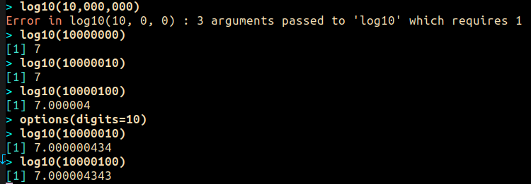
    
    

## Exponential function

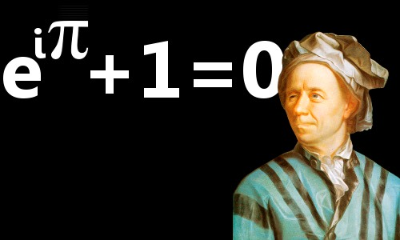

-   \(log(x)\) implies \(b=e\approx{2.7182}\)
-   Verify for \(x=10\),\(x=2.718282\),\(x=0\):

\begin{equation}
       \label{eqn:e}
       e^{ln(x)} = ln(e^x)=x
\end{equation}

In mathematics, the *Euler constant* \(e\) is as magical as the other
mysterious constants \(\pi\), \(0\), \(1\) and \(i\) (the imaginary
unit). There are [different ways](https://en.wikipedia.org/wiki/E_(mathematical_constant)) to arrive at its value of
approximately \(2.718282\).

For now, we only care about the fact that \(e\) is the base of the
natural logarithm, denoted as \(ln\) or \(log_e(x)\). Remember this:

## Logarithm rules

-   Argument `x` and base `b` must be positive
-   \(\forall x\): `log(x,b=x)=1` since only \(x^1=x\)
-   \(\forall b\): `log(x=1,b)=0` since \(b^0=1\)

## Logarithm puzzles

-   Compute \(log_{10}(10,000,000)\) in R
-   Enter `log10(10,000,000)` in R
-   Find the logarithm with base \(10\) for \(10,000,010\).
-   Why is the result the same as before?
-   Check: enter `log10(10000100)`
    
    

    
    
    (1) The error in the first line results from the fact that in R
    functions, the comma separates arguments, so it looks to R as if
    3 arguments were provided where only one is required, because,
    unlike the function `log()`, `log10()` already has a fixed base
    `b=10`. This is fixed in the next line.
    
    (2) The trouble with the seemingly identical results of
    `log10(10000010)` and `log10(10000000)` lies in the suppression
    of digits. This can be fixed with the `options()` utility
    function, which we met in an earlier lecture. After setting
    `options(digits=10)`, the missing numbers appear.
    
    (3) Typing `log10(10000100)` would have revealed the problem,
    because this result can be shown with the default number of
    digits (`7`).
    
    
    
    

## Exponential function

-   \(log(x)\) implies \(b=e\approx{2.7182}\)

-   Verify for \(x=10\),\(x=2.718282\),\(x=0\):

\begin{equation}
       \label{eqn:e}
       e^{ln(x)} = ln(e^x)=x
\end{equation}

In mathematics, the *Euler constant* \(e\) is as magical as the other
mysterious constants \(\pi\), \(0\), \(1\) and \(i\) (the imaginary
unit). There are [different ways](https://en.wikipedia.org/wiki/E_(mathematical_constant)) to arrive at its value of
approximately \(2.718282\).

For now, we only care about the fact that \(e\) is the base of the
natural logarithm, denoted as \(ln\) or \(log_e(x)\). Remember this:

(1) In R, if you don't specify the base \(b\), \(log(x)\) implies
`b=e`. To use another value than \(e\), you must set the base. \(10\)
is a frequently needed base so it has its own function, \(log10()\).

(2) The inverse of the natural log is the exponential function
\(e^x\), or `exp(x)` in R:

\begin{equation}
\label{eqn:e}
  e^{ln(x)} = ln(e^x)=x
\end{equation}

**Challenge:** verify equation (\ref{eqn:e}) for different values of
\(x\), e.g. \(x=10, x=2.718282, x=0\) using the R console.

Many statistical methods use logarithm and exponential function,
see e.g. the definition of the [normal (or Gaussian) distribution](https://en.wikipedia.org/wiki/Normal_distribution) or
"bell curve".

## Constants

-   `pi` (\(\pi \approx 3.14\))
-   `LETTERS` and `letters`
-   `month.name` and `month.abb`
-   What about Euler's number \(e\)?

# E-notation

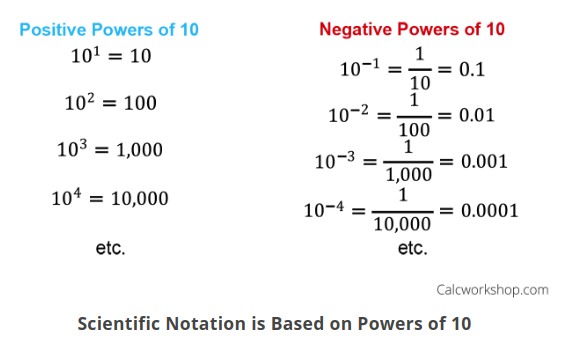

You already know that the number of digits that is displayed by R
can be changed using the `options()` utility function. The default
number of digits displayed is \(7\).

In order to display values with many more digits than that - either
very large, or very small numbers, we use the scientific or
e-notation. In this notation, any number is expressed as a multiple
of \(10\).

## Examples

<table border="2" cellspacing="0" cellpadding="6" rules="groups" frame="hsides">

<colgroup>
<col  class="org-left" />
</colgroup>
<tbody>
<tr>
<td class="org-left">\(10\,000 = 10\times10\times10\times10\times10=1\times10^5 =\) `1eR+05`</td>
</tr>

<tr>
<td class="org-left">`7.45678389e12` = \(7.45678389\times10^{12}\) = \(745.678389\times10^{10}\)</td>
</tr>

<tr>
<td class="org-left">\(e\) `= 271828182845e-11` \(= 271828182845\times10^{-11}\)</td>
</tr>
</tbody>
</table>

## Be the computer!

-   Enter \(100\,000\,000\)
-   Enter \(0.00000000000000010\)
-   Enter `exp(1000)` and `(-1)/0`
-   Enter `sqrt(-1)`

Let's look at some examples:

\(10\,000 = 10\times10\times10\times10\times10=1\times10^5\), shown
in R as `1e+05`.

`7.45678389e12` is the same as \(7.45678389\times10^{12}\) and the
same as \(745.678389\times10^{10}\).

\(e\) `= 271828182845e-11` \(= 271828182845\times10^{-11}\)

To get from the e-notation with exponent \(y\) or \(-y\) to the
complete number of digits, simply move the decimal point by \(y\)
places to the right or to the left, resp.

No information is lost even if R hides digits; e-notation is purely
to improve readability. Extra bits are stored by R

`Inf`, `-Inf` and `NaN` are special numbers.

# Math help in R

-   `?Arithmetic`
-   `?Math`
-   `?Comparison` etc.

# To infinity and beyond

## Special numbers

-   `Inf` for positive infinity (\(\infty\))
-   `-Inf` for negative infinity (\(-\infty\))
-   `NaN` for "not-a-number" (not displayable)
-   `NA` for "not available" (missing value)

`NA` values are especially important when we clean data and must
remove missing values. There are Boolean (logical) functions to test
for special values.

Missing values can be created easily by doing "forbidden" stuff. An
example is trying to compute the square root of a negative number,
e.g. `(-2)^(1/2)`. The result is a complex number (in this case the
solution to the quadratic equation \(x²+1=0\), called the imaginary
number \(i\)). You can also use the function `is.na` to test for
missing values: compute `is.nan(sqrt(-1))` for example.

## Be the computer!

<table border="2" cellspacing="0" cellpadding="6" rules="groups" frame="hsides">

<colgroup>
<col  class="org-left" />

<col  class="org-left" />
</colgroup>
<tbody>
<tr>
<td class="org-left">`Inf+1`</td>
<td class="org-left">`Inf-1`</td>
</tr>

<tr>
<td class="org-left">`Inf/Inf`</td>
<td class="org-left">`Inf-Inf`</td>
</tr>

<tr>
<td class="org-left">`NA`</td>
<td class="org-left">`NA+NA`</td>
</tr>

<tr>
<td class="org-left">`NaN`</td>
<td class="org-left">`NaN+NaN`</td>
</tr>
</tbody>
</table>

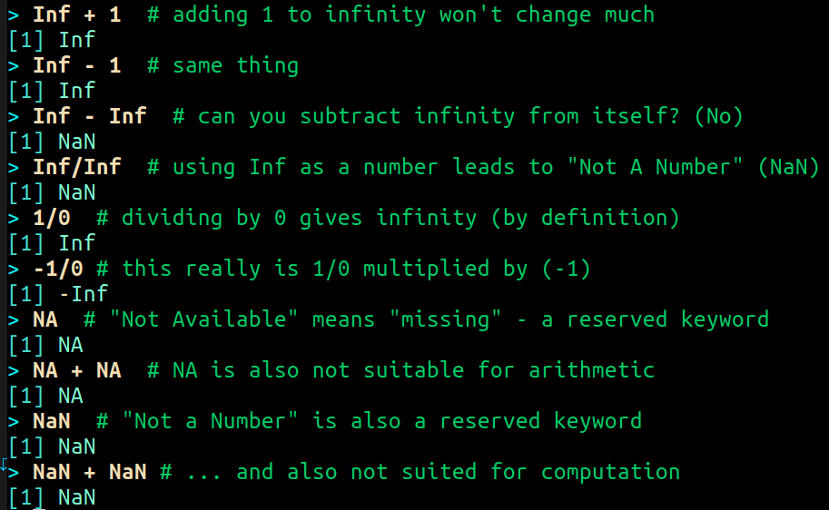

## Special functions

<table border="2" cellspacing="0" cellpadding="6" rules="groups" frame="hsides">

<colgroup>
<col  class="org-left" />

<col  class="org-left" />
</colgroup>
<tbody>
<tr>
<td class="org-left">`is.finite(Inf)`</td>
<td class="org-left">`is.infinite(Inf)`</td>
</tr>

<tr>
<td class="org-left">`is.finite(NA)`</td>
<td class="org-left">`is.na(NA)`</td>
</tr>

<tr>
<td class="org-left">`is.nan(NaN)`</td>
<td class="org-left">`is.nan(NA)`</td>
</tr>
</tbody>
</table>

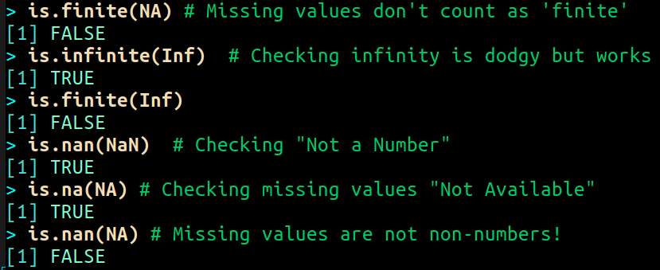

## Be the computer!

-   Enter `10^309`
-   Subtract \(\sqrt{2}^{2}\) from \(2\)
    
    

    
    
    (1) `10^309` is `Inf`. The last number is infinite, because the
    largest number that can be represented by a 64-bit computer is
    \(1.7976931348623157e+308\).
    
    (2) Subtract `sqrt(2)^2` from `2`. The
    answer is: `4.440892e-16`.
    
    

# Logical values and operators

`TRUE` and `FALSE` are reserved in R for logical values, and the
variables `T` and `F` are already predefined. This can cause
problems, because these variable names are not reserved, i.e. you
can redefine them. So better stay away from saving time by using the
short versions of these values.

## Be the Computer!

<table border="2" cellspacing="0" cellpadding="6" rules="groups" frame="hsides">

<colgroup>
<col  class="org-left" />

<col  class="org-left" />
</colgroup>
<tbody>
<tr>
<td class="org-left">`T`</td>
<td class="org-left">`= TRUE`</td>
</tr>

<tr>
<td class="org-left">`F`</td>
<td class="org-left">`= FALSE`</td>
</tr>

<tr>
<td class="org-left">`T <- FALSE`</td>
<td class="org-left">`=> ?`</td>
</tr>

<tr>
<td class="org-left">`F <- TRUE`</td>
<td class="org-left">`=> ?`</td>
</tr>
</tbody>
</table>

[Cotton (2013)](#org52c7a13) calls R's logic "Troolean" logic, because besides the
so-called Boolean values `TRUE` and `FALSE`, R also has a third
logical value, the "missing" value, `NA`

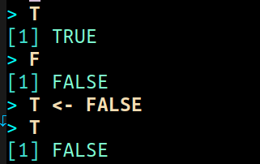

## Logical operators

There are three logical operators in R:

<table border="2" cellspacing="0" cellpadding="6" rules="groups" frame="hsides">

<colgroup>
<col  class="org-left" />

<col  class="org-left" />
</colgroup>
<tbody>
<tr>
<td class="org-left">`!` for "*not*":</td>
<td class="org-left">`1 != 1`</td>
</tr>

<tr>
<td class="org-left">`&` for "*and*":</td>
<td class="org-left">~(1==1)&(1==2)</td>
</tr>

<tr>
<td class="org-left">&vert; for  "*or*":</td>
<td class="org-left">(1==2)&vert;(1!=1)</td>
</tr>
</tbody>
</table>

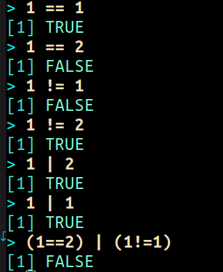

In the last command, we generated a `FALSE` value by comparing two
`FALSE` values, which is the only way to make an `|` statement `FALSE`.

## Be the Computer!

<table border="2" cellspacing="0" cellpadding="6" rules="groups" frame="hsides">

<colgroup>
<col  class="org-left" />
</colgroup>
<tbody>
<tr>
<td class="org-left">`sqrt(2)^2`</td>
</tr>

<tr>
<td class="org-left">`sqrt(2)^2 == 2`</td>
</tr>

<tr>
<td class="org-left">`all.equal(sqrt(2)^2, 2)`</td>
</tr>

<tr>
<td class="org-left">`identical(sqrt(2)^2, 2)`</td>
</tr>
</tbody>
</table>

Comparing non-integers is iffy, because non-integers
(floating-point numbers) are only an approximation of the "pure",
real numbers - how accurate they are depends on the architecture of
your computer. In practice, this means that rounding errors can
creep in your calculations, leading to wildly wrong answers. [The R
FAQ has an own entry about it](https://cran.r-project.org/doc/FAQ/R-FAQ.html#Why-doesn_0027t-R-think-these-numbers-are-equal_003f). The figure shows a simple example:
`sqrt(2)^2` and `2` should be the same, but they aren't as far as R
is concerned - a logical comparison with `==` gives `FALSE`. To
test near equality (bar rounding errors), you can use the function
`all.equal`. To test for exact equality, use `identical`:

**CHALLENGE:** (1) Check the help pages `?all.equal` and
`?identical`. (2) Which of these numbers are infinite? `0`, `Inf`,
`-Inf`, `NaN`, `NA`, `10^308`, `10^309`. (3) How small is the
rounding error in the example in the figure actually?

# Concept summary

-   In R mathematical expressions are evaluated according to the
    PEMDAS rule.
-   The natural logarithm \(ln(x)\) is the inverse of the exponential
    function \(e^x\).
-   In the scientific or e-notation, numbers are expressed as positive
    or negative multiples of \(10\).
-   Each positive or negative multiple shifts the digital point to the
    right or left, respectively.
-   Infinity `Inf`, not-a-number `NaN`, and not available numbers `NA`
    are special values in R.

# Code summary

<table border="2" cellspacing="0" cellpadding="6" rules="groups" frame="hsides">

<colgroup>
<col  class="org-left" />

<col  class="org-left" />
</colgroup>
<thead>
<tr>
<th scope="col" class="org-left">CODE</th>
<th scope="col" class="org-left">DESCRIPTION</th>
</tr>
</thead>

<tbody>
<tr>
<td class="org-left">`log(x=,b=)`</td>
<td class="org-left">logarithm of `x`, base `b`</td>
</tr>

<tr>
<td class="org-left">`exp(x)`</td>
<td class="org-left">\(e^x\), exp[onential] of \(x\)</td>
</tr>

<tr>
<td class="org-left">`is.finite(x)`</td>
<td class="org-left">tests for finiteness of `x`</td>
</tr>

<tr>
<td class="org-left">`is.nan(x)`</td>
<td class="org-left">checks if `x` is not-a-number</td>
</tr>

<tr>
<td class="org-left">`is.na(x)`</td>
<td class="org-left">checks if `x` is not available</td>
</tr>

<tr>
<td class="org-left">`all.equal(x,y)`</td>
<td class="org-left">tests near equality</td>
</tr>

<tr>
<td class="org-left">`identical(x,y)`</td>
<td class="org-left">tests exact equality</td>
</tr>

<tr>
<td class="org-left">`1e2`, `1e-2`</td>
<td class="org-left">\(10^{2}=100\), \(10^{-2}=\frac{1}{100}\)</td>
</tr>
</tbody>
</table>

# Thank you! Questions?

## REFERENCES

 Richard Cotton (2013). [Learning R.](http://duhi23.github.io/Analisis-de-datos/Cotton.pdf) O'Reilly Media.

 Tilman M. Davies (2016). [The Book of R. (No Starch Press).](https://nostarch.com/bookofr)

 Rafael A. Irizarry (2020). [Introduction to Data
Science](https://rafalab.github.io/dsbook/) (also: CRC Press, 2019).

 Norman Matloff (2020). [fasteR: Fast Lane to Learning R!](https://github.com/matloff/fasteR).

