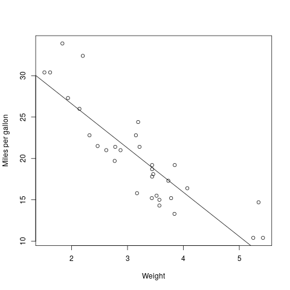

# What will you learn?

-   Preview of important data structures
-   Vectors and scalars
-   Character strings
-   Matrices
-   Lists
-   Data Frames
-   Classes
-   Extended example

# Overview

# Vectors and scalars

## Vectors

-   Storage modes: check `?mode`
-   Functions: `mode`, `storage.mode`, `typeof`
-   E.g. `numeric` (`double` or `integer`)
-   Create a numeric vector of three elements!

    x <- c(1,2,3)  # integer
    y <- rnorm(3)  # double
    z <- 1:3       # integer
    
    ## print all three
    x; y; z
    
    ## check mode
    mode(x)
    storage.mode(x)
    typeof(x)
    
    ## check mode
    mode(y)
    storage.mode(y)
    typeof(y)
    
    ## check mode
    mode(z)
    storage.mode(z)
    typeof(z)

## Scalars

-   There are no scalars (numbers)
-   Scalars are one-element vectors
-   How could you show that?

    s <- 1
    s # prints vector of length 1
    
    ## change rownumber display
    Nile[1:17]
    options(width=100)
    Nile[1:17]

# Character strings

-   Single-element vectors of mode `character`
-   Assign `x <- letters[1:3]` and print `x`
-   Check the mode of `x`

    x <- letters[1:3]
    x
    mode(x)

## String manipulation

-   Create one numeric, two character vectors
-   Concatenate character vectors with `paste`
-   Split character vector with `strsplit`

    ## define vectors
    x <- c(5,12,13)  # create numeric vector
    x                # print x
    length(x)        # print length of x
    mode(x)          # print mode of x
    
    y <- "abc"       # create character string
    y
    length(y)
    mode(y)
    
    z <- c("abc", "29 88")
    z
    length(z)
    mode(z)
    
    ## concatenate character strings
    u <- paste("abc","de","f")
    u
    length(u)
    
    ## split string according to blanks
    v <- strsplit(u, " ")
    v   # notice that v is a list with one vector as element
    length(v)      # list length
    length(v[[1]]) # vector element length

# Conversion vs. coercion

-   `character` conversion: `as.character`
-   `numeric` conversion: `as.numeric`
-   Change numeric vector to character
-   Change character vector to numeric

    y # three real numbers
    yc <- as.character(y)
    yc
    mode(yc)
    
    x # three letters
    xn <- as.numeric(x)
    xn
    mode(xn)

# Matrices

-   A matrix is a rectangular array of numbers
-   Matrices are vectors with rows and column attributes

## Create matrices with `matrix`

-   `matrix` creates a matrix from input values

    A <- matrix()  # an empty 1 x 1 matrix
    A
    dim(A) # rows x columns
    
    B <- matrix(NA) # an empty 1 x 1 matrix
    B
    
    C <- matrix(c(1,2)) # a 2 x 1 matrix
    C
    is.matrix(C)   # check if it's a matrix

## Attaching rows and columns

-   `rbind` attaches rows
-   `cbind` attaches columns
    
        D <- rbind(c(1,4),c(2,2))
        D
        
        E <- cbind(c(1,4),c(2,2))
        E

## Matrix algebra

-   Matrices are multiplied with `%*%`

    D %*% c(1,1)
    E %*% c(1,1)
    D %*% E

## Matrix indexing

-   Matrices are indexed with two subscripts

    D
    D[1,2]  # row 1, col 2
    D[,2]   # col 2
    D[2,2]  # row 2, col 2
    D[1,]   # row 1

# Lists

-   Lists can contain different data types
-   This is like a `struct` in C/C++
-   Access elements with two-part names

    x <- list(u=2, v="abc") # number and string as list
    x
    mode(x)
    
    x$u # access list element u
    x$v # access list element v
    
    y <- paste(x$u,x$v)  # concatenation leads to coercion
    y
    mode(y)
    length(y)

## Use of lists

-   Combine multiple values
-   Return list by function

    hist(Nile)       # produces graph
    hn <- hist(Nile) # save histogram as list
    mode(hn)         # mode of hn
    print(hn)        # print hn (we can also just type hn

-   More common way to show structure with `str`
    
        str(hn)

# Data frames

-   Data frames are lists made of vectors
-   Vectors can have different modes
-   Data frames are rectangular but not matrices

## Create data frame

-   Turn a list into a data frame using `data.frame`

    
    fam <- list(kids=c("Jack","Jill"), ages=c(12,10))
    fam
    d <- data.frame(fam)
    d

-   Turn vectors directly into a data frame
    
        
        df <- data.frame(kids=c("Jack","Jill"),ages=c(12,10))
        df

## Read data frame from file

-   Use `read.table` or `read.csv`
-   You can read in straight from the web

    ## read csv without header information
    pima_raw <-
      read.csv(file=
    	     "https://raw.githubusercontent.com/jbrownlee/Datasets/master/pima-indians-diabetes.data.csv",
    	   header=FALSE, sep=,)
    head(pima_raw)

-   [Download from Kaggle](https://www.kaggle.com/uciml/pima-indians-diabetes-database/version/1) and read in from local machine

    ## read csv with header information
    pima <- read.csv(file="/home/marcus/GitHub/dsc101/5_datastructures/data/diabetes.csv",
    		 header=TRUE,
    		 sep=,)
    str(pima)

# Classes

-   R objects<a id="fnr.1" class="footref" href="#fn.1">1</a> are instances of *classes*
-   Classes are *abstract* data types<a id="fnr.2" class="footref" href="#fn.2">2</a>
-   Class instances are R lists with a class name

## Class example: time series

-   The class of `Nile` is time series or `ts`

    str(Nile)
    class(Nile)

## Class example: histogram

-   Non-graphical output of `hist()` has a class
-   Compare also with `print(hn)`

    hn <- hist(Nile)  # create a histogram object hn
    mode(hn)          # the object is of mode "list'
    class(hn)         # its object class is "histogram"

## What are classes good for?

-   Classes are used by *generic* functions ([Chambers, 2002](#orgc58d00b))
-   Generic = defines family of similar functions
-   Each function fits a specific class
-   This relates to R's package extensibility

## Generic function example: `summary()`

-   Invoking `summary()` searches according to class, e.g.
    -   Calling `summary()` on the output of `hist()`
    -   Calling `summary()` on the output of `lm()` (regression)

    summary(hn) # summarize histogram of Nile data set
    summary(Nile) # summarize time series of Nile data set
    summary(lm(1:100~Nile)) # summarize linear fit of Nile data set

## Generic function example: `plot()`

-   You can call `plot()` on just about any R object, e.g.
    -   Call `plot()` on a time series like `Nile`
    -   Call `plot()` on a data frame like `mtcars`

    plot(Nile) # plot of Nile time series data

    plot(hn)  # plot histogram

    plot(mtcars) # plot of all mtcars variables

# Extended example: regression analysis

## Objective

We walk through a brief statistical regression analysis - fitting a
linear function to a small data set, showing different R objects
along the way.

## Data set

The file `grades.txt` contains grades. The numbers correspond to
letter grades on a 5-point scale common in Continental Europe:

<table border="2" cellspacing="0" cellpadding="6" rules="groups" frame="hsides">

<colgroup>
<col  class="org-left" />

<col  class="org-right" />
</colgroup>
<thead>
<tr>
<th scope="col" class="org-left">LETTER</th>
<th scope="col" class="org-right">POINT</th>
</tr>
</thead>

<tbody>
<tr>
<td class="org-left">A+</td>
<td class="org-right">0.7</td>
</tr>

<tr>
<td class="org-left">A</td>
<td class="org-right">1.0</td>
</tr>

<tr>
<td class="org-left">A-</td>
<td class="org-right">1.3</td>
</tr>
</tbody>

<tbody>
<tr>
<td class="org-left">B+</td>
<td class="org-right">1.7</td>
</tr>

<tr>
<td class="org-left">B</td>
<td class="org-right">2.0</td>
</tr>

<tr>
<td class="org-left">B-</td>
<td class="org-right">2.3</td>
</tr>
</tbody>

<tbody>
<tr>
<td class="org-left">C+</td>
<td class="org-right">2.7</td>
</tr>

<tr>
<td class="org-left">C</td>
<td class="org-right">3.0</td>
</tr>

<tr>
<td class="org-left">C-</td>
<td class="org-right">3.3</td>
</tr>
</tbody>

<tbody>
<tr>
<td class="org-left">D+</td>
<td class="org-right">3.7</td>
</tr>

<tr>
<td class="org-left">D</td>
<td class="org-right">4.0</td>
</tr>

<tr>
<td class="org-left">D-</td>
<td class="org-right">4.3</td>
</tr>
</tbody>

<tbody>
<tr>
<td class="org-left">F</td>
<td class="org-right">5.0</td>
</tr>
</tbody>
</table>

## Column vectors

Each row contains the data for one student consisting of the midterm
examination grade, the final examination grade, and the average quiz
grade.

We want to see how well the midterm and quiz grades predict the
student's final exam grade.

We'll come back to this example when we go deeper into
visualization and data interpretation.

## Read data into R

-   Make sure you are in the right folder
-   Read in data file using `read.table()`
-   Don't read the first row as `header` (default)

    setwd("/home/marcus/GitHub/dsc101/5_datastructures")
    grades <- read.table(file="./data/grades.txt", header=FALSE)

-   Take a look at the data with `head()`
-   R assigns default column vector names

    head(grades)

## Check R data

-   `grades` is an R object of class `data.frame`
-   `str()` also contains this information (and more)

    class(grades)
    str(grades)

## Model data

-   Predict finals score (`V2`) from midterm scores (`V1`)
    
        lma <- lm(grades[,2] ~ grades[,1]) # using indices

-   The `lm()` function fits a linear prediction equation: predicted
    final = b0 + b1 \* midterm, where b0 and b1 are constant
    estimated from the data

-   Check out `help(lm)` and `example(lm)` for details
    
    How could we also have extracted the column vectors?

## Extracting column vectors with `$`

The accessor operator `$` works only for named non-atomic vectors

    lma <- lm(grades$V2 ~ grades$V1) # using accessor $

## Explore the `lm` object

-   The fit returned by `lm()` is in an object
-   The object is stored in the variable `lma`
-   `lma` is an instance of the class `lm`

    class(lma)

## List components of the object with `attributes()`

    attributes(lma)

## More details with `str()`

    str(lma)

## Objects store attributes

-   Estimated linear coefficients are stored in `lma$coefficients`
-   Long names can be shortened (if they're not ambiguous)

    lma$coef

## Generic function `coef`

There is a generic function, `coef`, just for this, too

    coef(lma)

## Using generic `print()`

You can also print the object `lma` itself

    lma

-   By default, this is the generic `print()` function
-   `print()` hands the work over to `print.lm()`

## Classes contain `methods()`

-   See all methods of `print()` with `methods()`

    methods("print")

## More stats with `summary()`

-   Get more stats info with `summary()`
-   It triggers a call to `summary.lm()`

    summary(lma)

## Improving the model

-   We can also estimate from both exam 1 and quiz scores
-   To make it easier, we name the column vectors first

    names(grades) <- c("final","midterm", "quiz")
    head(grades)

### Add predictors

-   Now we use `+` to add another predictor variable
    
        lmb <- lm(grades$final ~ grades$midterm + grades$quiz)

# Concept summary

# Code summary

<table border="2" cellspacing="0" cellpadding="6" rules="groups" frame="hsides">

<colgroup>
<col  class="org-left" />

<col  class="org-left" />
</colgroup>
<thead>
<tr>
<th scope="col" class="org-left">CODE</th>
<th scope="col" class="org-left">DESCRIPTION</th>
</tr>
</thead>

<tbody>
<tr>
<td class="org-left">&#xa0;</td>
<td class="org-left">&#xa0;</td>
</tr>
</tbody>
</table>

# References

 Chambers J (2 Jan 2002). The Definition of Generic
Functions and Methods [Website]. [Online: r-project.org.](https://developer.r-project.org/methodDefinition.html)

# Footnotes

<a id="fn.1" href="#fnr.1">1</a> Objects in R are "specialized data structures which can be
referred to through symbols or variables". These symbols are
themselves objects and accessible to programs.

<a id="fn.2" href="#fnr.2">2</a> These are S3 classes - the S stems from the predecessor to R,
the S language. S and R are object oriented languages - everything is
an object - but R objects are different from C++ or Java objects.
