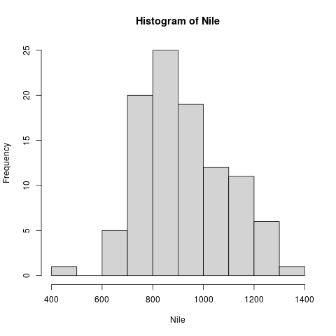

# Table of Contents

1.  [WHAT WILL YOU LEARN?](#org956aaff)
2.  [EVERYTHING IS AN OBJECT](#orge09bdf4)
3.  [ASSIGNING OBJECTS](#orga950bca)
4.  [WHY WE NEED VECTORS](#orgbe1efd4)
5.  [CREATING VECTORS](#orgbc7263e)
6.  [DOWN THE NILE](#orgdc12032)
7.  [PLOTTING THE NILE](#org3bf56d9)
8.  [THE OBVIOUS](#org1e7b9cb)
9.  [CREATING SEQUENCES AND REPETITIONS](#org1451798)
    1.  [THE COLON OPERATOR](#org3d41196)
    2.  [SEQUENCES](#org878bf5e)
    3.  [REPETITION](#org97a47d7)
10. [SORTING AND MEASURING LENGTHS](#orgbfdc9d4)
    1.  [SORT](#orgd6f35b1)
    2.  [LENGTH](#org42837f9)
11. [EXERCISES AND SOLUTIONS](#org207f32d)
12. [SUBSETTING](#orgc1b83b9)
    1.  [Vectorization 1-2-3](#org1b1dbb5)
    2.  [The row labels, like `[1]`, correspond to the **index**](#orgf561467)
    3.  [Subsetting: retrieving vector elements](#org2e9a667)
    4.  [Using colon operator in index](#orgdf359b0)
    5.  [Careful with sequences: is `foo[n]:foo[m]==foo[n:m]`?](#org2446167)
    6.  [Stats functions work on any vector subset: `mean`, `sum`,](#org43b8b4c)
    7.  [Logical functions in vectors: `<`, `>`, `!=`, `==`](#orgde30302)
    8.  [Selecting with logical index vectors](#orge9cd07a)
    9.  [Exercise with `Nile`](#org16f0218)
    10. [Negative indices - removes elements (only output, no overwrite)](#org12b2409)
    11. [Putting dissected vectors back together](#org959a374)
    12. [Defining and using vectors of indices](#org8e1bd44)
    13. [Overwriting a subvector with another vector](#orge10e54c)
    14. [Exercises and Solutions](#orgb455e77)
    15. [Example: rescaling](#orgc34b99f)
    16. [Vector Recycling](#orgb097dac)
    17. [Class exercise: rescale from inches to cm](#orgb74ed8d)
    18. [Exercises & Solutions](#orgee07272)
13. [NAMING](#org42c50d1)
14. [EXAMPLE DATASET `islands`](#org3507f01)
15. [INDEXING VECTORS (AGAIN)](#org0e7aebc)
16. [COERCION](#org938cbe6)
17. [SUMMARY](#orga53e59b)
18. [SOURCES](#org11e67cd)

---

# WHAT WILL YOU LEARN?

After this lesson, you should be able to:

-   Understand assignment in R
-   Creating vectors, sequences and repetitions
-   Sorting and measuring vector length
-   Subsetting and extracting vector elements
-   Vectorizing (rescaling)
-   Classes and logical vectors

# EVERYTHING IS AN OBJECT

[[Watch YouTube Playlist​]​](https://www.youtube.com/playlist?list=PL6SfZh1-kWXl3_YDc-8SS5EuG4h1aILHz)

[[Watch the video (4:33 min)]​](https://youtu.be/7Ab2RQs7Lj8)

---

R is a functional, object-oriented language: everything's an object,
and functions rule, as you already know. Because functions rule,
there are usually many different ways to achieve the same
result. They often differ in terms of performance, ease of use, and
clarity. Performance becomes important when you work with truly
large data sets, otherwise not so much. Ease of use to some extent
determines the fun you do or don't have when using the
language. Clarity is essential when communicating your methods
(including your code) and your results to others. This is not a nice
to have. Views of different packages (like the Tidyverse) differ
massively regarding all of these.

# ASSIGNING OBJECTS

[[Watch the video (10 min)]​](https://youtu.be/WZqJ_AyoOEU)

---

We talk about "assigning values to a variable" or "storing values
in a variable." These expressions are interchangeable. We can use
`<-` or `=` for assignment. Whatever you do, try to be consistent.

    x <- 5     # assigns 5 to a variable x
    x          # prints the content of x to the screen
    y = 10     # assigns 10 to a variable y
    print(y)   # prints the content of y to the screen
    x+y        # adds content of both variables
    x <- x + 1 # overwrites value of x
    x          # prints new content of x

The session results:

    > x <- 5
    > x
    [1] 5
    > y = 10
    > print(y)
    [1] 10
    > x+y
    [1] 15
    > x <- x+1
    > x
    [1] 6

Because you can overwrite variables easily, `=` could be confusing,
because it looks like mathematical equality (a status) while it
actually is an action. `=` is usually reserved for setting arguments
inside functions. You've seen this before: `log(x=100, b=10)`.

There are also some naming rules: objects must start with a letter
and they must avoid reserved words (like `TRUE` or
`NA`). Interesting objects for us include: vectors, factors, and
data frames.

**Problem:**

> 1.  Create an object `a` that stores the value \(3^2\times 4^\frac{1}{8}\)
> 2.  Overwrite `a` with itself divided by \(2.33\). Print the result to
>     the console.
> 3.  Create a new object `b` with the value \(-8.2\times 10^{-13}\)
> 4.  Print to the console the result of multiplying `a` and `b`.

**Solution:**

    a <- 3^2 * 4^(1/8)  # 1) 10.70286
    a <- a/2.33         # 2) 4.593504
    a
    b <- (-8.2) * 10^(-13) # 3) -8.2e-13
    a * b                  # 4) -3.766673e-12

The session results:

    > a <- 3^2 * 4^(1/8)
    > a <- a/2.33
    > a
    [1] 4.593504
    > b <- (-8.2)*10^(-13)
    > b
    [1] -8.2e-13
    > a * b
    [1] -3.766673e-12

# WHY WE NEED VECTORS

[[Watch the video (6:40)]​](https://youtu.be/iFsB_34mnR0)

---

We need vectors to handle multiple items in R (more than one data
point). Interesting data are usually made up of multiple
items. Think of a vector as a collection of observations or
measurements concerning a single variable. An important condition
for vectors is that all entries must be observations of the same
type<a id="fnr.1" class="footref" href="#fn.1">1</a>.

**CHALLENGE**

> Give three examples of such collections that could make up
> vectors: 1) numbers, 2) text, 3) logical values.

**SOLUTION**

> 1.  the heights of every student of this class, in cm.
> 2.  the first names of every student of this class (strings).
> 3.  observations, if a student is male or not male (male means `TRUE`).

Let's put some wood behind the arrow and define sample vectors for these:

    s_heights <- c(180, 181, 158, 175, 179, 168)
    s_names <- c("Vincent", "Natalija", "Adrian", "Andres", "Helena")
    s_male <- c(TRUE, FALSE, TRUE, TRUE, FALSE)

In order to check what R thinks about your observation or data type,
you can use the function `class`. Look at the help page for details
and enter the examples at the bottom of the help page.

Let's call `class` for our three sample vectors:

    class(s_heights) # what type vector is this?
    class(s_names)   # what type vector is this?
    class(s_male)    # what type vector is this?

The resulting session output:

    > class(s_heights)
    [1] "numeric"
    > class(s_names)
    [1] "character"
    > class(s_male)
    [1] "logical"

# CREATING VECTORS

[[Watch the video (5:11)]​](https://youtu.be/Ov6SIrpY_io)

---

The function to create a vector, or "combine values", is `c()`:

    myvec <- c(1,3,1,42) # combine integers as vector
    myvec                # prints 1 3 1 42
    class(myvec)         # determine the data type - "numeric"

The session results:

    > myvec <- c(1,3,1,42)
    > myvec
    [1]  1  3  1 42
    > class(myvec)
    [1] "numeric"

Vector elements can be calculations or previously stored items:

    foo <- 32.1
    myvec2 <- c(3, -3, 3.45, 1e+03, 64^0.5, 2+(3-1.1)/9.44, foo)
    myvec2

The resulting output - note that `[1]` and `[7]` are row labels:

    [1]    3.000000   -3.000000    3.450000 1000.000000    8.000000    2.201271
    [7]   32.100000

The session results:

    > foo <- 32.1
    > myvec2 <- c(3, -3, 3.45, 1e+03, 64^0.5, 2+(3-1.1)/9.44, foo)
    > myvec2
    [1]    3.000000   -3.000000    3.450000 1000.000000    8.000000    2.201271
    [7]   32.100000

Vector elements can even be vectors themselves:

    myvec3 <- c(myvec, myvec2)
    myvec3
    class(myvec3)

In the resulting output, the two vectors were put side by side. The
new vector now has \(11 = 4 + 7\) elements:

    [1]    1.000000    3.000000    1.000000   42.000000    3.000000   -3.000000
    [7]    3.450000 1000.000000    8.000000    2.201271   32.100000
    [1] "numeric"

The session output:

    > myvec3 <- c(myvec, myvec2)
    > myvec3
    [1]    1.000000    3.000000    1.000000   42.000000    3.000000   -3.000000
    [7]    3.450000 1000.000000    8.000000    2.201271   32.100000
    > class(myvec3)
    [1] "numeric"

**Problem:**

> What about missing values, `NA`, and non-numbers, `NaN`, and what
> about the special values `Inf` and `-Inf` - can you have these in
> vectors, too? Can you think about a way to test this?

**Solution:**

    > specvec <- c(NA, NaN) # a vector with a NA and a NaN
    > specvec
    [1]  NA NaN
    > class(specvec)
    [1] "numeric"
    > is.nan(specvec)  # testing for NaN values
    [1] FALSE  TRUE
    > is.na(specvec)   # testing for NA values
    [1] TRUE TRUE
    > specvec1 <- c(specvec, Inf, -Inf) # a new vector with Inf, Inf
    > specvec1
    [1]   NA  NaN  Inf -Inf
    > is.finite(specvec1)  # testing for finiteness
    [1] FALSE FALSE FALSE FALSE
    > is.infinite(specvec1)  # testint for infiniteness
    [1] FALSE FALSE  TRUE  TRUE
    > class(specvec1)
    [1] "numeric"

A more elaborate way of generating a non-number

# DOWN THE NILE

[[Watch the video (4:33)]​](https://youtu.be/wwsD2KuoKt8)

---

Let's not forget that there are real data out there!  R
(i.e. "[Base-R](https://rstudio.com/wp-content/uploads/2016/05/base-r.pdf)") includes a number of built-in datasets (i.e. you
don't have to install any packages to access them).

**Problem:**

> Do you remember how to find these pre-loaded datasets? One of these
> is `Nile`. Do you remember how to get information on such a dataset
> (or on any R object)?

**Solution:**

    data()      # lists all available/loaded datasets
    ?Nile       # opens help page for the dataset Nile

`Nile` contains a so-called "time series", a sequence of numbers
that correspond to measurements of the annual flow (in billion -
10⁸ - cubic meters) of the river Nile at [Aswan](https://en.wikipedia.org/wiki/Aswan), measured between
1871-1970. You can use `class` to confirm it:

    class(Nile)  # what type of dataset is this?

The output is `"ts"`, or time series. You may remember that we
previously looked at large datasets. `mtcars` for example was a
"data frame" (we'll learn more about them later).

**Problem:**

> How can we print this dataset on the screen?

**Solution:** there are different ways to look inside `Nile`:

    str(Nile)   # show dataset structure
    head(Nile)  # show first few elements
    Nile        # this prints the whole dataset

Results from the session:

    > str(Nile)
    Time-Series [1:100] from 1871 to 1970: 1120 1160 963 1210 1160 1160 813 1230 1370 1140 ...
    > head(Nile)
    [1] 1120 1160  963 1210 1160 1160
    > Nile
    Time Series:
    Start = 1871
    End = 1970
    Frequency = 1
    [1] 1120 1160  963 1210 1160 1160  813 1230 1370 1140  995  935 1110  994 1020
    [16]  960 1180  799  958 1140 1100 1210 1150 1250 1260 1220 1030 1100  774  840
    [31]  874  694  940  833  701  916  692 1020 1050  969  831  726  456  824  702
    [46] 1120 1100  832  764  821  768  845  864  862  698  845  744  796 1040  759
    [61]  781  865  845  944  984  897  822 1010  771  676  649  846  812  742  801
    [76] 1040  860  874  848  890  744  749  838 1050  918  986  797  923  975  815
    [91] 1020  906  901 1170  912  746  919  718  714  740

Because we don't know yet how to look at sub-vectors or individual
vector elements, we cannot directly check what type the elements of
`Nile` have, but the output seems to suggest that the Nile flow is
measured in integer numbers.

You can also see from the print output of `Nile` how row labels
work: there are 15 numbers per row, and the second row starts with
the 16th number, indicated by `[16]`.

# PLOTTING THE NILE

[[Watch the video (4:10)]​](https://youtu.be/c_BvsnKU7T4)

---

Looking at the numbers otherwise won't give us any idea about what's
going on, but fortunately, R has amazing plotting
capabilities. Let's begin with a histogram, for which we need the
`hist` function.

**Problem:**

> What does `hist` do? How does it work?

**Solution:**

> You know of course what to do at this point: call for help using
> `?hist`. Skip to the `Examples` section at the end, where you find
> the command `hist(islands)`. This creates a histogram of another
> dataset, `islands`. With the help of `?islands`, you find out
> quickly that this is a "named vector of 48 elements". Never mind
> what this means, but you can enter the command, which will generate
> a plot. This is a histogram: it plots frequency of the data and
> distributes them into bins<a id="fnr.2" class="footref" href="#fn.2">2</a>. Let's get back to the river Nile&#x2026;

Like most R functions, `hist` has many options. If you execute
`hist(Nile)`, you get the same type of graph as in the example (see
figure [68](#org5cb82f4)), except that we know what the data are (annual
Nile flow measurements in `10⁸ m³`, or 100,000,000 (100 million) of
cubic metres.

The `hist` function creates 10 bins by default and distributes the
data accordingly. You can alter this number of bins by changing the
argument `breaks`, e.g. `hist(Nile, breaks=20)` (try it!).

We'll get back to the `Nile` once we know more about vectors! In the
next four sections, we're going to look at useful functions.

# THE OBVIOUS

In the following, I won't waste more space with the obvious:
whenever I mention a new function or dataset, or keyword, look the
corresponding help up immediately. More often than not, you will
take something away from it - at the very minimum an example. Over
time, you'll understand things even though you don't know how you
possibly could: this is because you've begun to develop a habit by
using a system of learning - looking up the help content - and the
more you look at help pages, the more you recognize known concepts.

# CREATING SEQUENCES AND REPETITIONS

[[Watch the video (16:05)]​](https://youtu.be/G2P_MVq3eyM)

---

## THE COLON OPERATOR

We already met the colon operator: remember how `1:n` creates a
sequence of numbers separated by intervals of `1`:

    3:27  # generate sequence of integers space by 1 from 3 to 27

The output looks like this:

    R> 3:27
    [1]  3  4  5  6  7  8  9 10 11 12 13 14 15 16 17 18 19 20 21 22 23 24 25 26 27

Simple enough! You'll need this e.g. when plotting data points. You
can check that these are integer numbers with `class(3:27)`. You can
also store the sequence, or use arithmetic to specify the range. Any
calculation must strictly be in parentheses:

    foo <- 5.3              # assign 5.3 to foo
    bar <- foo:(-47+1.5)    # assign sequence to bar

The sequence `bar` looks like this:

    R> bar
      [1]   5.3   4.3   3.3   2.3   1.3   0.3  -0.7  -1.7  -2.7  -3.7  -4.7  -5.7
     [13]  -6.7  -7.7  -8.7  -9.7 -10.7 -11.7 -12.7 -13.7 -14.7 -15.7 -16.7 -17.7
     [25] -18.7 -19.7 -20.7 -21.7 -22.7 -23.7 -24.7 -25.7 -26.7 -27.7 -28.7 -29.7
     [37] -30.7 -31.7 -32.7 -33.7 -34.7 -35.7 -36.7 -37.7 -38.7 -39.7 -40.7 -41.7
     [49] -42.7 -43.7 -44.7

Try to understand what happened here by checking the numbers: the
first value of the sequence is `foo = 5.3`. The last value is a
negative value, `-47+1.5 = -45.5`. In order to generate the
sequence, R counts down in steps of `1` from the first to the last
value. It stops at `-44.7`, because the next value, `-45.7` would be
outside of the interval \([5.3,-45.5])\).

So far so good, but this isn't very flexible, because we cannot
alter the "bin-size" (in histogram-speak), or the step-width of the
sequence generator - it'll always be \(1\). We need a function!

## SEQUENCES

The function `seq` "generates regular sequences" (that's what the
help says, which I am sure you looked up as soon as you saw the
headline!). Alas, the help is a little obscure (esp. the
examples). Let's make our own examples, or borrow them<a id="fnr.3" class="footref" href="#fn.3">3</a>: here
is a variation on the last example, with step-width specified via
the argument `by = 3`:

    R> seq(from = 3, to = 27, by = 3)
    [1]  3  6  9 12 15 18 21 24 27

`seq` will always start at the `from` value but (just like in the
earlier example) not always end exactly on the `to` value. In the
following example, the last value `10` is not included, because it
both last value and step-width are even. In the second example, the
last value is odd, and then it works:

    R> seq(1,10,2)
    [1] 1 3 5 7 9
    
    R> seq(1,11,2)
    [1]  1  3  5  7  9 11

To end exactly on the last value, use the `length.out` argument
instead:

    R> seq(from = 3, to = 27, length.out = 40)
    [1]  3.000000  3.615385  4.230769  4.846154  5.461538  6.076923  6.692308
    [8]  7.307692  7.923077  8.538462  9.153846  9.769231 10.384615 11.000000
    [15] 11.615385 12.230769 12.846154 13.461538 14.076923 14.692308 15.307692
    [22] 15.923077 16.538462 17.153846 17.769231 18.384615 19.000000 19.615385
    [29] 20.230769 20.846154 21.461538 22.076923 22.692308 23.307692 23.923077
    [36] 24.538462 25.153846 25.769231 26.384615 27.000000

The intervals between the `40` values generated are exactly evenly
spaced. If you want the sequence to decrease, `by` must be
negative, like here:

    > foo <- 5.3
    > myseq <- seq(from=foo, to=(-47+1.5),by=-2.4)
    > myseq
    [1]   5.3   2.9   0.5  -1.9  -4.3  -6.7  -9.1 -11.5 -13.9 -16.3 -18.7 -21.1
    [13] -23.5 -25.9 -28.3 -30.7 -33.1 -35.5 -37.9 -40.3 -42.7 -45.1

`length,out` can only be positive (there is no 'negative
length'). This example creates a decreasing sequence of length \(5\):

    > myseq2 <- seq(from=foo, to=(-47+1.5), length.out=5)
    > myseq2
    [1]   5.3  -7.4 -20.1 -32.8 -45.5

## REPETITION

If you simply want to repeat a value, you can use the `rep`
function. For example, to create a sequence of four numbers `1`, type:

    R> rep(x=1, times=4)
    [1] 1 1 1 1

You can repeat any object! Here are three different repetitions of
the numerical vector `c(3, 62, 8, 3)` - first guess the outcome,
then type them into the R console to check your thinking:

    rep(x=c(3,62,8,3), times=3)
    rep(x=c(3,62,8,3), each=2)
    rep(x=c(3,62,8,3), times=3, each=2)

The argument `times` says how many **times** `x` is repeated. The
argument `each` says how many times **each** element of `x` is
repeated. The output should look like this:

    R> rep(x=c(3,62,8,3), times=3)
    [1]  3 62  8  3  3 62  8  3  3 62  8  3
    
    R> rep(x=c(3,62,8,3), each=2)
    [1]  3  3 62 62  8  8  3  3
    
    R> rep(x=c(3,62,8,3), times=3, each=2)
    [1]  3  3 62 62  8  8  3  3  3  3 62 62  8  8  3  3  3  3 62 62  8  8  3  3

If neither are specified, the default is `times = each =
   1`. Therefore, what do you think is the output of `rep(c(3,62,8,3))`<a id="fnr.4" class="footref" href="#fn.4">4</a>?

As with `seq`, you can include the result of `rep` in a vector of
the same data type (e.g. "numeric"):

    R> foo <- 4
    R> c(3,8.3,rep(x=32,times=foo), seq(from=-2,to=1,length.out=foo+1))
    [1]  3.0  8.3 32.0 32.0 32.0 32.0 32.0 -2.0 -1.5 -1.0 -0.5  0.0  0.5  1.0

`rep` also works for characters and character vectors:

    R> rep("data science", times=2)
    [1] "data science" "data science"
    
    R> rep(c("data","science"), times=2)
    [1] "data"    "science" "data"    "science"
    
    R> rep(c("data","science"), times=2, each=2)
    [1] "data"    "data"    "science" "science" "data"    "data"    "science"
    [8] "science"

Did you hear the "matching data type" remark? Try to mix characters
and numbers in a vector and see what happens! (Tip: it's called
"[coercion](https://www.oreilly.com/library/view/r-in-a/9781449358204/ch05s08.html)").

If you want a vector of a specified type and length, you can use the
`vector` function. Each of the values in the result is zero,
`FALSE`, or an empty string, or whatever the equivalent of "nothing"
is. You can check the `class` yourself:

    R> vector("numeric",5)
    [1] 0 0 0 0 0
    R> vector("logical",5)
    [1] FALSE FALSE FALSE FALSE FALSE
    R> vector("character",5)
    [1] "" "" "" "" ""

So-called "wrapper" functions exist, which achieve the same thing
when creating vectors this way:

    R> numeric(5)
    [1] 0 0 0 0 0
    R> logical(5)
    [1] FALSE FALSE FALSE FALSE FALSE
    R> character(5)
    [1] "" "" "" "" ""

# SORTING AND MEASURING LENGTHS

[[Watch the video (9:30)]​](https://youtu.be/KRghGmuS6Ck)

---

## SORT

Sorting and ordering and ranking vector elements comes up all the
time, because what we wish to know, or show, or display, is
irrelevant to the way the data are stored. We'll talk about ordering
and ranking later, when we have introduced sub-setting vectors.

R is simple, so of course the function we're looking for is called
`sort`. Sorting a numerical vector rearranges the elements according
to size. Let's look at a few examples

    R> sort(x = c(2.5, -1, -10, 3.44), decreasing = FALSE)
    [1] -10.00  -1.00   2.50   3.44
    
    R> sort(x = c(2.5, -1, -10, 3.44), decreasing = TRUE)
    [1]   3.44   2.50  -1.00 -10.00

You supply a vector to the function as the argument `x`, and a
second argument, `decreasing`, to indicate the order you wish to
sort in: `decreasing=FALSE` is the default (i.e. increasing) -
sorting from smallest to largest, while `decreasing=TRUE` means
searching from largest to smallest.

Note: the argument value of `decreasing` is not `numeric`, it is
`logical`.

## LENGTH

The `length` function (check the help!) gets or sets the length of
vectors<a id="fnr.5" class="footref" href="#fn.5">5</a> - for vectors, `length(x)` determines, how many
entries the vector has:

    R> length(x=c(3,2,8,1))
    [1] 4
    R> length(x=5:13)
    [1] 9

You can still include objects that need to be evaluated - arithmetic
computations, or sequences, or repetitions - but `length` will tell
you the number of entries after the inner functions have been executed.

    R> foo <- 4
    R> bar <- c(3, 8.3, rep(x=32, times=foo), seq(from=-2, to=1, length.out=foo+1))
    R> length(bar)
    [1] 11
    R> bar
    [1]  3.00  8.30 32.00 32.00 32.00 32.00 -2.00 -1.25 -0.50  0.25  1.00

The help page `?length` contains a peculiar example: you can measure
the utility function `options()`, it seems! (In fact, I didn't know
this!) Try it yourself: type `length(options())`. Can you figure out
why the answer is `68`?

# EXERCISES AND SOLUTIONS

[[Watch the solution video (10:27)]​](https://youtu.be/lKxNNR1l3u8)

---

**Problem:**

> (a) Create and store a sequence of values from `5` to `-11` that
> progresses in steps of `0.3`.

**Solution:**

    > foo <- seq(from=5, to=-11, by=-0.3)
    > foo
    [1]   5.0   4.7   4.4   4.1   3.8   3.5   3.2   2.9   2.6   2.3   2.0   1.7
    [13]   1.4   1.1   0.8   0.5   0.2  -0.1  -0.4  -0.7  -1.0  -1.3  -1.6  -1.9
    [25]  -2.2  -2.5  -2.8  -3.1  -3.4  -3.7  -4.0  -4.3  -4.6  -4.9  -5.2  -5.5
    [37]  -5.8  -6.1  -6.4  -6.7  -7.0  -7.3  -7.6  -7.9  -8.2  -8.5  -8.8  -9.1
    [49]  -9.4  -9.7 -10.0 -10.3 -10.6 -10.9

**Problem:**

> (b) Overwrite the object from (a) using the same sequence with the order
> reversed.

**Solution:**

    > foo <- sort(x=foo, decreasing=FALSE)
    > foo
    [1] -10.9 -10.6 -10.3 -10.0  -9.7  -9.4  -9.1  -8.8  -8.5  -8.2  -7.9  -7.6
    [13]  -7.3  -7.0  -6.7  -6.4  -6.1  -5.8  -5.5  -5.2  -4.9  -4.6  -4.3  -4.0
    [25]  -3.7  -3.4  -3.1  -2.8  -2.5  -2.2  -1.9  -1.6  -1.3  -1.0  -0.7  -0.4
    [37]  -0.1   0.2   0.5   0.8   1.1   1.4   1.7   2.0   2.3   2.6   2.9   3.2
    [49]   3.5   3.8   4.1   4.4   4.7   5.0

**Problem:**

> (c) Repeat the vector `c(-1,3,-5,7,-9)` twice, with each element
> repeated `10` times, and store the result. Display the result sorted
> from largest to smallest.

**Solution:**

    > foo <- rep(x=c(-1,3,-5,7,-9), times=2,each=10)
    > foo
    [1] -1 -1 -1 -1 -1 -1 -1 -1 -1 -1  3  3  3  3  3  3  3  3  3  3 -5 -5 -5 -5 -5
    [26] -5 -5 -5 -5 -5  7  7  7  7  7  7  7  7  7  7 -9 -9 -9 -9 -9 -9 -9 -9 -9 -9
    [51] -1 -1 -1 -1 -1 -1 -1 -1 -1 -1  3  3  3  3  3  3  3  3  3  3 -5 -5 -5 -5 -5
    [76] -5 -5 -5 -5 -5  7  7  7  7  7  7  7  7  7  7 -9 -9 -9 -9 -9 -9 -9 -9 -9 -9
    
    > sort(x=foo, decreasing=TRUE)
    [1]  7  7  7  7  7  7  7  7  7  7  7  7  7  7  7  7  7  7  7  7  3  3  3  3  3
    [26]  3  3  3  3  3  3  3  3  3  3  3  3  3  3  3 -1 -1 -1 -1 -1 -1 -1 -1 -1 -1
    [51] -1 -1 -1 -1 -1 -1 -1 -1 -1 -1 -5 -5 -5 -5 -5 -5 -5 -5 -5 -5 -5 -5 -5 -5 -5
    [76] -5 -5 -5 -5 -5 -9 -9 -9 -9 -9 -9 -9 -9 -9 -9 -9 -9 -9 -9 -9 -9 -9 -9 -9 -9

**Problem:**

> (d) Create and store a vector that contains, in any configuration,
> the following:
> 
> -   A sequence of integers from `6` to `12` (inclusive)
> -   A threefold repetition of the value `5.3`
> -   The number `-3`
> -   A sequence of nine values starting at `102` and ending at the
>     number that is the total length of the vector created in problem
>     (c).
> -   Confirm that the length of the vector created is `20`

**Solution:**

    > bar <- c(6:12,rep(5.3,times=3),-3,seq(from=102,to=length(foo),length.out=9))
    > bar
    [1]   6.00   7.00   8.00   9.00  10.00  11.00  12.00   5.30   5.30   5.30
    [11]  -3.00 102.00 101.75 101.50 101.25 101.00 100.75 100.50 100.25 100.00
    > length(bar)
    [1] 20

(Source: [Davies, 2016](#orgcb3cea5))

# SUBSETTING

[Watch YouTube Playlist](https://www.youtube.com/playlist?list=PL6SfZh1-kWXlA2axuHdNMzhwhuEhtGtlK)

---

## Vectorization 1-2-3

If you'd use a programming language like `C` or `FORTRAN`, which is
at its heart not interactive but procedural, or even `Python`,
which can be used interactively (via a console), you'd have to
write a loop to perform an operation on all the elements of a
vector. Not so in `R`.

There are three forms of vectorization in `R`:

1.  An operator or a function acts on each element of a vector
    without you having to explicitly write a loop (it's also much
    faster in terms of execution):
    
        > foo <- c(1, -1, 4, 4, 0, 59, 3)
        
        > foo + 3               # add a number to the vector
        [1]  4  2  7  7  3 62  6
        
        > foo/3.2               # divide vector by number
        [1]  0.3125 -0.3125  1.2500  1.2500  0.0000 18.4375  0.9375
        
        > bar <- foo[-c(4:length(foo))]  # delete part of a vector
        [1]  1 -1  4
        
        > rep(x=bar, times=2)    # repeat a vector
        [1]  1 -1  4  1 -1  4
        
        > exp(pi*1i)+1  # Euler's formula
        [1] 0+1.224647e-16i
        
        > prod(c(1,2,3,4,5))
        [1] 120
2.  A function takes a vector as input and calculates a summary
    statistic:
    
        > 1:5
        [1] 1 2 3 4 5
        > sum(1:5)
        [1] 15
        > mean(1:5)
        [1] 3
3.  A function calculates a summary statistic from several of its
    input arguments - does not always work:
    
        > sum(1,2,3,4,5)  # OK
        [1] 15
        > mean(1,2) # not OK
        [1] 1
        > mean(c(1,2)) # OK
        [1] 1.5

Where does this leave us?

-   How to get to parts of a vector
-   How to control the indexing
-   How to rescale vectors
-   How to create matrices and arrays
-   How to mix different data types

## The row labels, like `[1]`, correspond to the **index**

    > Nile
    Time Series:
    Start = 1871
    End = 1970
    Frequency = 1
    [1] 1120 1160  963 1210 1160 1160  813 1230 1370 1140  995  935 1110  994 1020
    [16]  960 1180  799  958 1140 1100 1210 1150 1250 1260 1220 1030 1100  774  840
    [31]  874  694  940  833  701  916  692 1020 1050  969  831  726  456  824  702
    [46] 1120 1100  832  764  821  768  845  864  862  698  845  744  796 1040  759
    [61]  781  865  845  944  984  897  822 1010  771  676  649  846  812  742  801
    [76] 1040  860  874  848  890  744  749  838 1050  918  986  797  923  975  815
    [91] 1020  906  901 1170  912  746  919  718  714  740

## Subsetting: retrieving vector elements

    > Nile [1]
    [1] 1120
    > Nile[length(Nile)]
    [1] 740

## Using colon operator in index

    > foo <- c(-1,3.0,4,67,330,-3) # assign vector to foo
    > foo
    [1]  -1   3   4  67 330  -3
    
    > bar <- foo[2:5]  # assign subset of foo to bar
    > bar
    [1]   3   4  67 330

## Careful with sequences: is `foo[n]:foo[m]==foo[n:m]`?

    > bar <- foo[2:5]   # assign a subset of foo to bar
    > bar
    [1]   3   4  67 330
    
    > baz <- foo[2]:foo[5]  # asign a sequence to baz
    >
    > bar <- foo[2:5]; bar
    [1]   3   4  67 330
    
    > identical(bar,baz)  # are bar and baz identical?
    [1] FALSE
    >
    > all.equal(bar,baz)  # are they near equal at least?
    [1] "Numeric: lengths (4, 328) differ"

## Stats functions work on any vector subset: `mean`, `sum`,

    > mean(foo[2:5])
    [1] 101
    
    > sum(foo)
    [1] 400
    
    > summary(foo)
    Min. 1st Qu.  Median    Mean 3rd Qu.    Max.
    -3.00    0.00    3.50   66.67   51.25  330.00

## Logical functions in vectors: `<`, `>`, `!=`, `==`

    > foo <- c(-1, 3, 4, 5, 67, 330, -3, -99, 0, 0, 44)
    > foo_pos <- c(foo > 0)
    > foo_neg <- c(foo < 0)
    > foo_nul <- c(foo == 0)  # Why not = instead of ==?
    
    > c(foo=0)
    foo
    0
    
    > foo_pos
    [1] FALSE  TRUE  TRUE  TRUE  TRUE  TRUE FALSE FALSE FALSE FALSE  TRUE
    
    > foo_neg
    [1]  TRUE FALSE FALSE FALSE FALSE FALSE  TRUE  TRUE FALSE FALSE FALSE
    
    > foo_nul
    [1] FALSE FALSE FALSE FALSE FALSE FALSE FALSE FALSE  TRUE  TRUE FALSE
    
    > sum(foo_pos)   # What do you expect here (vector is LOGICAL)?
    [1] 6
    > sum(foo_neg)
    [1] 3
    > sum(foo_nul)
    [1] 2

## Selecting with logical index vectors

    > foo[foo_pos]
    [1]   3   4   5  67 330  44
    
    > foo[foo_neg]
    [1]  -1  -3 -99
    
    > foo[foo_nul]
    [1] 0 0

## Exercise with `Nile`

1.  How many entries does the time series vector `Nile` have?
    
        > length(Nile)
        [1] 100
2.  What is its last element?
    
        > tail(Nile)
        [1] 912 746 919 718 714 740
        > Nile[length(Nile)]
        [1] 740
        > Nile[100]
        [1] 740
        > Nile
3.  What is the third to last element of `Nile`?
    
        > Nile[length(Nile)-3]
        [1] 919
4.  What is the average flow of the Nile between 1909-1969?
    
        > 1909-1871
        [1] 38
        > 1969-1871
        [1] 98
        > mean(Nile[(1909-1871):(1969-1871)])
        [1] 860.3279
5.  How many values are below, how many above the mean
    value?
    
        > nile_pos <- c(Nile > mean(Nile))  # logical vector of values greater mean
        > nile_pos
        [1]  TRUE  TRUE  TRUE  TRUE  TRUE  TRUE FALSE  TRUE  TRUE  TRUE  TRUE  TRUE
        [13]  TRUE  TRUE  TRUE  TRUE  TRUE FALSE  TRUE  TRUE  TRUE  TRUE  TRUE  TRUE
        [25]  TRUE  TRUE  TRUE  TRUE FALSE FALSE FALSE FALSE  TRUE FALSE FALSE FALSE
        [37] FALSE  TRUE  TRUE  TRUE FALSE FALSE FALSE FALSE FALSE  TRUE  TRUE FALSE
        [49] FALSE FALSE FALSE FALSE FALSE FALSE FALSE FALSE FALSE FALSE  TRUE FALSE
        [61] FALSE FALSE FALSE  TRUE  TRUE FALSE FALSE  TRUE FALSE FALSE FALSE FALSE
        [73] FALSE FALSE FALSE  TRUE FALSE FALSE FALSE FALSE FALSE FALSE FALSE  TRUE
        [85] FALSE  TRUE FALSE  TRUE  TRUE FALSE  TRUE FALSE FALSE  TRUE FALSE FALSE
        [97] FALSE FALSE FALSE FALSE
        
        > nile_neg <- c(Nile < mean(Nile)) # logical vector of values smaller than mean
        > nile_neg
        [1] FALSE FALSE FALSE FALSE FALSE FALSE  TRUE FALSE FALSE FALSE FALSE FALSE
        [13] FALSE FALSE FALSE FALSE FALSE  TRUE FALSE FALSE FALSE FALSE FALSE FALSE
        [25] FALSE FALSE FALSE FALSE  TRUE  TRUE  TRUE  TRUE FALSE  TRUE  TRUE  TRUE
        [37]  TRUE FALSE FALSE FALSE  TRUE  TRUE  TRUE  TRUE  TRUE FALSE FALSE  TRUE
        [49]  TRUE  TRUE  TRUE  TRUE  TRUE  TRUE  TRUE  TRUE  TRUE  TRUE FALSE  TRUE
        [61]  TRUE  TRUE  TRUE FALSE FALSE  TRUE  TRUE FALSE  TRUE  TRUE  TRUE  TRUE
        [73]  TRUE  TRUE  TRUE FALSE  TRUE  TRUE  TRUE  TRUE  TRUE  TRUE  TRUE FALSE
        [85]  TRUE FALSE  TRUE FALSE FALSE  TRUE FALSE  TRUE  TRUE FALSE  TRUE  TRUE
        [97]  TRUE  TRUE  TRUE  TRUE
        
        > sum(nile_pos)
        [1] 43
        > sum(nile_neg)
        [1] 57
6.  How much water flowed down the Nile between 1871 and 1970?
    
        > sum(Nile)
        [1] 91935

## Negative indices - removes elements (only output, no overwrite)

    > foo[foo_len]
    [1] 44
    
    > foo[-1]
    [1]  3   4   5  67 330  -3 -99   0   0  44
    
    > foo[-foo_len]
    [1] -1   3   4   5  67 330  -3 -99   0   0
    
    > foo   # foo is not changed (not overwritten)
    [1]  -1   3   4   5  67 330  -3 -99   0   0  44
    
    > foo[-c(1,3)]   # remove elements 1 and 3 from foo
    [1]   3   5  67 330  -3 -99   0   0  44
    
    > foo[-(1:2)]    # remove elements 1 and 2 from foo
    [1]   4   5  67 330  -3 -99   0   0  44

-   Exercise: fixing wrong entries?
    
        myvec <- c(5,-2,3,4,4,4,6,8,10,40221,-8)
        > myvec
        [1] 5 -2 3 4  4  4  6  8  10  40221  -8
        # I want 5 -2.3 4 4 4 6 8 10 40221 -8
        
        > myvec[2] <- -2.3     # change second element
        > myvec[-3]            # does NOT change myvec!
        > myvec <- myvec[-3]   # delete third element
        > myvec
        [1] 5.0 -2.3  4.0  4.0  4.0  6.0  8.0  10.0  40221.0  -8.0

## Putting dissected vectors back together

    > myvec <- c(5,-2.3,4,4,4,6,8,10,40221,-8)  # assigning vector to myvec
    > myvec
    [1]     5.0    -2.3     4.0     4.0     4.0     6.0     8.0    10.0 40221.0
    [10]    -8.0
    
    > myvec.len <- length(x=myvec)   # storing length of myvec in myvec.len
    > myvec.len
    [1] 10
    
    > bar <- myvec[myvec.len-1]   # storing next-to-last entry of myvec in bar
    > bar
    [1] 40221
    
    > qux <- myvec[-(myvec.len-1)]   # qux is myvec without the next-to-last element
    > qux
    [1]  5.0 -2.3  4.0  4.0  4.0  6.0  8.0 10.0 -8.0
    
    ## how can we put myvec from qux and bar back together?
    ## 1. remove last element of qux
    ## 2. add bar at the end
    ## 3. put last element of qux back
    
    > c(qux[-length(x=qux)], bar, qux[length(x=qux)])
    [1]     5.0    -2.3     4.0     4.0     4.0     6.0     8.0    10.0 40221.0
    [10]    -8.0
    
    > identical(myvec,c(qux[-length(x=qux)], bar, qux[length(x=qux)]))
    [1] TRUE

## Defining and using vectors of indices

    > foo <- myvec[1:4]  # foo is a subset of myvec
    > foo
    [1]  5.0 -2.3  4.0  4.0
    
    > indexes <- c(4, rep(x=2, times=3),1,1,2,3:1)
    > indexes
    [1] 4 2 2 2 1 1 2 3 2 1
    
    > foo[indexes]   # indexes uses foo to create a new vector
    [1]  4.0 -2.3 -2.3 -2.3  5.0  5.0 -2.3  4.0 -2.3  5.0
    
    > indexes_bad <- c(1,-1)   # this is not allowed
    > foo[indexes_bad]
    Error in foo[indexes_bad] :
    only 0's may be mixed with negative subscripts

## Overwriting a subvector with another vector

    > bar <- c(3,2,4,4,1,2,4,1,0,0,5)
    > bar
    [1] 3 2 4 4 1 2 4 1 0 0 5
    > length(bar)
    [1] 11
    > bar[1] <- 6  # replace first entry in bar
    > bar
    [1] 6 2 4 4 1 2 4 1 0 0 5
    > bar[c(2,4,6)] <- c(-2,0.5,-1) # same length vectors!
    > bar
    [1]  6.0 -2.0  4.0  0.5  1.0 -1.0  4.0  1.0  0.0  0.0  5.0
    > bar[7:10] <- 100  # overwrite indices 7 to 10 with 100
    > bar
    [1]   6.0  -2.0   4.0   0.5   1.0  -1.0 100.0 100.0 100.0 100.0   5.0

## Exercises and Solutions

> (1) Create and store a vector that contains the following, in this
> order:
> 
> -   A sequence of length `5` from `3` to `6` (inclusive)
> -   A twofold repetition of the vector `c(2,-5.1,-33)`
> -   The value \(\frac{7}{42}+2\)

    > foo <- c(seq(from=3, to=6, length.out=5), rep(x=c(2,-5.1,-33), times=2), 7/42+2)
    > foo
    [1]   3.000000   3.750000   4.500000   5.250000   6.000000   2.000000
    [7]  -5.100000 -33.000000   2.000000  -5.100000 -33.000000   2.166667

> (2) Extract the first and last elements of your vector in (1), and
> store them as a new object.

    > bar <- c(foo[1],foo[length(foo)])
    > bar <- foo[c(1,length(foo))]          # shorter solution
    > bar
    [1] 3.000000 2.166667

> (3) Store as a third object the values returned by omitting the
> first and last values of your vector in (1).

    > baz <- foo[-c(1,length(foo))]   # or: foo[c(-1,-length(foo))]
    [1]   3.75   4.50   5.25   6.00   2.00  -5.10 -33.00   2.00  -5.10 -33.00

> (4) Use only (2) and (3) to reconstruct (1).

    > foo  # reconstruct using only bar and baz
    [1]   3.000000   3.750000   4.500000   5.250000   6.000000   2.000000
    [7]  -5.100000 -33.000000   2.000000  -5.100000 -33.000000   2.166667
    
    > bar                  # contains the first and last element of foo
    [1] 3.000000 2.166667
    
    > baz                  # foo without bar
    [1]   3.75   4.50   5.25   6.00   2.00  -5.10 -33.00   2.00  -5.10 -33.00
    
    > c(bar[1],baz,bar[2])
    [1]   3.000000   3.750000   4.500000   5.250000   6.000000   2.000000
    [7]  -5.100000 -33.000000   2.000000  -5.100000 -33.000000   2.166667
    
    > identical(foo,c(bar[1],baz,bar[2]))    # check identity
    [1] TRUE

> (5) Overwrite (1) with the same values sorted from smallest
> to largest.

    > foo
    [1]   3.000000   3.750000   4.500000   5.250000   6.000000   2.000000
    [7]  -5.100000 -33.000000   2.000000  -5.100000 -33.000000   2.166667
    
    > foo <- sort(x=foo, decreasing=FALSE)  # from smallest to largest
    > foo
    [1] -33.000000 -33.000000  -5.100000  -5.100000   2.000000   2.000000
    [7]   2.166667   3.000000   3.750000   4.500000   5.250000   6.000000

> (6) Use the colon operator as an index vector to reverse the order
> of (5), and confirm this is identical to using `sort` on (5)
> with `decreasing=TRUE`.

    > foo[length(foo):1]  # the index sequence is reversed
    [1]   6.000000   5.250000   4.500000   3.750000   3.000000   2.166667
    [7]   2.000000   2.000000  -5.100000  -5.100000 -33.000000 -33.000000
    
    > sort(x=foo, decreasing=TRUE)  # sort from largest to smallest
    [1]   6.000000   5.250000   4.500000   3.750000   3.000000   2.166667
    [7]   2.000000   2.000000  -5.100000  -5.100000 -33.000000 -33.000000
    
    > identical(foo[length(foo):1],sort(x=foo, decreasing=TRUE))
    [1] TRUE

> (7) Create a vector from (3) that repeats the third element of (3)
> three times, the sixth element four times, and the last element
> once.

    > baz[c(rep(x=3,times=3),rep(x=6,times=4),length(x=baz))]
    [1]   5.25   5.25   5.25  -5.10  -5.10  -5.10  -5.10 -33.00

> (8) Create a new vector as a copy of (5) as to a newly named
> object. Using this new copy of (5), overwrite the first, the
> fifth to the seventh (inclusive), and the last element with the
> values `99` to `95` (inclusive), respectively.

    > foo            # vector from (5)
    [1] -33.000000 -33.000000  -5.100000  -5.100000   2.000000   2.000000
    [7]   2.166667   3.000000   3.750000   4.500000   5.250000   6.000000
    
    > qux <- foo     # create copy
    > qux
    [1] -33.000000 -33.000000  -5.100000  -5.100000   2.000000   2.000000
    [7]   2.166667   3.000000   3.750000   4.500000   5.250000   6.000000
    
    > qux[c(1,5:7,length(qux))] <- 99:95  # overwrite indices with sequence
    > qux
    [1]  99.00 -33.00  -5.10  -5.10  98.00  97.00  96.00   3.00   3.75   4.50
    [11]   5.25  95.00

(Source: Davies, 2016, p. 32)

## Example: rescaling

In the example below, a vector of six values in increments of 1 is
created. Then another vector is subtracted from it: the operation
is carried out element-wise. The elements are matched up and the
operation (subtraction) is carried out on each corresponding pair:

    > foo <- 5.5:0.5
    > foo
    [1]  5.5 4.5 3.5 2.5 1.5 0.5
    > foo-c(2,4,6,8,10,12)  # subtract another vector
    [1]   3.5   0.5  -2.5  -5.5  -8.5 -11.5

What if the vectors have different length?  Either the longer
vector can be evenly divided by the shorter vector, or not.

    # Want to alternate entries of foo as positive and negative
    
    > foo * c(1,-1,1,-1,1,-1) # explicit multiplcation by element
    [1]  5.5 -4.5  3.5 -2.5  1.5 -0.5
    
    > bar <- c(1,-1) # multiply by even multiple
    > length(foo)
    [1] 6
    > length(bar)
    [1] 2
    > foo * bar
    [1]  5.5 -4.5  3.5 -2.5  1.5 -0.5
    
    > baz <- c(1, -1, 0.5, -0.5)
    > length(baz)
    [1] 4
    > foo*baz
    [1] 5.50 4.50 1.75 1.25 1.50 0.50
    Warning message:
    In foo * baz :
    longer object length is not a multiple of shorter object length

")

    > foo
    [1] 5.5 4.5 3.5 2.5 1.5 0.5
    > qux <- 3
    
    > foo + qux
    [1] 8.5 7.5 6.5 5.5 4.5 3.5
    
    > foo + c(3,3,3,3,3,3)
    [1] 8.5 7.5 6.5 5.5 4.5 3.5
    
    > foo+rep(x=3,times=length(x=foo))
    [1] 8.5 7.5 6.5 5.5 4.5 3.5

    > foo
    [1] 5.5 4.5 3.5 2.5 1.5 0.5
    
    > foo[c(1,3,5,6)] <- c(-99,99)
    > foo
    [1] -99.0   4.5  99.0   2.5 -99.0  99.0

## Vector Recycling

    > 1:5 + 1:6
    [1]  2  4  6  8 10  7
    Warning message:
    longer object length is not a multiple of shorter object length
    
    > 1:5 + 1:7
    [1]  2  4  6  8 10  7  9
    Warning message:
    longer object length is not a multiple of shorter object length

## Class exercise: rescale from inches to cm

\*Problem: convert inches to cm (\(1\,inch\equiv 2.54\, cm\)):

    inches <- c(69, 62, 66, 70, 70, 73, 67, 73, 67, 70)

**Solution:**

    > cm <- inches * 2.54
    > cm
    [1] 175.26 157.48 167.64 177.80 177.80 185.42 170.18 185.42 170.18 177.80

## Exercises & Solutions

> (1) Convert the vector `c(2,0.5,1,2,0.5,1,2,0.5,1)` to a vector of
> only ~1~s, using a vector of length \(3\).

    > foo <- c(2,0.5,1,2,0.5,1,2,0.5,1)
    > bar <- c(2,0.5,1)
    > foo / bar
    [1] 1 1 1 1 1 1 1 1 1

> (2) The conversion from a temperature measurement in degrees
> Fahrenheit \(F\) to Celsius \(C\) is performed using the following
> equation:
> 
> \begin{equation}
> C = \frac{5}{9}\left( F-32\right)
> \end{equation}
> 
> Use vector-oriented behavior in `R` to convert the temperatures
> \(45\), \(77\), \(20\), \(19\), \(101\), \(120\), and \(212\) in degrees
> Fahrenheit to degrees Celsius.

    > temp <- c(45, 77, 20, 19, 101, 120, 212)  # degrees Fahrenheit
    > temp
    [1]  45  77  20  19 101 120 212
    
    > temp_C <- 5/9 * (temp - 32)  # degrees Celsius
    > temp_C
    [1]   7.222222  25.000000  -6.666667  -7.222222  38.333333  48.888889 100.000000

> (3) Use the vector `c(2,4,6)` and the vector `c(1,2)` in conjunction
> with `rep` and `*` to produce the vector `c(2,4,6,4,8,12)`.

    > rep(x=c(2,4,6),times=2)
    [1] 2 4 6 2 4 6
    
    > rep(x=c(1,2),each=3)
    [1] 1 1 1 2 2 2
    
    > rep(x=c(2,4,6),times=2)*rep(x=c(1,2),each=3)
    [1]  2  4  6  4  8 12

> (4) Overwrite the middle four elements of the resulting vector from
> (3) with the two recycled values `-0.1` and `-100`, in that
> order.

    > foo <- rep(x=c(2,4,6),times=2)*rep(x=c(1,2),each=3)
    > foo
    [1]  2  4  6  4  8 12
    > foo[2:5] <- c(-0.1,-100)
    > foo
    [1]    2.0   -0.1 -100.0   -0.1 -100.0   12.0

# NAMING

Each vector element can be given a name. This can make code much
more readable. Elements can be named inside the vector definition:

    c(apple = 1, banana = 2, "kiwi fruit" = 3, 4)

Or they can be named explicitly using the function `names`<a id="fnr.6" class="footref" href="#fn.6">6</a>

    x <- 1:4
    names(x) <- c("apple", "bananas", "kiwi fruit", "")
    x

`names(x)` returns the names of a vector, and you can remove the
names by overwriting `names(x)` with `NULL`, an object whose value
is undefined (not to be mixed up with `NA` and `NaN`):

    names(1:4)  # unnamed sequence vector has the value NULL
    names(c(apple=1,banana=2,3))  # last element's name is empty ""
    class(names)

And here are some data type checks involving names:

    class(names)             # "function"
    class(names(1:4))        # "NULL"
    class(c(apple=1))        # "numeric"
    class(names(c(apple=1))) # "character"

What if your names are too short (or too long) for your vector?
Watch this:

    week <- c("Mon", "Tue", "Wed", "Thu", "Fri", "Sat", "Sun")
    week    # "Mon" "Tue" "Wed" "Thu" "Fri" "Sat" "Sun"
    vec <- rep(x=c(1,2,3,4,5,6,7),times=2)
    vec   #  1 2 3 4 5 6 7 1 2 3 4 5 6 7
    names(vec) <- week
    vec   # this one shows seven NA names
    vec[8:14]                 # subvector with the NA names only
    names(vec)[8:14] <- week  # name the subvector (remove NA)
    names(vec)[-(8:14)]       # deleting names subvector
    names(vec) <- NULL        # remove names

# EXAMPLE DATASET `islands`

This is the example used in `help(names)`.

    > str(islands)
     Named num [1:48] 11506 5500 16988 2968 16 ...
     - attr(*, "names")= chr [1:48] "Africa" "Antarctica" "Asia" "Australia" ...
    > head(islands)
          Africa   Antarctica         Asia    Australia Axel Heiberg       Baffin
           11506         5500        16988         2968           16          184

(Yes, "Axel Heiberg Island" exists: [\(16,671\) square miles according to Wikipedia](https://en.wikipedia.org/wiki/Axel_Heiberg_Island).)

# INDEXING VECTORS (AGAIN)

[Watch video]

---

-   Passing a vector of positive numbers returns the slice of the
    vector containing the elements at those locations.
    
        > x <- (1:5)^2   # example vector
        > x
        [1]  1  4  9 16 25
         > x[c(1,3,5)]
        [1]  1  9 25
-   Passing a vector of negative numbers returns the slice of the
    vector containing the elements everywhere except at those
    locations.
    
        > x[c(-2,-4)]
        [1]  1  9 25
-   Passing a logical vector returns the slice of the vector
    containing the elements where the index is TRUE.
    
        > x[c(TRUE, FALSE, TRUE, FALSE, TRUE)]
        [1]  1  9 25
-   For named vectors, passing a character vector of names returns the
    slice of the vector containing the elements with those names.
    
        > names(x) <- c("one", "four", "nine", "sixteen", "twenty five")
        > x[c("one", "nine", "twenty five")]
           one        nine twenty five
             1           9          25

# COERCION

All vector elements have to be of the same `class` or type:
`logical`, `numeric`, or `character`. What happens when you mix
these? R will make it happen at the price of "coercion". Let's look
at a few examples:

In the first example, `foo` contains a missing value, a number and a
character, but the vector is still classified as a `character`
vector, and the number is converted to a character, because R knows
how to turn `3` into `"3"`, but does not know what number to assign
to a character:

    (foo <- c("a",NA,1))
    class(foo)

Output:

    : [1] "a" NA  "1"
    : [1] "character"

With the `is.na` function, we can test for `NA` values, and with
`as.character` and `is.numeric` for `character` and `numeric`
values, respectively:

    is.na(foo)         # check for missing values
    is.character(foo)  # check for character vector
    is.numeric(foo)    # check for numeric vector

Output:

    : [1] FALSE  TRUE FALSE
    : [1] TRUE
    : [1] FALSE

You can also (try to) explicitly convert the elements using
`as.[class]`: Let's do this one by one to relish the results:

    as.character(foo) # convert vector to character values

    : [1] "a" NA  "1"

No surprises here. This is the default

Now, force vector to numeric values:

    as.numeric(foo)  # convert vector to numeric values

    : [1] NA NA  1
    : Warning message:
    : NAs introduced by coercion

The output contains some surprises! The first element of the
`"character"` vector is `"a"` and cannot be turned into a number,
hence it becomes MIA, and R confesses to "coercion".

And lastly, not to forget logical values:

    as.logical(foo)   # convert vector to logical values

    : [1] NA NA NA

This may come as a surprise, since we learnt that `TRUE` is stored
as `1` and `FALSE` as `0` (remember summing with `sum` over a
logical vector?). But the presence of `NA` and character `"a"`
spoils it. The conversion of a vector consisting only of numbers
does however work - sort of. In fact, any non-zero number is
converted into `TRUE`:

    as.logical(c(1,0,-1, 0.333, -Inf,NaN )) 

    : [1]  TRUE FALSE  TRUE  TRUE  TRUE    NA
    ...except ~NaN~, but that's not a number, by definition):

I think that's enough evidence for you to stay away from mixing data
types in vectors - though the conversion functions will come in very
handy!

# SUMMARY

-   R is a functional language in which everything's an object.
-   R functions differ in: performance (speed), ease-of-use and
    clarity.
-   To assign values to objects, use the `<-` operator.
-   To assign values to arguments in functions, use the `=` operator.
-   The elements of a numeric, character or logical vector are
    numbers, letters or truth values.
-   A vector can have arithmetic calculations or vectors as elements.
-   A histogram distributes data by frequency across evenly spaced
    bins.
-   Sequences of numbers can be created using the colon operator, or
    the functions `seq` or `rep`.
-   Vectors can be sorted with `sort` in either direction.
-   Vector length can be measured as the number of vector elements with `length`.
-   Index vectors can be used to select sub-vectors.
-   Negative index values delete the corresponding vector elements

---

**R CODE EXAMPLES:**

<table border="2" cellspacing="0" cellpadding="6" rules="groups" frame="hsides">

<colgroup>
<col  class="org-left" />

<col  class="org-left" />
</colgroup>
<tbody>
<tr>
<td class="org-left"><code>x &lt;- 5</code></td>
<td class="org-left">assign <code>5</code> to object <code>x</code></td>
</tr>

<tr>
<td class="org-left"><code>x &lt;- x+1</code></td>
<td class="org-left">overwrite <code>x</code> (new value)</td>
</tr>

<tr>
<td class="org-left"><code>c(1,2,3,4)</code></td>
<td class="org-left">define (numerical) vector</td>
</tr>

<tr>
<td class="org-left"><code>class(bar)</code></td>
<td class="org-left">check type of object <code>bar</code></td>
</tr>

<tr>
<td class="org-left"><code>hist(x,breaks=foo)</code></td>
<td class="org-left">histogram of dataset <code>x</code> with <code>foo</code> bins</td>
</tr>

<tr>
<td class="org-left"><code>m:n</code></td>
<td class="org-left">sequence <code>m</code> to <code>n</code> at intervals <code>= 1</code></td>
</tr>

<tr>
<td class="org-left"><code>seq(from=foo,to=bar,by=baz)</code></td>
<td class="org-left">sequence from <code>foo</code> to <code>bar</code> intervals <code>=baz</code></td>
</tr>

<tr>
<td class="org-left"><code>seq(from=foo,to=bar,length.out=fuz)</code></td>
<td class="org-left">seq. <code>foo</code> to <code>bar</code>, <code>fuz</code> equal intervals</td>
</tr>

<tr>
<td class="org-left"><code>rep(x=foo,times=bar,each=baz)</code></td>
<td class="org-left">repeat <code>foo</code> times <code>bar</code>, and</td>
</tr>

<tr>
<td class="org-left">&#xa0;</td>
<td class="org-left">repeat each element of <code>foo</code> times <code>baz</code></td>
</tr>

<tr>
<td class="org-left"><code>vector("numeric",foo), numeric(foo)</code></td>
<td class="org-left">empty numeric vector of length <code>foo</code></td>
</tr>

<tr>
<td class="org-left"><code>vector("character",foo), character(foo)</code></td>
<td class="org-left">empty numeric vector of length <code>foo</code></td>
</tr>

<tr>
<td class="org-left"><code>vector("logical",foo), logical(foo)</code></td>
<td class="org-left">empty numeric vector of length <code>foo</code></td>
</tr>

<tr>
<td class="org-left"><code>sort(x=foo, decreasing=FALSE)</code></td>
<td class="org-left">sort vector <code>foo</code> from smallest to largest</td>
</tr>

<tr>
<td class="org-left"><code>sort(x=foo, decreasing=TRUE)</code></td>
<td class="org-left">sort vector <code>foo</code> from largest to smallest</td>
</tr>

<tr>
<td class="org-left"><code>length(x=foo)</code></td>
<td class="org-left">print length of vector <code>foo</code></td>
</tr>

<tr>
<td class="org-left"><code>[n]</code>, <code>[n:m]</code>, <code>[-n]</code></td>
<td class="org-left">indices <code>n</code>, <code>n</code> to <code>m</code>, deleting element <code>n</code></td>
</tr>

<tr>
<td class="org-left"><code>prod(foo)</code>, <code>sum(foo)</code></td>
<td class="org-left">multiply / sum up all elements of vector foo</td>
</tr>

<tr>
<td class="org-left"><code>names(x)</code></td>
<td class="org-left">return names of vector <code>x</code> (or <code>NULL</code>)</td>
</tr>

<tr>
<td class="org-left"><code>as.character</code>, <code>as.numeric</code>, <code>as.logical</code></td>
<td class="org-left">coerce arguments to the resp. class</td>
</tr>
</tbody>
</table>

# SOURCES

-    Richie Cotton (2013). [Learning R. O'Reilly Media.](https://www.oreilly.com/library/view/learning-r/9781449357160/)
-    Tilman M. Davies (2016). [The Book of R. (No Starch Press).](https://nostarch.com/bookofr)
-    Rafael A. Irizarry (2020). [Introduction to Data
    Science](https://rafalab.github.io/dsbook/) (also: CRC Press, 2019).
-    Norman Matloff (2020). [fasteR: Fast Lane to Learning R!](https://github.com/matloff/fasteR).

# Footnotes

<a id="fn.1" href="#fnr.1">1</a> Note: If this is not the case, R coerces the vector elements to
conform to one type, as we will see later. A data type that can hold
any type of value is called a list.

<a id="fn.2" href="#fnr.2">2</a> The [Wikipedia entry for "histogram"](https://en.wikipedia.org/wiki/Histogram) is not bad as a start, lots
of examples and you'll soon find out how to make these yourself! The
origin of the name "histogram" is not clear - it was probably invented
by Pearson, who introduced this type of graph, and is short for
"HISTorical diaGRAM".

<a id="fn.3" href="#fnr.3">3</a> I am borrowing heavily everywhere in this script from several
[sources](#org352edea): the books that I've read on R, by Cotton (2013), Davies
(2016), Irizarry (2019), and the tutorial by Matloff (2020). You
should check them out. If you want to get one, get the book by Davies
in print. The others are free online.

<a id="fn.4" href="#fnr.4">4</a> The answer is `[1] 3 62 8 3`. `times=each=1` means that the
vector and each of its elements is repeated once, i.e. identical to
the input vector.

<a id="fn.5" href="#fnr.5">5</a> Both `length` and `sort`, as you can read in the respective
help pages, work both for vectors and for "factors". These are
necessary whenever we deal with qualities (like "male" or "female")
rather than quantities. You'll learn about them soon!

<a id="fn.6" href="#fnr.6">6</a> You should look up the examples in `help(names)`: the data set
`islands` is a named vector suited to play around with vector naming.
