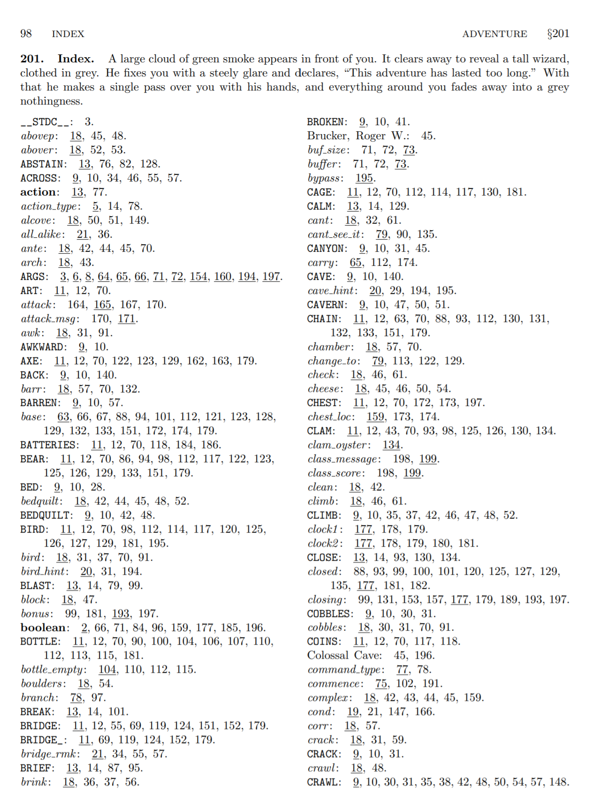
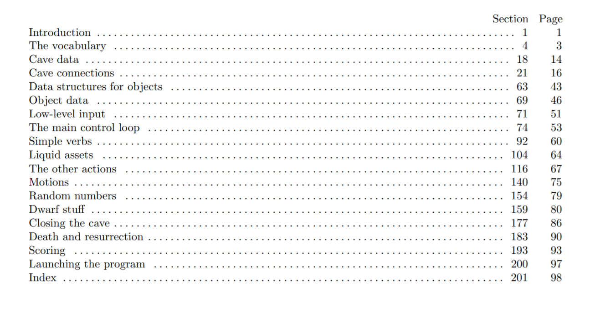

# What will you learn?

-   What is the main idea behind the Web?
-   What are Markup and Markdown?
-   What is "literate programming"?
-   What does it have to do with data science notebooks?
-   Which data science notebooks are out there?
-   How can I use notebooks for data science?
-   How can I use notebooks in my own work?

# It's personal

-   DESY Particle Physics PhD
-   CERN WWW development
-   What is the main idea behind the Web?

*Image: glimpse of the early days of the web*

# What is markup?

-   HTML = HyperText Markup Language
-   Hide meta information - unlike "WYSIWIG"
-   Example - active text element behind [This is a link](https://www.w3schools.com).
    
    Right-click and choose `Inspect` to see the active element:
    
    

Q: *Who can write HTML (and CSS) documents?*<a id="fnr.1" class="footref" href="#fn.1">1</a>

# What is markdown?

> 
> 
> »The idea for Markdown is to make it easy to read, write, and edit
> prose. HTML is a publishing format; Markdown is a writing
> format. Thus, Markdown’s formatting syntax only addresses issues that
> can be conveyed in plain text.« &#x2013; [John Gruber](#org79f0886)

## Why markdown?

-   Easy-to-read and easy-to-write
-   Easy to customize
-   Even easier than HTML:

*Q: Have you come across Markup or Markdown?*

## What is `YAML`

-   [YAML](https://en.wikipedia.org/wiki/YAML) ("YAML Ain't Markup Language")
-   Used for configuration (e.g. headers)
-   Used in R Markdown Notebooks

# What is [ORG-MODE](https://orgmode.org/)?

-   Major GNU Emacs editor mode<a id="fnr.2" class="footref" href="#fn.2">2</a>
-   Plain text markup + export + publishing
-   Literate Programming environment<a id="fnr.3" class="footref" href="#fn.3">3</a>

*Q: Can you think of any reasons to live life in plain text?*

*Image: this very page in Emacs Org-mode.*

# Literate programming

> »Instead of imagining that our main task is to instruct a *computer*
> what to do, let us concentrate rather on explaining to *human beings*
> what we want a computer to do.« &#x2013; [Donald Knuth](#org205adb9)

## Why literate programming?

-   Machines cannot handle uncertainty
-   Humans like stories

## How does literate programming work?

-   Write programs for use by humans *and* by machines
-   Write mainly documentation that also contains code

## Literate programming workflow

-   Documentation + code is contained in one file (`file.w`)
-   Tangling leads to a file that the computer can run
-   Weaving leads to a file that can be printed (`*.dvi`<a id="fnr.4" class="footref" href="#fn.4">4</a>)

### Literate programming example: `adventure`

-   [`advent`](https://en.wikipedia.org/wiki/Colossal_Cave_Adventure) is the first digital Role Playing Game (RPG)
-   It was rewritten in `cweb` by Don Knuth
-   [Play it online here!](https://quuxplusone.github.io/Advent/) (Linux: built-in `$ advent`)

(Source: [Adventure, 1976](#org3da95f1))

### Literate programming example: `adventure`

Literate program text that corresponds to the instructions above:

### Literate programming example: `adventure`

-   Automatic index of commands, variables, objects
-   Index of subroutines, table of contents
-   Support for digital, code-based storytelling
    
    *Image: automatic index of `adventure`*
    
    
    
    *Image: automatic table of contents of `adventure`*
    
    

# Pros and cons of literate programming

<table border="2" cellspacing="0" cellpadding="6" rules="groups" frame="hsides">

<colgroup>
<col  class="org-left" />

<col  class="org-left" />
</colgroup>
<thead>
<tr>
<th scope="col" class="org-left"><b>LITPROG PROS</b></th>
<th scope="col" class="org-left"><b>LITPROG *CONS</b></th>
</tr>
</thead>

<tbody>
<tr>
<td class="org-left">Storytelling supported</td>
<td class="org-left">Requires thought</td>
</tr>
</tbody>

<tbody>
<tr>
<td class="org-left">Prettyprinting with TeX<a id="fnr.5" class="footref" href="#fn.5">5</a></td>
<td class="org-left">TeX difficult to learn</td>
</tr>
</tbody>

<tbody>
<tr>
<td class="org-left">Automatic index/TOC</td>
<td class="org-left">Requires (different) training</td>
</tr>
</tbody>

<tbody>
<tr>
<td class="org-left">Free Software</td>
<td class="org-left">Standardisation difficult</td>
</tr>
</tbody>
</table>

# The case for literate programming

-   Code and documentation in separate files and rarely synchronized,
-   Variable names that are mnemonics and acronyms, not words,
-   Documentation that is seldom created by the programmer, and
-   Documentation that has a lower priority than the program.
    
    See also: "Whither Literate Programming" ([Myers, 2018](#org02573e4))

> »It is commonly accepted in software engineering circles that one of
> the greatest needs in computing is the reduction of the cost of
> maintenance of codes.  Maintenance programmers spend at least half
> of their time trying to understand what code does and maintenance is
> accepted to be 60% to 80% of a code’s cost.« ([Childs, 2010](#org33f7266))

# Modern application examples

-   [Extreme Programming](http://www.extremeprogramming.org/) (XP)
-   [Agile Modeling](http://agilemodeling.com/) (AM)
-   Interactive programming

*Image: computational [IPython](http://ipython.org/) notebook from 2005 (precursor of
Jupyter notebooks)*

## Agile methodologies

-   Ways to develop and document anything
-   Better suited for *complex* projects and *culturally* diverse teams
-   Core value: optimize customer *communication*

*Image: [Scrum](https://www.scrum.org/resources/what-is-scrum/) is the best known agile methodology*

## Notebook examples

-   [Subsetting quiz as shiny app with `learnr` package](https://monty.shinyapps.io/subsetting/#section-introduction)
-   [GNA Internet Course on Literate Programming (1994)](https://web.archive.org/web/20161002004240/http://www.desy.de/user/projects/LitProg/Course.html)
-   [SQL cells in Deepnote (demo, 1 min)](https://docs.deepnote.com/deepnote-crash-course-videos)
-   [Kaggle notebook from Pima Indians database](https://www.kaggle.com/uciml/pima-indians-diabetes-database)
-   [Count cloud notebook](https://count.co/)
-   [Introduction to DataCamp projects (with R)](https://projects.datacamp.com/projects/41)
-   [R Markdown Outputs Gallery](https://rmarkdown.rstudio.com/gallery.html)

## Notebook tutorials

-   Tutorial: [Jupyter and R Markdown: Notebooks with R](https://www.datacamp.com/community/blog/jupyter-notebook-r) (2016)
-   Book: [R notebook (bookdown)](https://bookdown.org/yihui/rmarkdown/notebook.html)
-   Article: [R notebooks for dummies](https://medium.com/swlh/r-notebook-for-dummies-save-and-share-results-easily-51d343a4882) (2020)
-   Course: [Reporting with R Markdown](https://learn.datacamp.com/courses/reporting-with-rmarkdown) (2020)
-   Course: [R Markdown from RStudio](https://rmarkdown.rstudio.com/index.html)

## Org-mode again

-   Notebooks work with R, SQL, Python,&#x2026;anything
-   [SQLite](https://sqlite.org/about.html) example (SQLite = SQL for IoT)
-   Present, too, if you like
-   R notebook example (print+plot)
    
    ---

*Image: SQLite notebook example*

## Notebook demo (rstudio cloud)

-   EDA using the [`Pima` Indian data set](http://heather.cs.ucdavis.edu/FasteR/data/Pima.csv) (via Matloff)
-   Head over to [this RStudio cloud notebook](https://rstudio.cloud/project/2030701) to start
-   Compare your results with [this solution (PDF)](https://moodle.hwr-berlin.de/mod/resource/view.php?id=911275)

*Image: screenshot from the RStudio cloud workspace*

# Notebook applications for you

-   Emacs + ESS + Org-mode (see [FAQ](https://github.com/birkenkrahe/org/blob/master/FAQ.md#org89c9b03))
-   RStudio notebooks
-   Write your next paper or thesis as a "literate program"<a id="fnr.6" class="footref" href="#fn.6">6</a>

# References

 Bart Childs, "Literate Programming, Why?"
(n.d.). [literateprogramming.com](http://www.literateprogramming.com/bchilds1.pdf)

 Bart Childs, "Thirty years of literate
programming and more?". [TUGboat, Volume 31(2), 2010:183-188](https://www.tug.org/TUGboat/tb31-2/tb98childs.pdf).

 John Gruber, "Markdown:
Syntax". Blog. [daringfireball.net](https://daringfireball.net/projects/markdown/syntax#block)

 Donald E. Knuth, "Von Neumann's First Computer
Program". Computing Surveys, 2(4), 1970.

 Donald E. Knuth and Silvio Levy, "The `CWEB` System of
Structured Documentation", 2002. Manual. [literateprogramming.com](http://www.literateprogramming.com/cweb.pdf)

 Bob Myers (2018). Whither Literate Programming
[blog]. [Online: medium.com](https://torazaburo.medium.com/whither-literate-programming-1-f7326fec86e4).

 Wikipedia (14 Oct 2021). TeX [article]. [Online:
en.wikipedia.org.](https://en.wikipedia.org/wiki/TeX)

 [Don Woods and Don Knuth, 1998.](http://www.literateprogramming.com/adventure.pdf) ([Play online](https://quuxplusone.github.io/Advent/))

 Zachary M. Smith, "R Markdown Crash Course",
2020-03-02. [github.com](https://zsmith27.github.io/rmarkdown_crash-course/index.html)

# Footnotes

<a id="fn.1" href="#fnr.1">1</a> For a live view, right click & pick "View page source" in your
browser.

<a id="fn.2" href="#fnr.2">2</a> A major mode in Emacs is an editing environment that is
customized for a particular purpose - e.g. coding in a specific
language like R, or writing notes, like Org-mode, or presenting, like
Org-present. Most editors don't have this possibility. For GNU Emacs,
all modes are easily extensible, that is users can create their own
customizations and contribute them to the editor - just like packages
in R.

<a id="fn.3" href="#fnr.3">3</a> See also: [Org-mode spreadsheets (Gif)](https://orgmode.org/resources/img/features/tables.gif)

<a id="fn.4" href="#fnr.4">4</a> `*.dvi` files ("device independent") are binary output files of
the TeX typesetting software ([texfaq](https://texfaq.org/FAQ-dvi))

<a id="fn.5" href="#fnr.5">5</a> TeX is a typesetting system designed and written by Donald Knuth
as a literate program. The LaTeX typesetting system, popular in
science and research, is derived from TeX. For more, see Wikipedia
([2021](#org1e80afb)).

<a id="fn.6" href="#fnr.6">6</a> Remember: litprog means "documentation first" - this is
data-driven storytelling from the story rather than from the data
end - much easier and much more likely to result in a good story!
