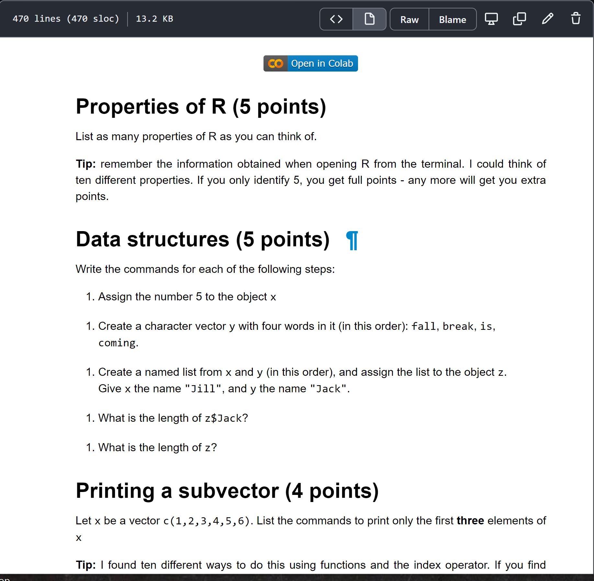

# Followup Oct 12, 2021 - LitProg

-   [Whiteboards](https://drive.google.com/drive/folders/1jMzKWroneUX8n1jnLtB413osHRU4gibo?usp=sharing)
-   [Colaboratory notebook](https://github.com/birkenkrahe/dsc101/blob/main/tests/Midterm_problems.ipynb) (a [Jupyter notebook](https://jupyter.org/))

Today's session was all about repeating foundations of R. These are
really important - more than half of all the things you'll do to
explore data involve the following skills:

-   Create vectors and data frames
-   Extract subvectors
-   Create and manipulate index vectors
-   Extract rows
-   Installing and loading packages

Conceptually, we talked about literate programming, and about the
importance (according to Donald Knuth) for programmers to being
able to operate on different levels of abstraction - e.g. on the
conceptual/modeling level, and on the level of code implementation.

On Thursday, we'll continue the revision of the midterm exam, which
contains all of the items above, using interactive online notebook
(i.e. literate programming) technology.

Remember that a new DataCamp chapter ["Introduction to importing
data](https://app.datacamp.com/groups/data-science-methods-and-tools/assignments)", is due. I've moved the deadline to Monday, because we'll do
a practice test in class with some problems related to the
assignment.

Note: if you were not in class today, **be on time** on Thursday for
a Colaboratory refresher (if you need it) and **bring your own**
laptop to class if possible! Several of the PCs in 209 seem buggy -
I'll try to sort it out by Thursday but I'm not sure I will
succeed. If you haven't done it yet, [open the notebook in
Colaboratory](https://github.com/birkenkrahe/dsc101/blob/main/tests/Midterm_problems.ipynb) (see image below) and answer the first few questions
(same as the midterm exam).

*Image: screenshot of midterm exam problem set as interactive
notebook.*

## Links mentioned

-   The [Anaconda data science platform](https://www.anaconda.com/) includes Jupyter and many
    other platforms (Spyder, Python, Orange for datamining etc.)
    integrated in one neat bundle
-   The September 2021 [R New York conference](https://youtube.com/playlist?list=PLlzRFZmxVl9RVwRP6WKOUXTiRMFkF2cPF) is on YouTube with many
    interesting topics - each talk is only about 20 minutes long. If
    you watch one of these, bring comments and questions to class!
    The organizer, Jared Lander, has also written one of the best R
    textbooks.

