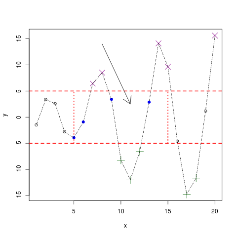

# Table of Contents

1.  [What will you learn?](#org03c7e3d)
2.  [What is `plot`?](#org23d92a7)
3.  [Define and plot two vectors](#orga358a6f)
4.  [Save your plot to a file](#orgbf009cf)
5.  [Plot vectors as matrix](#org27816e6)
6.  [Graphical parameters](#org75f6082)
    1.  [Line and point `type`](#org38165a9)
        1.  [Lines only](#org9630379)
        2.  [Lines and points](#orga030355)
        3.  [Lines plotted over points](#orgfe8f295)
        4.  [No points](#orgb6de56a)
        5.  [Challenge](#orgaa52f31)
    2.  [Title and axis labels: `main`, `xlab` `ylab`](#org3397928)
    3.  [Adding color: `col`](#org4cea05e)
    4.  [Line and Point appearances: `pch`, `lty`, `cex`](#org51e6aae)
        1.  [Point characters: `pch`](#orga4dd820)
        2.  [Line characters: `lty`](#org114e3c9)
        3.  [Point extension: `lwd` and `cex`](#orge76582d)
        4.  [Line thickness](#org15f4c4c)
    5.  [Plotting region limits: `xlim`, `ylim`](#orgb3dfd70)
7.  [ADDING STUFF TO AN EXISTING PLOT](#org9b4bbfd)
    1.  [Data](#orged0d542)
    2.  [Create empty region](#org3280e9b)
    3.  [Add horizontal lines](#org6a9c78b)
    4.  [Add vertical segments](#org813eed3)
    5.  [Add upper points](#orgf0566d1)
    6.  [Add lower points](#orgc131eb9)
    7.  [Add sweet spot points](#org1735468)
    8.  [Add remaining points](#org2a27718)
    9.  [Draw lines](#orge6d79e8)
    10. [Add arrow pointing to the sweet spot](#org6407769)
    11. [Print label at top of arrow](#orgd2d7d02)
    12. [Print legend](#orgc1b540b)
8.  [SUMMARY](#org8145409)
9.  [CODE SUMMARY](#orgdf88e54)

# What will you learn?

-   Basic R plotting with [`plot`](https://r-coder.com/plot-r/)
-   [Graphical parameters](./img/params.png) to customize plots
-   Adding stuff to an already [existing plot](./img/stuff12.png)
-   Complete [video playlist](https://youtube.com/playlist?list=PL6SfZh1-kWXkDVwgn2kXG13Y4SnoWDj9q) (60 min) available
-   Source: T M Davies, Book of R (chapter 7)

")

WHY IS THIS A \*"TERRIBLE PLOT"?

> 
> 
> 1.  It contains too much information!
> 2.  The scale on the left and on the right are different and do not
>     both begin at \(0\). The right one is likely a logarithmic scale.
> 3.  The values on the x-axis are alphabetized, which makes no
>     sense. Instead, the bar chart should be reordered by height.
> 4.  The CAGR ("Compound Annual Growth Rate") line plot (time
>     series) has no (clear) relationship with the bar chart.

# What is `plot`?

-   Default plot of `plot()`: [scatterplot](https://chartio.com/learn/charts/what-is-a-scatter-plot/)
-   Generic (= built in) R function (Base-R!)
-   Versatile (= customizable) R function (OOP!)

# Define and plot two vectors

-   Define two sample vectors
-   Plot them with `plot`
-   Save the plot with `ggsave`

    
    ## define two vectors and plot them
    foo  <- c(1.1, 2, 3.5, 3.9, 4.2)
    bar <- c(2,2.2,-1.3,0,0.2)
    plot(x=foo, y=bar, main="Vectorplot") # output is redirected

# Save your plot to a file

-   Simplest way is with `ggsave`
-   `ggsave` is part of the `ggplot2` package
-   `.png` stands for "Portable Network Graphics"

    
    ## load ggplot (for ggsave)
    library(ggplot2)
    ggsave(filename="vecplot.png")

# Plot vectors as matrix

    
    ## define matrix and plot it
    foo  <- c(1.1, 2, 3.5, 3.9, 4.2)
    bar <- c(2,2.2,-1.3,0,0.2)
    baz <- cbind(foo,bar)
    baz
    plot(baz, main="Matrixplot")

Output:

    :      foo  bar
    : [1,] 1.1  2.0
    : [2,] 2.0  2.2
    : [3,] 3.5 -1.3
    : [4,] 3.9  0.0
    : [5,] 4.2  0.2

# Graphical parameters

## Line and point `type`

-   Set `type` attribute
-   `"l"` for line plots
-   `"b"` for both lines and [data]points
-   `"o"` for plotting points over lines
-   `"n"` for no points whatsoever

### Lines only

    
    ## plot vectors with lines between the points
    foo  <- c(1.1, 2, 3.5, 3.9, 4.2)
    bar <- c(2,2.2,-1.3,0,0.2)
    
    plot(foo,bar, type="l") # type "l" = lineplot

")

### Lines and points

    
    ## plot vectors with lines between the points as circles
    foo  <- c(1.1, 2, 3.5, 3.9, 4.2)
    bar <- c(2,2.2,-1.3,0,0.2)
    
    plot(foo,bar, type="b")  # b = "both points and lines"

")

### Lines plotted over points

    
    ## plot vectors with lines between the points as circles
    ## and overplot the points with lines
    foo  <- c(1.1, 2, 3.5, 3.9, 4.2)
    bar <- c(2,2.2,-1.3,0,0.2)
    
    plot(foo,bar, type="o")  # o = "points and lines overplotted"

")

### No points

Useful e.g. to build a plot up in stages

    
    ## define vectors
    foo  <- c(1.1, 2, 3.5, 3.9, 4.2)
    bar <- c(2,2.2,-1.3,0,0.2)
    
    plot(foo,bar, type="n")  # n = "no points"

")

### Challenge

-   Build a plot with lines and points from `rnorm(1:10)`
-   Repeat the command a couple of times
-   What do you think the function `rnorm` does?

## Title and axis labels: `main`, `xlab` `ylab`

-   Use `main` to title your plot
-   Use the escape character `\n` to go over several lines
-   See "[String manipulation with `stringr`](https://campus.datacamp.com/courses/string-manipulation-with-stringr-in-r/string-basics?ex=4)" in DataCamp

    
    ## plot vectors with axis labels and title over two lines
    foo  <- c(1.1, 2, 3.5, 3.9, 4.2)
    bar <- c(2,2.2,-1.3,0,0.2)
    
    plot(foo,bar, type="b",
         main="My lovely plot\ntitle on two lines",
         xlab="x axis label", ylab="location y")

## Adding color: `col`

-   Available color string values: `colors()`
-   See also `demo("colors")` and "[colors in R](http://www.sthda.com/english/wiki/colors-in-r)"

    
    colors()[10:15] # 6 elements of the ~colors~ characters

-   To set color, use the `col` attribute in `plot`

    
    foo  <- c(1.1, 2, 3.5, 3.9, 4.2)
    bar <- c(2,2.2,-1.3,0,0.2)
    
    plot(foo,bar, type="b",    # lines and points
         main="Color demo\n\"red\"", # title
         col="red")    # color the plot

")

## Line and Point appearances: `pch`, `lty`, `cex`

### Point characters: `pch`

-   Point appearance: `pch` attribute
-   Specify any character or a value between `1` and `25`
-   More information: `?points`

    
    ## show all available point appearances
    plot((1:25),(1:25), main="pch demo",pch=(1:25))

")

### Line characters: `lty`

-   Line appearance: `lty` attribute
-   Assign values `1` through `6`
-   Function `abline` draws lines

    
    ##
    plot(1:6, main="lty=(1:6)", xlab="",ylab="",type="n")
    
    abline(v=(1:6),   # draw line at every vector element
           col=c("blue","red","seagreen",  # 6 colors
    	     "black","orange","aquamarine4"),
           lty=(1:6)) # align line types with the vector

")

### Point extension: `lwd` and `cex`

-   Plotted point size: `cex` attribute
-   `cex` must be positive

    
    plot((1:8),                 # vector definition
         main="cex=2\npch=16",  # title
         xlab="",               # empty label
         ylab="",               # empty label
         col=(1:8),             # color vector
         pch=16,                # point character
         cex=2)                 # double the point size

### Line thickness

-   Line thickness: `lwd` attribute
-   `lwd` must be positive

    
    ##
    plot(1:6, main="lty=(1:6)", xlab="",ylab="",type="n")
    abline(v=(1:6), col=c("blue","red","seagreen",
    		      "black","orange","aquamarine4"),
           lty=(1:6),
           lwd=4)      # increase default line thickness

## Plotting region limits: `xlim`, `ylim`

-   R chooses displayed plot ranges based in input values
-   Custom plot ranges: attributes `xlim`, `ylim`
-   Values are set as vectors with `c()`

    
    ## sample vectors
    foo  <- c(1.1, 2, 3.5, 3.9, 4.2)
    bar <- c(2,2.2,-1.3,0,0.2)
    
    ## plot with custom range
    plot(foo, bar, type="b",
         main="custom area\ndemo",
         xlab="",
         ylab="",
         col="blue",
         pch=8,
         lty=2,
         cex=2.3,
         lwd=3.3,
         xlim=c(-10,5), # x axis
         ylim=c(-3,3))  # y axis

, \(ylim=[-3,3]\)")

-   You are not tied to the input values
-   In the following example, some points cannot be shown

    
    foo  <- c(1.1, 2, 3.5, 3.9, 4.2)
    bar <- c(2,2.2,-1.3,0,0.2)
    plot(foo, bar, type="b",
         main="custom area\ndemo",
         xlab="",ylab="",
         col="chocolate4",
         pch=15,
         lty=3,
         cex=0.7,
         lwd=2,
         xlim=c(3,5),
         ylim=c(-0.5,0.2))

, \(ylim=[-0.5,0.2]\)")

# ADDING STUFF TO AN EXISTING PLOT

We're going to build the plot shown in figure [76](#org0ce86da) step by
step using the graphical parameters already shown and a few
ready-to-use functions that add to an existing plot without
refreshing or clearing the window, in only 10 lines of code.

In figure [76](#org0ce86da), data points are plotted differently depending
on their relative position to the "sweet spot":

-   Points with \(y>5\) are marked with a `purple` \(\times\) (`pch=4`)
-   Points with \(y<-5\) are marked with a `green` \(+\) (`pch=3`)
-   Points with \(y\in[-5,5]\) but outside the sweet spot are marked \(\circ\)
-   Point in the sweet spot with \(x\in[5,15]\) and \(y\in[-5,5]\) are
    marked with a `blue` \(\bullet\)
-   To delineate the sweet spot, we use thick (`lwd=2`) dashed
    (`lty=2`) `red` `lines`
-   The sweet spot is named and labeled (`text`) with an arrow (`arrows`)
-   There is a `legend` explaining point and line types

")

## Data

We add two hypothetical vectors and plot them (fig. [78](#org0f14a44))
using only default settings of `plot`.

    ## define x and y vectors for 20 (x,y) locations
    x <- 1:20
    y <- c(-1.49, 3.37, 2.59, -2.78, -3.94, -0.92,
           6.43, 8.51, 3.41, -8.23, -12.01, -6.58,
           2.87, 14.12, 9.63, -4.58, -14.78,-11.67,
           1.17, 15.62)
    plot(x,y)

## Create empty region

Create an empty plotting region to add points and draw lines but
don't plot anything - see figure [80](#org73e55a0).

    x <- 1:20
    y <- c(-1.49, 3.37, 2.59, -2.78, -3.94, -0.92,
           6.43, 8.51, 3.41, -8.23, -12.01, -6.58,
           2.87, 14.12, 9.63, -4.58, -14.78, -11.67,
           1.17, 15.62)
    
    ## create region for plot without plotting anthing
    plot(x,y, type="n", main="")

## Add horizontal lines

Add straight lines spanning a plot using [`abline`](https://www.rdocumentation.org/packages/graphics/versions/3.6.2/topics/abline). Specify *slope*
and *intercept* values, or just add horizontal or vertical
lines. The code below adds two separate horizontal lines at \(y=5\)
and \(y=-5\) using the parameter `h=c(-5,5)`. We want the lines red,
dashed and with double thickness. See figure [82](#org12b083d).

    x <- 1:20
    y <- c(-1.49, 3.37, 2.59, -2.78, -3.94, -0.92,
           6.43, 8.51, 3.41, -8.23, -12.01, -6.58,
           2.87, 14.12, 9.63, -4.58, -14.78, -11.67,
           1.17, 15.62)
    plot(x,y, type="n", main="")
    
    ## add straight horizontal lines
    abline(h=c(-5,5), col="red", lty=2, lwd=2)

For vertical lines, you could have written `v=c(-5,5)`, which would
have drawn lines at \(x=-5\) and \(x=5\). See `?abline` for more info.

## Add vertical segments

Add shorter vertical lines to form a box for the "sweet spot". We
use `segments` since we don't want the lines to span the whole
region. `segments` takes a "from" coordinate (`x0` and `y0`) and a
"to" coordinate (`x1` and `y1`). The vector-oriented behavior of R
matches the two sets of coordinates - e.g. from `(5,-5)` to `(5,5)`
for the first line. See figure [87](#org61ffeb7).

    
    x <- 1:20
    y <- c(-1.49, 3.37, 2.59, -2.78, -3.94, -0.92,
           6.43, 8.51, 3.41, -8.23, -12.01, -6.58,
           2.87, 14.12, 9.63, -4.58, -14.78, -11.67,
           1.17, 15.62)
    plot(x,y, type="n", main="") # empty plot
    abline(h=c(-5,5), col="red", lty=2, lwd=2) # horizontal line
    
    ## add segment from x in [5,15] to y in [-5,5]
    segments(
      x0=c(5,15), y0=c(-5,-5), # draw from x0,y0 to
      x1=c(5,15), y1=c(5,5),   #           x1,y1
      col="red",
      lty=3,
      lwd=2)

Note that the left segment goes from `(x0[1],y0[1])=(5,-5)` to
`(x1[1],y1[1])=(5,5)`, and the right segment goes from
`(x0[2],y0[2])=(15,-5)` to `(x1[2],y1[2])=(15,5)`.

So to draw only the left/right line, the following commands would
also apply:

    segments(x0=5, y0=-5,x1=5, y1=5)
    segments(x0=15,y0=-5,x1=15,y1=5)

 to \(y\in[-5,5]\)")

## Add upper points

Use the function `points` to extract specific coordinates from the
data vectors `x` and `y` to the plot. Like `plot`, `points` takes
two arguments of equal length with \(x\) and \(y\) values.

Use logical subsetting to identify and extract elements where
\(y\geq5\), add them as `purple` \(\times\) symbols (`pch=4`),
enlarged by a factor two with `cex`, as shown in figure
[90](#orgd16f516).

    x <- 1:20
    y <- c(-1.49, 3.37, 2.59, -2.78, -3.94, -0.92,
           6.43, 8.51, 3.41, -8.23, -12.01, -6.58,
           2.87, 14.12, 9.63, -4.58, -14.78, -11.67,
           1.17, 15.62)
    plot(x,y, type="n", main="")
    abline(h=c(-5,5), col="red", lty=2, lwd=2)
    segments(x0=c(5,15),
    	 y0=c(-5,-5),
    	 x1=c(5,15),
    	 y1=c(5,5),
    	 col="red",
    	 lty=3,
    	 lwd=2)
    
    ## Add points with y greater or equal 5
    points(x[y>5], y[y>5],
           pch=4,
           col="darkmagenta",
           cex=2)

 as fat, purple \(\times\) signs")

## Add lower points

Extract points from the vectors with \(y\leq-5\) using enlarged,
green \(+\) symbols - see figure [92](#org2a01062).

    x <- 1:20
    y <- c(-1.49, 3.37, 2.59, -2.78, -3.94, -0.92,
           6.43, 8.51, 3.41, -8.23, -12.01, -6.58,
           2.87, 14.12, 9.63, -4.58, -14.78, -11.67,
           1.17, 15.62)
    plot(x,y, type="n", main="")
    abline(h=c(-5,5), col="red", lty=2, lwd=2)
    segments(x0=c(5,15), y0=c(-5,-5),
    	 x1=c(5,15), y1=c(5,5),
    	 col="red", lty=3, lwd=2)
    points(x[y>5], y[y>5], pch=4,
           col="darkmagenta",
           cex=2)
    
    ## Add points with y smaller or equal -5
    points(x[y<=-5], y[y<=-5],
           pch=3, col="darkgreen", cex=2)

 as fat, green \(+\) signs")

## Add sweet spot points

Extract points in the segment drawn before. These points fulfil the
condition \(x\in[5,15] \cup y\in[-5,5]\). Plot them as full blue
\(\bullet\) signs - as shown in figure [94](#org3187910).

    x <- 1:20
    y <- c(-1.49, 3.37, 2.59, -2.78, -3.94, -0.92,
           6.43, 8.51, 3.41, -8.23, -12.01, -6.58,
           2.87, 14.12, 9.63, -4.58, -14.78, -11.67,
           1.17, 15.62)
    plot(x,y, type="n", main="")
    abline(h=c(-5,5), col="red", lty=2, lwd=2)
    segments(x0=c(5,15), y0=c(-5,-5),
    	 x1=c(5,15), y1=c(5,5),
    	 col="red", lty=3, lwd=2)
    points(x[y>5], y[y>5], pch=4,
           col="darkmagenta", cex=2)
    points(x[y<=-5], y[y<=-5], pch=3,
           col="darkgreen", cex=2)
    
    ## Add points inside the segment
    points(x[(x>=5&x<=15)&(y>=-5&y<=5)],
           y[(x>=5&x<=15)&(y>=-5&y<=5)],
           pch=19,col="blue")

 signs")

## Add remaining points

All remaining points satisfy the condition: \(x<5\) or \(x>15\), and
\(y\in(-5,5)\). See figure [96](#org5b07e4b).

    x <- 1:20
    y <- c(-1.49, 3.37, 2.59, -2.78, -3.94, -0.92,
           6.43, 8.51, 3.41, -8.23, -12.01, -6.58,
           2.87, 14.12, 9.63, -4.58, -14.78, -11.67,
           1.17, 15.62)
    plot(x,y, type="n", main="")
    abline(h=c(-5,5), col="red", lty=2, lwd=2)
    segments(x0=c(5,15), y0=c(-5,-5),
    	 x1=c(5,15), y1=c(5,5),
    	 col="red", lty=3, lwd=2)
    points(x[y>5], y[y>5], pch=4,
           col="darkmagenta", cex=2)
    points(x[y<=-5], y[y<=-5], pch=3,
           col="darkgreen", cex=2)
    points(x[(x>=5&x<=15)&(y>=-5&y<=5)],
           y[(x>=5&x<=15)&(y>=-5&y<=5)],
           pch=19,col="blue")
    
    ## Add remaining points x<5 or x>15 AND y in (-5,5)
    points(x[(x<5|x>15)&(y>-5&y<5)],
           y[(x<5|x>15)&(y>-5&y<5)])

 sign")

## Draw lines

Use `lines` to draw lines connecting the coordinates in `x` and
`y`. Draw them in dash-dot-dash style (`lty=4`), see figure [98](#org786bdfb).

    x <- 1:20
    y <- c(-1.49, 3.37, 2.59, -2.78, -3.94, -0.92,
           6.43, 8.51, 3.41, -8.23, -12.01, -6.58,
           2.87, 14.12, 9.63, -4.58, -14.78, -11.67,
           1.17, 15.62)
    plot(x,y, type="n", main="")
    abline(h=c(-5,5), col="red", lty=2, lwd=2)
    segments(x0=c(5,15), y0=c(-5,-5),
    	 x1=c(5,15), y1=c(5,5),
    	 col="red", lty=3, lwd=2)
    points(x[y>5], y[y>5], pch=4,
           col="darkmagenta", cex=2)
    points(x[y<=-5], y[y<=-5],
           pch=3, col="darkgreen", cex=2)
    points(x[(x>=5&x<=15)&(y>=-5&y<=5)],
           y[(x>=5&x<=15)&(y>=-5&y<=5)],pch=19,col="blue")
    points(x[(x<5|x>15)&(y>-5&y<5)],
           y[(x<5|x>15)&(y>-5&y<5)])
    
    ## draw lines
    lines(x,y,lty=4)

## Add arrow pointing to the sweet spot

The function `arrows` is used just like `segments` with limiting
coordinate pairs `(x0,y0)` and `(x1,y1)`. The arrow head is by
default pointed at the "to" coordinate - check `?arrows` to find
out how to alter this. See [100](#org6a46c51) for the result.

    x <- 1:20
    y <- c(-1.49, 3.37, 2.59, -2.78, -3.94, -0.92,
           6.43, 8.51, 3.41, -8.23, -12.01, -6.58,
           2.87, 14.12, 9.63, -4.58, -14.78, -11.67,
           1.17, 15.62)
    plot(x,y, type="n", main="")
    abline(h=c(-5,5), col="red", lty=2, lwd=2)
    segments(x0=c(5,15), y0=c(-5,-5), x1=c(5,15), y1=c(5,5),
    	 col="red", lty=3, lwd=2)
    points(x[y>5], y[y>5], pch=4,
           col="darkmagenta", cex=2)
    points(x[y<=-5], y[y<=-5], pch=3,
           col="darkgreen", cex=2)
    points(x[(x>=5&x<=15)&(y>=-5&y<=5)],
           y[(x>=5&x<=15)&(y>=-5&y<=5)],
           pch=19,col="blue")
    points(x[(x<5|x>15)&(y>-5&y<5)],
           y[(x<5|x>15)&(y>-5&y<5)])
    lines(x,y,lty=4)
    
    ## add arrow
    arrows(x0=8, y0=14, x1=11,y1=2.5)

## Print label at top of arrow

Print label on the plot at the top of the arrow using the function
`text`. By default, the text in `labels` is centered on the given
coordinates, as shown in [102](#org23e6508).

    x <- 1:20
    y <- c(-1.49, 3.37, 2.59, -2.78, -3.94, -0.92,
           6.43, 8.51, 3.41, -8.23, -12.01, -6.58,
           2.87, 14.12, 9.63, -4.58, -14.78, -11.67,
           1.17, 15.62)
    plot(x,y, type="n", main="")
    abline(h=c(-5,5), col="red", lty=2, lwd=2)
    segments(x0=c(5,15), y0=c(-5,-5),
    	 x1=c(5,15), y1=c(5,5),
    	 col="red", lty=3, lwd=2)
    points(x[y>5], y[y>5], pch=4,
           col="darkmagenta", cex=2)
    points(x[y<=-5], y[y<=-5], pch=3,
           col="darkgreen", cex=2)
    points(x[(x>=5&x<=15)&(y>=-5&y<=5)],
           y[(x>=5&x<=15)&(y>=-5&y<=5)],pch=19,col="blue")
    points(x[(x<5|x>15)&(y>-5&y<5)],
           y[(x<5|x>15)&(y>-5&y<5)])
    lines(x,y,lty=4)
    arrows(x0=8, y0=14, x1=11,y1=2.5)
    
    ## add arrow label
    text(x=8, y=15, labels="sweet spot")

## Print legend

Find the final result with the legend in [104](#org257ba33). Here, you
need to use a fair amount of `NA` values, because the graphical
vectors have to have the same length to be processed.

    x <- 1:20
    y <- c(-1.49, 3.37, 2.59, -2.78, -3.94, -0.92,
           6.43, 8.51, 3.41, -8.23, -12.01, -6.58,
           2.87, 14.12, 9.63, -4.58, -14.78, -11.67,
           1.17, 15.62)
    plot(x,y, type="n", main="")
    abline(h=c(-5,5), col="red", lty=2, lwd=2)
    segments(x0=c(5,15), y0=c(-5,-5), x1=c(5,15), y1=c(5,5),
    	 col="red", lty=3, lwd=2)
    points(x[y>5], y[y>5], pch=4, col="darkmagenta", cex=2)
    points(x[y<=-5], y[y<=-5], pch=3, col="darkgreen", cex=2)
    points(x[(x>=5&x<=15)&(y>=-5&y<=5)],
           y[(x>=5&x<=15)&(y>=-5&y<=5)],pch=19,col="blue")
    points(x[(x<5|x>15)&(y>-5&y<5)],
           y[(x<5|x>15)&(y>-5&y<5)])
    lines(x,y,lty=4)
    arrows(x0=8, y0=14, x1=11,y1=2.5)
    text(x=8, y=15, labels="sweet spot")
    
    ## add legend
    legend("bottomleft",
           legend=c("overall process", "sweet",
    		"standard", "too big",
    		"too small", "sweet y range",
    		"sweet x range"),
           pch=c(NA,19,1,4,3,NA,NA),
           lty=c(4,NA,NA,NA,NA,2,3),
           col=c("black","blue","black",
    	     "darkmagenta","darkgreen","red","red"),
           lwd=c(1,NA,NA,NA,NA,2,2),
           pt.cex=c(NA,1,1,2,2,NA,NA))

# SUMMARY

-   `plot` is a generic R function with many different possible
    parameters to customize plots.
-   You can change line type, point type, color points and restrict
    plotting regions.
-   You can add points, lines and text to an existing plot.

# CODE SUMMARY

Parameters for scatterplots with `plot`:

<table border="2" cellspacing="0" cellpadding="6" rules="groups" frame="hsides">

<colgroup>
<col  class="org-left" />

<col  class="org-left" />
</colgroup>
<thead>
<tr>
<th scope="col" class="org-left">PARAMETER</th>
<th scope="col" class="org-left">DESCRIPTION</th>
</tr>
</thead>

<tbody>
<tr>
<td class="org-left"><code>type</code></td>
<td class="org-left">how to plot given coordinates</td>
</tr>

<tr>
<td class="org-left"><code>main</code>, <code>xlab</code>, <code>ylab</code></td>
<td class="org-left">plot title and axis labels</td>
</tr>

<tr>
<td class="org-left"><code>col</code></td>
<td class="org-left">colors for plotting lines and points</td>
</tr>

<tr>
<td class="org-left"><code>pch</code></td>
<td class="org-left">point character (plotting symbol)</td>
</tr>

<tr>
<td class="org-left"><code>cex</code></td>
<td class="org-left">character expansion/point size</td>
</tr>

<tr>
<td class="org-left"><code>lty</code></td>
<td class="org-left">type of line (solid. dotted, dashed)</td>
</tr>

<tr>
<td class="org-left"><code>lwd</code></td>
<td class="org-left">line width / thickness</td>
</tr>

<tr>
<td class="org-left"><code>xlim</code>, <code>ylim</code></td>
<td class="org-left">horizontal/vertical region limits</td>
</tr>

<tr>
<td class="org-left"><code>points</code></td>
<td class="org-left">function to add points to a plot</td>
</tr>

<tr>
<td class="org-left"><code>lines</code>, <code>ablines</code></td>
<td class="org-left">functions to add lines to a plot</td>
</tr>

<tr>
<td class="org-left"><code>text</code></td>
<td class="org-left">function to write text in a plot</td>
</tr>

<tr>
<td class="org-left"><code>arrows</code></td>
<td class="org-left">function to add arrows to a plot</td>
</tr>

<tr>
<td class="org-left"><code>legend</code></td>
<td class="org-left">function to add a legend to a plot</td>
</tr>

<tr>
<td class="org-left"><code>segments</code></td>
<td class="org-left">function to add line segments</td>
</tr>
</tbody>
</table>

