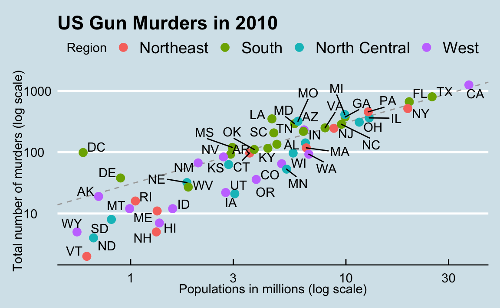
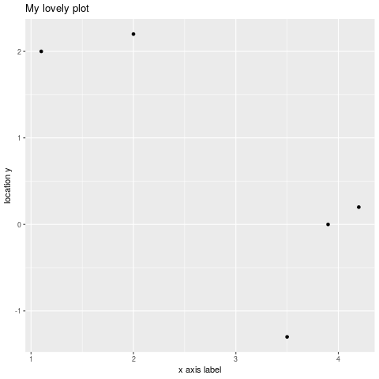
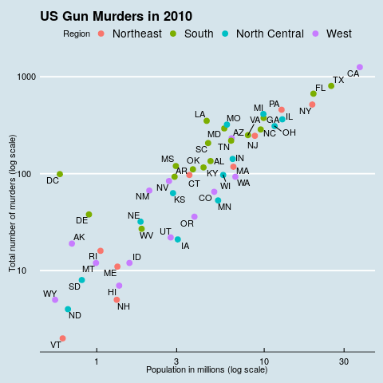

# Table of Contents

1.  [WHAT WILL YOU LEARN?](#orgee00f1d)
2.  [GRAPHICS PACKAGES IN R](#orga164a2e)
    1.  [Installation](#org29465d4)
        1.  [Problems students had in Windows 10](#org032da74)
        2.  [Problems students had in MacOS](#orgbc0ed71)
    2.  [Beyond the Tidyverse](#orga9e1858)
    3.  [Tidyness](#org2c711f1)
    4.  [What are messy data?](#orgadaa2de)
3.  [QUICK PLOTS](#org24fa1af)
    1.  [Print coordinate vectors](#orgcb153e0)
    2.  [Define plot labels](#org5e42874)
    3.  [Difference to `plot`](#orgd7b445f)
4.  [COMPONENTS OF A GRAPH](#org82e014a)
5.  [OBJECTS AND PIPING](#orgf1b0f51)
6.  [GEOMETRIES](#orgdf8f0ad)
7.  [AESTHETIC MAPPINGS](#orgf2f2ce1)
8.  [LAYERS](#org119ce4e)
9.  [SIZE IS NOT A MAPPING](#org5802eea)
10. [NUDGING IS NOT A MAPPING EITHER](#org6af3e3a)
11. [GLOBAL AESTHETIC MAPPING](#orgf074909)
12. [LOCAL OVERRIDE](#org0ac4281)
13. [LOG SCALE I](#org1b3532f)
14. [LOG SCALE II](#org28c2363)
15. [LABELS AND TITLES](#org684f09f)
16. [COLOR I](#orga7c078f)
17. [COLOR II](#orgc5d20a9)
18. [MORE](#org83def53)
19. [PUTTING IT ALL TOGETHER](#org9f6adf3)
20. [CHALLENGES](#org8d9b6c9)
21. [REFERENCES](#org6cbf58a)
22. [SUMMARY](#org11d845b)
23. [CODE](#org40ffc9d)

# WHAT WILL YOU LEARN?<a id="fnr.1" class="footref" href="#fn.1">1</a>

-   Quick plots
-   Components of a graph
-   Plot objects and piping
-   Geometries
-   Aesthetic mappings
-   Layers
-   Scales
-   Labels and titles
-   Categories as colors
-   Putting it all together

# GRAPHICS PACKAGES IN R

## Installation

In this chapter, we first return to the data used in the chapter on
"Basic plotting with R", and create some simple examples using the
`ggplot2` package. Then we move on to a real data frame.

Note that there are yet more graphics packages in R, e.g. `grid` and
`lattice` ([Kumar, 2020](#org76ae6de))

To begin, make sure that you have installed `ggplot2`:

    R> install.packages("ggplot2")
    R> library(ggplot2)

### Problems students had in Windows 10

-   Installation of `dplyr`
    
    > > library(dplyr)
    > Error: package or namespace load failed for 'dplyr' in loadNamespace(j <- i1L, c(lib.loc, .libPaths()), versionCheck = vIj):
    > there is no package called 'purrr'
    
    [Solution (community forum)](https://community.powerbi.com/t5/Desktop/R-refresh-not-working-anymore-rlang-loaded-0-2-2-but-0-3-0/m-p/571035#M269586)

### Problems students had in MacOS

-   Default locale problem - see screenshot from the introductory
    lesson (installation) in figure [19](#org4dbe14e).
    
    

## Beyond the Tidyverse

This lesson builds on [Davies (2016)](#org90776f3) and [Irizarry (2020)](#org9a71ab2). The book by
Irizarry is available online for free - the chapter on `ggplot2`
assumes knowledge of the Tidyverse package `dplyr`. This package
contains several useful functions to manipulate data frames. The way
these functions work will be familiar to those who know SQL:

-   `filter` to extract rows/observations from a data frame
-   `select` to extract columns/vectors from a data frame
-   `mutate` to add column vectors (variables) to a data frame

---

A better performing package for big data in tables is
[`data.table`](https://www.datacamp.com/community/tutorials/data-table-r-tutorial). You will especially like this package if you
already know SQL since it follows the same logic.

## Tidyness

A condition for using both `ggplot2` and `dplyr` functions is that
the data are "tidy", which in short means that they are perfectly
tabular (like data in relational databases) - see [Wickham (2014)](#orgd3e27df)
for details, and figure [31](#orgbbdda95) for an illustration:

1.  Each variable is a column
2.  Each observation is a row
3.  Each type of observational unit is a table
    
    Tidy data are nice if you have someone to tidy the data for
    you, or if they are already in that format. Then you can focus
    on analysis instead of data cleaning. However, there is likely
    to be less room for new discoveries.
    
    In the Tidyverse, tidy data output is formatted as so-called
    "tibbles", which are rather hard to read. To me, the Tidyverse
    seems rather suited to the intermediate to professional R
    programmer - not the (casual) user or first-time learner of
    R<a id="fnr.2" class="footref" href="#fn.2">2</a>.

. Source: R for Data Science ([Wickham/Grolemund 2016](#org3e89da0))")

## What are messy data?

But how would "non-tidy" (aka messy) data look like? Wickham (2014)
gives several indications for messy data:

-   Column headers are values, not variable names.
-   Multiple variables are stored in one column.
-   Variables are stored in both rows and columns.
-   Multiple types of observational units are stored in the same
    table.
-   A single observational unit is stored in multiple tables.

Real data, especially big data, are usually messy, and not tidy. You
may not know this because for training purposes, mostly tidy tabular
data are used.

# QUICK PLOTS

## Print coordinate vectors

    ## load ggplot2 package
    library(ggplot2)
    
    ## define coordinate vectors
    foo <- c(1.1,2,3.5,3.9,4.2)
    bar <- c(2,2.2,-1.3,0,0.2)
    
    ## quick plot foo,bar
    qplot(foo,bar)

See figure [40](#org2cd3b5d) for the output of this code. Notice the visual
changes to the generic plotting function `plot(foo,bar)`. But the
syntax is the same: two vectors of equal length are passed to the
function and evaluated as two coordinate vectors.

## Define plot labels

Label definition works in the same way:

    ## load ggplot2 package
    library("ggplot2")
    
    ## define coordinate vectors
    foo <- c(1.1,2,3.5,3.9,4.2)
    bar <- c(2,2.2,-1.3,0,0.2)
    
    ## quick plot foo,bar with labels
    qplot(foo,bar,
          main="My lovely plot",
          xlab="x axis label",
          ylab="location y")

See figure [43](#org5bb701d) for the output of this code.

## Difference to `plot`

Instead of a step by step process, which is what `plot` does,
`ggplot2` creates graphics in a different way: the plots are stored
as objects and remain static until you change the object. `qplot`
visualizes the printed object at any given time.

To show this, store `plot(foo,bar)` and `qplot(foo,bar)` in two
vectors `baz` and `qux` and print them:

    ## load ggplot2 package
    library("ggplot2")
    
    ## define coordinate vectors
    foo <- c(1.1,2,3.5,3.9,4.2)
    bar <- c(2,2.2,-1.3,0,0.2)
    
    ## store and print plot
    baz <- plot(foo,bar)
    baz
    
    ## store and print qplot
    qux <- qplot(foo,bar)
    qux

`baz` is `NULL` because nothing is stored in the workspace. `qux`
on the other hand contains the `qplot` object. To be able to save
the plot this way before you display it offers new ways of
modifying and enhancing plots creating a distinct advantage over
base R graphics.

# COMPONENTS OF A GRAPH

We will construct the graph already shown earlier, in figure
[11](#orgdf3dcb2). First, we break the graph apart in components:

-   **Data:** the US `murders` data frame is summarized
-   **Geometry:** the plot is a scatterplot. Other possibilities:
    barplot, histogram, smooth density plots, boxplots.
-   **Aesthetic mapping:** visual clues, like mapping of observations to
    x- and y-axis, color, data labels, region legend, overall style
    (here borrowed from the magazine The Economist<a id="fnr.3" class="footref" href="#fn.3">3</a>).

# OBJECTS AND PIPING

We define a `ggplot` object using the `murders` data. You should get
an overview of the data using `str(murders)` et an overview of the
data using `str(murders)` and `head(murders)`.

    ## load package and data frame
    library(ggplot2)
    library(dslabs)
    data(murders)
    
    ## define object associated with the data
    p <- ggplot(data = murders)
    class(p)
    
    ## render plot by printing the object
    print(p)

An alternative is to pipe the data in as the first argument using
the `dplyr` operator `%>%`<a id="fnr.4" class="footref" href="#fn.4">4</a>:

    ## load package and data frame
    library(dplyr)
    library(ggplot2)
    library(dslabs)
    data(murders)
    ## pipe the data in as the first argument
    murders %>% ggplot()

The output is the same in both cases (see figure [54](#orgdd9b6ee)): since no
geometry was defined, the output is a blank slate with a pure grey
style background.

` without geometry")

# GEOMETRIES

`ggplot2` graphs are created using layers with the `+` symbol. The
schematic looks like this:

    ggplot(data=DATA) +  LAYER 1 + LAYER 2 + ... + LAYER N

Usually, the first layer defines the geometry - for scatterplot,
that's `geom_point`<a id="fnr.5" class="footref" href="#fn.5">5</a>

> [Challenge:](#org3ef0f48) check out the help file for `geom_point`. Which aesthetic
> mappings are possible, which are necessary?

# AESTHETIC MAPPINGS

The `aes` function is used as the argument of a geometry function:
note that you can call the vectors `murder$population` and
`murder$total` without the accessor `$`<a id="fnr.6" class="footref" href="#fn.6">6</a>:

    library(dslabs)
    library(ggplot2)
    data(murders)
    
    ## plot total murders vs population
    ggplot(data=murders) +
      geom_point(
        aes(x = population/10^6,
    	y = total))

For the output, see figure [60](#orgc33bac4).

# LAYERS

We add labels to identify each point with its US state
(`murders$abb`) using the `geom_text` geometry. To emphasize the
layer concept, we stick to the object notation (instead of the
piping), see figure [63](#orgb6bfbff) for the output:

    library(dslabs)
    library(ggplot2)
    data(murders)
    
    ## define ggplot object, x and y vectors
    p <- ggplot(data = murders)
    
    ## add text label layer to the scatterplot and render
    p + geom_point(
          aes(x = population/10^6,
    	  y = total)) +
      geom_text(aes(x = population/10^6,
    		y = total,
    		label=abb))

> [Challenge:](#orgc4e45b6) try calling `label=abb` outside of the `aes` function!

# SIZE IS NOT A MAPPING

We can change aesthetics like the size of the points using the
`size` argument inside the geometry. `size` is not a mapping,
because it does not use data from observations!

    library(dslabs)
    library(ggplot2)
    data(murders)
    
    ## define ggplot object, x and y vectors
    p <- ggplot(data = murders)
    
    ## add text label layer to the scatterplot and render
    p + geom_point(
          aes(x = population/10^6,
    	  y = total),
          size = 3) +
      geom_text(
        aes(x = population/10^6,
    	y = total,
    	label=abb))

This leads to a resizing of the points as shown in figure [66](#org96a47ab).

# NUDGING IS NOT A MAPPING EITHER

    library(dslabs)
    library(ggplot2)
    data(murders)
    
    ## define ggplot object, x and y vectors
    p <- ggplot(data = murders)
    
    ## add text label layer to the scatterplot and render
    p + geom_point(
          aes(x = population/10^6,
    	  y = total),
          size = 3) +
      geom_text(
        aes(x = population/10^6,
    	y = total,
    	label=abb),
        nudge_x = 1.5)

This leads to a nudging of the labels as shown in figure
[68](#org901827b).

# GLOBAL AESTHETIC MAPPING

We want to avoid having to define `aes` for each geometry. To do
this, we need to let R know that added layers will default to our
mapping. We redefine our plot object `p`. By defining a mapping
inside `ggplot`, it now applies globally. We then test this right
away with our `size` and `nudge_x` parameters (see figure
[70](#org7d75aad)):

    library(dslabs)
    library(ggplot2)
    data(murders)
    
    ## define ggplot object and aesthetic mapping
    p <- ggplot(data=murders,
    	    aes(population/10^6,
    		total,
    		label=abb))
    
    ## add text label layer to the scatterplot and render
    p + geom_point(size = 3) +
      geom_text(nudge_x = 1.5)

# LOCAL OVERRIDE

Local definitions override global definitions! Figure [72](#org8964098)
shows an example: the second call to `geom_text` does not use the
`murders` data.

    library(dslabs)
    library(ggplot2)
    data(murders)
    
    ## define ggplot object and aesthetic mapping
    p <- ggplot(data=murders,
    	    aes(population/10^6,
    		total,
    		label=abb))
    
    ## add text label layer to the scatterplot and render
    p + geom_point(size = 3) +
      geom_text(x = 10,
    	    y = 800,
    	    label = "Hello there!")

# LOG SCALE I

Log-scales are not the default. We add them with the
`scale_x_continuous` function (see figure [72](#org8964098)):

    library(dslabs)
    library(ggplot2)
    data(murders)
    
    ## define ggplot object and aesthetic mapping
    p <- ggplot(data=murders,
    	    aes(population/10^6,
    		total,
    		label=abb))
    
    ## add text label layer to the scatterplot and render
    ## transform x and y vectors to log10 values
    p + geom_point(size = 3) +
      geom_text(nudge_x = 0.05) +
      scale_x_continuous(trans = "log10") +
      scale_y_continuous(trans = "log10")

We reduce the `nudge_x` factor to accomodate the log-scale.

# LOG SCALE II

Logarithmic transformations are so common that there is a
specialized function for it:

    library(dslabs)
    library(ggplot2)
    data(murders)
    
    ## define ggplot object and aesthetic mapping
    p <- ggplot(data=murders,
    	    aes(population/10^6,
    		total,
    		label=abb))
    
    ## add text label layer to the scatterplot and render
    ## transform x and y vectors to log10 values
    p + geom_point(size = 3) +
      geom_text(nudge_x = 0.05) +
      scale_x_log10() +
      scale_y_log10()

The output is the same as before, see figure [78](#org9401dee).

# LABELS AND TITLES

The functions to change labels and add a title are shown in the next
code chunk - the the output in [80](#org7b6e520):

    library(dslabs)
    library(ggplot2)
    data(murders)
    
    ## define ggplot object and aesthetic mapping
    p <- ggplot(data=murders,
    	    aes(population/10^6,
    		total,
    		label=abb))
    
    ## add text label layer to the scatterplot and render
    ## transform x and y vectors to log10 values
    ## add title and axis labels
    p + geom_point(size = 3) +
      geom_text(nudge_x = 0.05) +
      scale_x_log10() +
      scale_y_log10() +
      xlab("Population in millions (log scale)") +
      ylab("US Gun Murders in 2010") +
      ggtitle("US Gun Murders in 2010")

# COLOR I

The `geom_point` function has a `color` argument. If we add it
alongside `size`, all points will appear in that color (figure
[82](#orga87a000)). To demonstrate this, we redefine `p` by taking out the
`geom_point` layer.

    library(dslabs)
    library(ggplot2)
    data(murders)
    
    ## define ggplot object and aesthetic mapping
    p <- ggplot(data=murders,
    	    aes(population/10^6,
    		total,
    		label=abb)) +
      geom_text(nudge_x = 0.05) +
      scale_x_log10() +
      scale_y_log10() +
      xlab("Population in millions (log scale)") +
      ylab("US Gun Murders in 2010") +
      ggtitle("US Gun Murders in 2010")
    
    ## changing color for all points
    p + geom_point(size = 3, color ="blue")

")

# COLOR II

This is not what we want. Instead, we use `aes` inside `geom_point`
to define an aesthetic mapping (since the color corresponds to data)
using the factor `murders$region` so that we get add a third
dimenstion to the plot - see figure [85](#orgae42d00).

    library(dslabs)
    library(ggplot2)
    data(murders)
    
    ## define ggplot object and aesthetic mapping
    p <- ggplot(data=murders,
    	    aes(population/10^6,
    		total,
    		label=abb)) +
      geom_text(nudge_x = 0.05) +
      scale_x_log10() +
      scale_y_log10() +
      xlab("Population in millions (log scale)") +
      ylab("US Gun Murders in 2010") +
      ggtitle("US Gun Murders in 2010")
    
    ## changing color for all points
    p + geom_point(aes(col = region),
    	       size = 3)

The coordinate point mappings are inherited. `aes` is expected to be
the first argument of `geom_point`. The legend showing the mapping
of color to region is added automatically<a id="fnr.7" class="footref" href="#fn.7">7</a>.

# MORE

There is a lot more you can do here. E.g. to add a line like with
the Base-R function `abline`, you can add a layer
`geom_abline()`. To compute the intercept and slope, we use the
`dplyr` functions `summarize` and `pull` - the line in the final
plot represents the average murder rate for the whole country.

To make changes to the legend, you can use the
`scale_color_discrete` geometry.

For a "quick" overview (never quick, because there are so many
functions in the package), you can check the [`ggplot2` cheat sheet](https://rstudio.com/wp-content/uploads/2015/03/ggplot2-cheatsheet.pdf)
from RStudio.

You can change the overall theme with the package [`ggthemes`](https://mran.microsoft.com/snapshot/2016-12-03/web/packages/ggthemes/vignettes/ggthemes.html),
e.g. to change the style to The Economist magazine style:

    library(ggthemes)
    p + theme_economist()

An alternative geometry to nudging the labels is `geom_text_repel`,
part of the [`ggrepel` package](https://www.rdocumentation.org/packages/ggrepel/versions/0.9.1).

In the next section, we use all of these to make the final plot.

# PUTTING IT ALL TOGETHER<a id="fnr.8" class="footref" href="#fn.8">8</a>

    ## load data libraries
    library(dslabs)
    data(murders)
    
    ## load plotting libraries
    library(ggplot2)   # improved plotting
    library(ggthemes)  # improved plot theme
    library(ggrepel)   # improved text labels
    
    ggplot(data=murders,
           aes(population/10^6,
    	   total,
    	   label = abb)) +
      geom_point(aes(col=region),
    	     size = 3) +
      geom_text_repel() +
      scale_x_log10() +
      scale_y_log10() +
      xlab("Population in millions (log scale)") +
      ylab("Total number of murders (log scale)") +
      ggtitle("US Gun Murders in 2010") +
      scale_color_discrete(name = "Region") +
      theme_economist()

# CHALLENGES

1.   The first few aesthetic mappings that `geom_point`
    understands, are `x`, `y`, and `color`, with `x`, `y` as the
    minimum.
2.   Calling `label=abb` outside of the `aes` function leads
    to an error: `abb` is not recognized outside of `aes` - you have
    to index it as `murders$abb`, then it would work:
    
        library(dslabs)
        library(ggplot2)
        data(murders)
        
        ## define ggplot object, x and y vectors
        p <- ggplot(data = murders)
        
        ## add text label layer to the scatterplot and render
        p + geom_point(aes(x = population/10^6, y = total)) +
          geom_text(aes(x = population/10^6, y = total), label=murders$abb)
    
    This code leads to the output shown in figure [96](#org7b3d862), which is
    identical to figure [63](#orgb6bfbff).

# REFERENCES

-    Davies (2016). Book of R chapter 7. NoStarch Press.
-    Grolemund/Wickham (2016). R for Data
    Science. O'Reilly. [Online: had.co.nz](https://r4ds.had.co.nz/)
-    Irizarry (2020). [Introduction to Data Science](https://rafalab.github.io/dsbook/introduction-to-data-visualization.html)
    Chapter 7: ggplot2. CRC Press. Online: [rafalab.github.io](https://rafalab.github.io/dsbook/ggplot2.html)
-    Kumar (2020). Grid and Lattice Packages in R
    Programming. [Online: geeksforgeeks.org](https://www.geeksforgeeks.org/grid-and-lattice-packages-in-r-programming/)
-    Matloff (2020). TidyverseSkeptic. [Online: github.com](https://github.com/matloff/TidyverseSkeptic)
-    Wickham (2014). Tidy data. Journal of Statistical
    Software 59(10). [Online: had.co.nz](https://vita.had.co.nz/papers/tidy-data.pdf) (preprint), `tidyr`
    [vignette](https://tidyr.tidyverse.org/articles/tidy-data.html)

# SUMMARY

-   Real data are mostly not "tidy" but "messy"
-   Components of a graph: data + aesthetic mapping  + geometry
-   Geometries: the type of plot (scatterplot, barplot etc.)
-   Graphs are created by adding layers to a `ggplot()` object
-   Arguments like size etc. are not part of the `aes` mapping
-   There are many add-on packages to refine plots

# CODE

<table border="2" cellspacing="0" cellpadding="6" rules="groups" frame="hsides">

<colgroup>
<col  class="org-left" />

<col  class="org-left" />
</colgroup>
<tbody>
<tr>
<td class="org-left"><code>install.packages("ggplot2")</code></td>
<td class="org-left">install <code>ggplot2</code> package</td>
</tr>

<tr>
<td class="org-left"><code>library(ggplot2)</code></td>
<td class="org-left">load <code>ggplot2</code> package into R session</td>
</tr>

<tr>
<td class="org-left"><code>qplot(foo,bar)</code></td>
<td class="org-left">quick scatterplot of <code>foo</code> vs. <code>bar</code></td>
</tr>

<tr>
<td class="org-left"><code>dslabs</code></td>
<td class="org-left">Package for Irizarry's DS course and book</td>
</tr>

<tr>
<td class="org-left"><code>dplyr</code></td>
<td class="org-left">Tidyverse package to manipulate data frames</td>
</tr>

<tr>
<td class="org-left"><code>data.table</code></td>
<td class="org-left">Package to manipulate Big Tables</td>
</tr>

<tr>
<td class="org-left"><code>geom_point()</code></td>
<td class="org-left">Scatterplot geometry</td>
</tr>

<tr>
<td class="org-left"><code>ggplot()</code></td>
<td class="org-left">Geometry of Graphics plot object</td>
</tr>

<tr>
<td class="org-left"><code>aes(x,y,color,label)</code></td>
<td class="org-left">Aesthetic mapping function</td>
</tr>

<tr>
<td class="org-left"><code>data %&gt;%</code></td>
<td class="org-left">Pipe <code>data</code> as argument into a function</td>
</tr>

<tr>
<td class="org-left"><code>geom_text()</code></td>
<td class="org-left">Add text labels</td>
</tr>

<tr>
<td class="org-left"><code>scale_x_log10</code></td>
<td class="org-left">Log transform the x axis</td>
</tr>

<tr>
<td class="org-left"><code>geom_abline()</code></td>
<td class="org-left">Adds a line</td>
</tr>

<tr>
<td class="org-left"><code>scale_color_discrete()</code></td>
<td class="org-left">Change legend details</td>
</tr>

<tr>
<td class="org-left"><code>theme_economics()</code></td>
<td class="org-left">The Economics theme from <code>ggthemes</code></td>
</tr>

<tr>
<td class="org-left"><code>geom_text_repel()</code></td>
<td class="org-left">Alternative text label repelling geometry</td>
</tr>
</tbody>
</table>

# Footnotes

<a id="fn.1" href="#fnr.1">1</a> The main source for this lecture is Rafael Irizarry's
introductory data science course and book ([Irizarry, 2019](#org9a71ab2)). As a sad
pandemic update on the 2010 US gun murder figures used here: "Murder
rates jumped more than 30 percent fall-over-fall and more than 40
percent summer-over-summer from 2019 to 2020." (Source: [Quillette](https://quillette.com/2021/01/27/did-the-blm-protests-against-the-police-lead-to-the-2020-spike-in-homicides/)).

<a id="fn.2" href="#fnr.2">2</a> I don't really know why but the whole "tidy" use of language
ticks me off - though I don't particularly like things messy. Norman
Matloff has a few interesting points to make on that in his essay
"[TidyverseSceptic](https://github.com/matloff/TidyverseSkeptic) - an alternative view of the Tidyverse 'dialect# of
the R language, and its promotion by RStudio" ([Matloff, 2020](#orgdca1f10)).

<a id="fn.3" href="#fnr.3">3</a> See "[Creating a plot like the Economist in R](http://www.dbenson.co.uk/Rparts/subpages/economist/)" for a detailed
discussion of recreating this style using R's `ggplot2` and
`ggthemes`.

<a id="fn.4" href="#fnr.4">4</a> Requires installation of `dplyr` and/or the Tidyverse through
`install.packages("tidyverse")`. This will take a while.

<a id="fn.5" href="#fnr.5">5</a> The usual syntax is `geom_X` where `X` denotes the geometry,
e.g. `geom_point`, `geom_bar`, `geom_histogram` etc.

<a id="fn.6" href="#fnr.6">6</a> This is specific to `aes`, for most functions, this trick will
not work. So you should not forget indexing operators!

<a id="fn.7" href="#fnr.7">7</a> To switch it off, you can add the argument `show.legend=FALSE`
to `geom_point`.

<a id="fn.8" href="#fnr.8">8</a> The only aspect of the original plot that we ignore here is the
faint dashed line that represents the averate murder rate across the
US. If you're interested in seeing how this came about using the
`dplyr` package, which I have ignored here, check [Irizarry (2020),
ch. 7.12](https://rafalab.github.io/dsbook/ggplot2.html#putting-it-all-together) .
