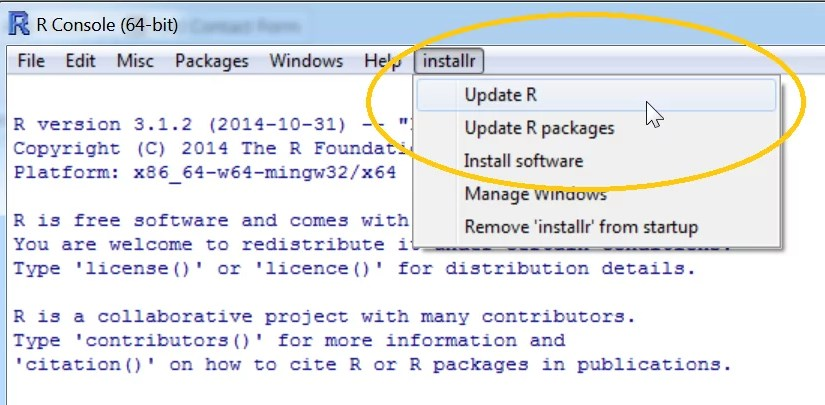
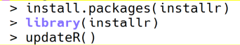

# Table of Contents

1.  [What is this?](#org84e19ad)
2.  [Which textbooks are we going to use?](#org7df3723)
3.  [Are we going to use RStudio?](#org1fbe81b)
4.  [Which editor and IDE do you use?](#orgc6bd77b)
5.  [What are the instructions for the final presentation?](#orge042ea3)
6.  [How can I update R?](#orgf40845e)

# What is this?

This is a Frequently Asked Questions (FAQ) file for the course DSC

1.  For the FAQs across courses, see the [org repo](https://github.com/birkenkrahe/org).

# Which textbooks are we going to use?

1.  The recommended resource is "[fasteR](https://github.com/matloff/fasteR#faster-fast-lane-to-learning-r)", which is on GitHub and it
    is free (you can clone it to your computer, or fork it to your
    GitHub account).
2.  In the [syllabus](https://github.com/birkenkrahe/dsc101/blob/main/syllabus.md), I mention this text from the same author: "The
    Art of R Programming - A Tour of Statistical Software Design", by
    Norman Matloff, NoStarch Press (2011). You can find it [online at
    the Internet Archive](https://archive.org/details/Norman_Matloff___The_Art_of_R_Programming) (I recommend buying it - a wonderful
    text). It is not for absolute beginners to programming, but it
    introduces R and statistics with R.
3.  In class, also showed a book by Irizarry "Introduction to Data
    Science", CRC Press 2020, also available for free [online
    here](https://rafalab.github.io/dsbook/). We'll cover about 1/3 of the book (part I + II) in this first
    course. However, there are some issues with this book (I'll
    explain in class).
4.  Two more excellent books that I have used, more about R and stats
    than about data science perhaps, are T M Davies' "The Book of R"
    (NoStarch Press, 2016), and R Cotton's "Learning R" (O'Reilly,
    2013).
    
    There is any number of books available, many online for free,
    available e.g. at [bookdown.org](https://bookdown.org/). These books often focus on the
    "Tidyverse" packages for R, which I think is not suitable for
    beginners ([see here](https://github.com/matloff/TidyverseSkeptic) for an explanation why).
    
    If you find a text or a book, or a tutorial that you really like,
    please share the information with us!

# Are we going to use RStudio?

No. [RStudio](https://rstudio.com/) is worth checking out, and it may well be what you use
later in your data science career, but I think it is much too
complex for beginners, and not really necessary at all. See
screenshot in the figure below:

RStudio is a so-called "IDE" (Integrated Development Environment) -
it presents a file editor (to create R programs, or notebooks), an R
console (to enter commands interactively), a graphical output device
(for plots), a file explorer, and an environment explorer (for
loaded variables etc.), and more. It's a tool created for
professionals and developers of packages<a id="fnr.1" class="footref" href="#fn.1">1</a>.

I want you to focus on the basics. As a beginner, this will serve
you best, I believe. It's a little like learning to drive on gear
shift, and then upgrading to automatic transmission.

I will however, show you RStudio, and we will also use it together
(optionally) during the session on "Literate Programming".

If you want to install RStudio on your computer, here is an
excellent [beginner's tutorial](https://techvidvan.com/tutorials/install-r/).

# Which editor and IDE do you use?

I use the free [Emacs](https://www.gnu.org/software/emacs/) editor. For R, I use Emacs + [ESS](https://ess.r-project.org/) ("Emacs Speaks
Statistics"), for general notebooking and task management
and&#x2026;everything really, I use Emacs + ESS + [Org-mode](https://orgmode.org/) (a
general-purpose task manager inside Emacs, first developed by
physicists like me). For slides, I use the [reveal.js](https://github.com/hakimel/reveal.js/) (JavaScript)
framework (generates HTML), or [org-tree-slide](https://github.com/takaxp/org-tree-slide) (for presenting
straight from Org-mode).

Emacs is hands down the best editor in the world, written in [LISP](https://en.wikipedia.org/wiki/Lisp_(programming_language))<a id="fnr.2" class="footref" href="#fn.2">2</a>,
one of the earliest programming languages for AI research, and the
second oldest language in widespread use (after FORTRAN).

They say the learning curve of this "complex beast" ([Petersen, 2019](https://masteringemacs.org/article/beginners-guide-to-emacs))
is steep but don't believe it.  Here is an link to [get started with
Emacs easily](https://opensource.com/article/20/3/getting-started-emacs) (Kenlon, 2019). Tale a look!

Here is a 2021 "[Introduction to Emacs Speaks Statistics](https://ess-intro.github.io/)" site with
lots of additional information.

Thee figure [20](#orge8034cf) shows four (out of an arbitrary number of)
panels inside the editor

# What are the instructions for the final presentation?

These are the instructions<a id="fnr.3" class="footref" href="#fn.3">3</a> for handing in the final
presentation of your data science term team project. Please read them
carefully, follow them to the letter and contact me immediately if
there are issues or mistakes<a id="fnr.4" class="footref" href="#fn.4">4</a>. Submit earlier, not in the last
minute, to be on the safe side!

The deadline for submitting the presentation is **December 5, 12AM
CST** (Sunday midnight in Batesville).

1.  **Fill in and sign** [this honor sheet (PDF)](https://github.com/birkenkrahe/org/blob/master/Honor_pledge.pdf) and write
    **"pledged"** next to your name in the column "Honor Pledge".

2.  Upload your **presentation documents** and the **scan of the
    signed honor sheet** [to this GitHub folder](https://github.com/birkenkrahe/dsc101/tree/main/presentations/4_sprint_review) - please add your
    name(s) to the title of the file. If you submit more than one
    file (e.g. notebook etc.) please create a folder!

3.  Post the **link** to your video presentation [to the discussion
    forum](https://github.com/birkenkrahe/dsc101/discussions) in GitHub<a id="fnr.5" class="footref" href="#fn.5">5</a>. Test the link before posting it!

4.  When you're done, **send me an email** (birkenkrahe@lyon.edu)
    confirming that you've done all of this, including which
    course you're in (DSC 101).

5.  Await my formative (comments) and summative (grade) feedback
    (via email) based on [this presentation assessment form](https://github.com/birkenkrahe/org/blob/master/Presentation_Assessment_Form.pdf) (PDF).
    
    Cheers, and have a good Thanksgiving break & a successful exam
    period!  Marcus Birkenkrahe

PS. There is no strict upper or lower time limit for your
presentation. Take all the time that you need to answer your
research question. Also, you submit as a team if you worked on the
project as a team - I don't care who gives the presentation,
i.e. how you split the work up among yourselves. Formally, you can
create a screencast, make a real video, record yourself in
powerpoint etc. - your choice of medium.

# How can I update R?

-   Why update? Because some packages won't work unless you upgrade
    base R, and also because the language changes and gets better.
-   The current version is "Bird Hippie" (4.1.2 - Nov 1) - check this
    by opening the R console, or by typing `R --version` in the
    terminal (command line).
-   You can update in the R GUI:
    
    
    
    -   Or you can update in the R console itself (after starting R)
        either with `RGui` or `RTerm`:
        
        

# Footnotes

<a id="fn.1" href="#fnr.1">1</a> It is unfortunate, that people (usually newbies) believe that "R
= RStudio = Tidyverse". This has to do with the great marketing
successes of RStudio (the company behind the product). Don't get me
wrong: there are many wonderful things about RStudio (e.g. it's Open
source). But you don't need it and it has a "lock-in" effect. I
e.g. use **Emacs + ESS + Org-mode** instead, but I also would not
recommend it for beginners.

<a id="fn.2" href="#fnr.2">2</a> Actually, Emacs is written in a dialect of Lisp, EmacsLisp
(Elisp), and it is also the language in which Emacs can be customized,
which is one of its greatest advantages (it's a totally extensible
editor - unlike all the other IDEs and GUI-tools that you use). [Elisp
is easy to learn](https://www.emacswiki.org/emacs/LearnEmacsLisp).

<a id="fn.3" href="#fnr.3">3</a> This text will be available here: Update in Schoology, Email to
participants, FAQ in GitHub (AI).

<a id="fn.4" href="#fnr.4">4</a> Please be advised that I'm traveling in Europe between November
29 and December 15 (communication of final grades), and will not be
easily reachable.

<a id="fn.5" href="#fnr.5">5</a> Start a `New discussion` and make sure that your name(s) appear
in the subject line of the post. Do **not post the video itself** since
GitHub has limited space available. Use GDrive, Vimeo or YouTube
(unlisted) instead.
