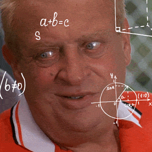
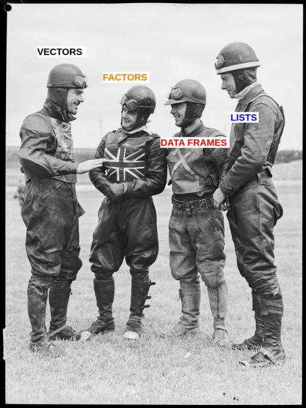
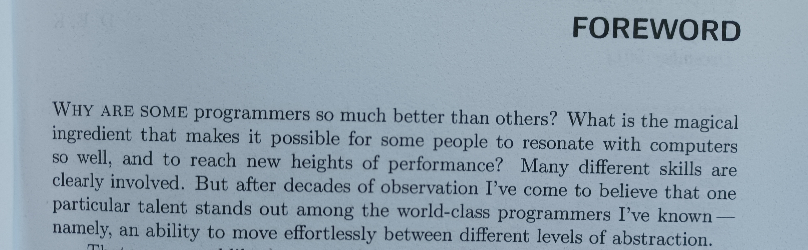
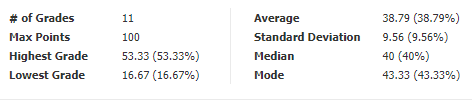
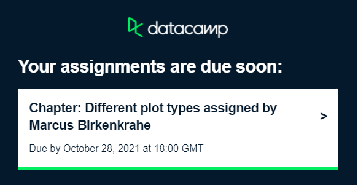

# Table of Contents

-   [Week 2 - August 24](#orgc344483)
-   [Week 2 - August 26](#orgf3c00a1)
-   [Week 3 - August 31](#orgda1b604)
-   [Week 3 - September 2](#org8d531ff)
-   [Week 4 - September 7](#org320f706)
-   [Week 4 - September 9](#org4190e1b)
-   [Week 5 - September 16](#org1b8466e)
-   [Week 6 - September 21](#orga8ca412)
-   [Week 7 - September 28](#org2d0230f)
-   [Week 9 - October 12+14](#orgf51c27f)
-   [Week 10 - October 19](#orgdddb506)
-   [Week 10 - October  21](#org474c7ba)
-   [Week 11 - October 26+28](#org397ff85)
-   [References](#orgdaef3fc)

# Week 2 - August 24

-   Housekeeping
-   Data science overview
-   Getting started with R
-   Next week: projects!

## Housekeeping

-   First weekly test ([Schoology](https://lyon.schoology.com/assignment/5226632989/assessment_questions))
-   Weekly assignment ([DataCamp](https://learn.datacamp.com/courses/free-introduction-to-r))
-   Delayed Schedule ([GitHub](https://github.com/birkenkrahe/dsc101/blob/main/syllabus.md#schedule-and-session-content))
-   FAQ: text books ([GitHub](https://github.com/birkenkrahe/dsc101/blob/main/FAQ.md#org052193d))
-   Term Diary ([GitHub](https://github.com/birkenkrahe/org/blob/master/diary.md#org3b0dc9e))
-   Questions?

# Week 2 - August 26

-   Housekeeping
-   First sprint review
-   Data science overview
-   Getting started with R

## Housekeeping

-   Weekly assignment ([DataCamp](https://learn.datacamp.com/courses/free-introduction-to-r))
-   Reading assignment ([article](https://1drv.ms/b/s!AhEvK3qWokrvhsVoCA7lL4i7m16ElQ)/[notes](https://github.com/birkenkrahe/dsc101/blob/main/2_datascience/followup_08_26_2021.md))
-   EDA Project info ([GitHub](https://github.com/birkenkrahe/dsc101/blob/main/1_overview/1_overview.md#org38b7223))

## Sprint reviews overview

<table border="2" cellspacing="0" cellpadding="6" rules="groups" frame="hsides">

<colgroup>
<col  class="org-left" />

<col  class="org-left" />
</colgroup>
<thead>
<tr>
<th scope="col" class="org-left">DATE</th>
<th scope="col" class="org-left">WHAT</th>
</tr>
</thead>

<tbody>
<tr>
<td class="org-left">Sep</td>
<td class="org-left">EDA Research question</td>
</tr>

<tr>
<td class="org-left">Oct</td>
<td class="org-left">Method: Plan of attack</td>
</tr>

<tr>
<td class="org-left">Nov</td>
<td class="org-left">First results</td>
</tr>

<tr>
<td class="org-left">Dec</td>
<td class="org-left">Final presentation</td>
</tr>
</tbody>
</table>

### What's in a sprint review?

1.  What did we want to achieve in the last sprint?
2.  What did we achieve in the last sprint?
3.  What are we proud of in the last sprint?
4.  What did we not achieve in the last sprint?
5.  What are we going change in the next sprint?
6.  What are our questions to the product owner?
7.  What are our questions to the other teams?

## Recap

-   What do you remember?
-   Followup 24 August ([GitHub](https://github.com/birkenkrahe/dsc101/blob/main/2_datascience/followup_08_24_2021.md))
-   Video recording / Podcast anyone?
-   Onwards: data science problems

# Week 3 - August 31

-   [Test 2 is live - 11 questions](https://lyon.schoology.com/assignment/5258461219/assessment_questions)
-   [DataCamp: keep the momentum going](https://app.datacamp.com/groups/data-science-methods-and-tools/assignments)
-   [New project deadline: 9-Sep-2021](https://github.com/birkenkrahe/dsc101/blob/main/syllabus.md#schedule-and-session-content)
-   [Getting started with R](https://github.com/birkenkrahe/dsc101/blob/main/3_introR/3_introR.md)
-   [Project examples](https://github.com/birkenkrahe/dsc101/blob/main/1_overview/1_overview.md#team-project--50) - new [Scrum FAQs](https://github.com/birkenkrahe/org/blob/master/FAQ.md#orge594cc2)

# Week 3 - September 2

-   Getting help
-   Working directory
-   R console prompt
-   Packages
-   Datasets
-   [Video lectures @YouTube](https://youtube.com/playlist?list=PL6SfZh1-kWXkLa45V6JeEhNZEXvsmUR1f) (45')

# Week 4 - September 7

The project journey begins!

## Housekeeping

-   [Test 3 "Getting started with R"](https://lyon.schoology.com/assignment/5285493129)
-   [Sprint review due Thu 9 Sep 12PM](https://github.com/birkenkrahe/dsc101/discussions/3)
-   [DataCamp deadlines/order changed](https://app.datacamp.com/groups/data-science-methods-and-tools/assignments)

## Recap

What do you remember from last time?

## Today: Arithmethic with R

[Videos available on YouTube (ca. 45 min)](https://youtube.com/playlist?list=PL6SfZh1-kWXnYzCUfVTHs842V3xmfbLp4)

# Week 4 - September 9

-   [Learning & Agile Methods](https://github.com/birkenkrahe/org/blob/master/diary.md)
-   Interactive lecture: [Arithmetics II](https://github.com/birkenkrahe/dsc101/tree/main/4_arithmetic)
-   [First sprint reviews](https://github.com/birkenkrahe/dsc101/discussions/3)
-   Web scraping with R

## Sprint reviews

-   Everyone: present yr research question
-   Everyone else: prepare 1 question
-   Ask 2 of your questions
-   MB: critique questions

## Two examples

### Harry & Viktor - IMDb vs Rotten Tomatoes

<table border="2" cellspacing="0" cellpadding="6" rules="groups" frame="hsides">

<colgroup>
<col  class="org-left" />

<col  class="org-left" />
</colgroup>
<thead>
<tr>
<th scope="col" class="org-left">PRO</th>
<th scope="col" class="org-left">CON</th>
</tr>
</thead>

<tbody>
<tr>
<td class="org-left">&#xa0;</td>
<td class="org-left">Citation not complete</td>
</tr>

<tr>
<td class="org-left">Personal interest</td>
<td class="org-left">Concerns not specific</td>
</tr>

<tr>
<td class="org-left">Rankings available</td>
<td class="org-left">Secondary data only</td>
</tr>

<tr>
<td class="org-left">Clear benefit</td>
<td class="org-left">Method unclear</td>
</tr>

<tr>
<td class="org-left">Doable</td>
<td class="org-left">No literature</td>
</tr>

<tr>
<td class="org-left">&#xa0;</td>
<td class="org-left">Choice of datasets</td>
</tr>
</tbody>
</table>

### Payne Moser - EDA into Pokemon

<table border="2" cellspacing="0" cellpadding="6" rules="groups" frame="hsides">

<colgroup>
<col  class="org-left" />

<col  class="org-left" />
</colgroup>
<thead>
<tr>
<th scope="col" class="org-left">PRO</th>
<th scope="col" class="org-left">CON</th>
</tr>
</thead>

<tbody>
<tr>
<td class="org-left">&#xa0;</td>
<td class="org-left">Citation not complete</td>
</tr>

<tr>
<td class="org-left">Personal interest</td>
<td class="org-left">No concerns given</td>
</tr>

<tr>
<td class="org-left">Research questions</td>
<td class="org-left">No prioritization</td>
</tr>

<tr>
<td class="org-left">Clear benefit</td>
<td class="org-left">Method unclear</td>
</tr>

<tr>
<td class="org-left">Doable</td>
<td class="org-left">No literature</td>
</tr>

<tr>
<td class="org-left">&#xa0;</td>
<td class="org-left">Choice of datasets</td>
</tr>
</tbody>
</table>

### Possible improvements

-   Harry & Viktor: citations / literature
-   Payne: team? Citations / Literature / data

# Week 5 - September 16

These boys mean business.

## Project corner

-   Data checking projects ([diary](https://github.com/birkenkrahe/dsc101/blob/main/diary.org#data-or-graph-checking-projects))
-   Project idea: [adventure games](https://lucidmanager.org/data-science/text-adventure//)<a id="fnr.1" class="footref" href="#fn.1">1</a>
-   Project idea: [Polya urn model](https://blog.ephorie.de/the-polya-urn-model-a-simple-simulation-of-the-rich-get-richer)<a id="fnr.2" class="footref" href="#fn.2">2</a>
-   Project idea! [Excel vs R in Finance](https://blog.rstudio.com/2021/09/07/my-excel-and-r-journey-in-financial-services/)<a id="fnr.3" class="footref" href="#fn.3">3</a>

## R Data structures

-   DataCamp<a id="fnr.4" class="footref" href="#fn.4">4</a> (doing [drills](https://www.datacamp.com/mobile#!)?)<a id="fnr.5" class="footref" href="#fn.5">5</a>
-   Vectors, matrices, data frames, lists
-   Classes, objects, types

## What's next

Vectors, factors, data frames and lists

See full [Schedule](https://github.com/birkenkrahe/dsc101/blob/main/schedule.org)

# Week 6 - September 21

-   Keep up with your **project** work!
-   Short midterm **exam** on Thu Sept 30!
-   Includes **everything** esp. DataCamp
-   Class on Thursday September 23 cancelled!

# Week 7 - September 28

-   Midterm exam Thursday 1PM
-   2nd sprint review Oct 7 ([FAQ](https://github.com/birkenkrahe/org/blob/master/FAQ.md))
-   DataCamp changes ([schedule](https://github.com/birkenkrahe/dsc101/blob/main/schedule.md))
-   Datastructures: extended example
-   After break: tests in class

# Week 9 - October 12+14

-   Fall 2021 Midterm Exam (problem [notebook](https://github.com/birkenkrahe/dsc101/tree/main/tests/problems))
-   Data structures practice (problem [notebook](https://github.com/birkenkrahe/dsc101/tree/main/tests/problems))
-   [2021 New York R Conference](https://youtube.com/playlist?list=PLlzRFZmxVl9RVwRP6WKOUXTiRMFkF2cPF)
-   By 18Oct: Importing data ([DataCamp](https://app.datacamp.com/learn/courses/introduction-to-importing-data-in-r))
    
    *Image source: Ruckert, M (2015). The MMIX
    Supplement. Addison-Wesley. [Online: Amazon](https://www.amazon.com/MMIX-Supplement-Computer-Programming-Volumes-dp-0133992314/dp/0133992314).*

# Week 10 - October 19

-   Review: [EDA practice notebook](https://github.com/birkenkrahe/dsc101/tree/main/tests/problems) (20')
-   Lecture: [Literate programming](https://github.com/birkenkrahe/dsc101/blob/main/7_litprog/) (20')
-   Practice test: [data import](https://github.com/birkenkrahe/dsc101/tree/main/tests/problems) (20') => homework
-   Discussion and questions (15')
-   Next: [Introduction to base R graphics](https://campus.datacamp.com/courses/data-visualization-in-r/a-quick-introduction-to-base-r-graphics?ex=1)<a id="fnr.6" class="footref" href="#fn.6">6</a>
-   Current: [Kaggle Data Science Survey](https://www.kaggle.com/c/kaggle-survey-2021) ([project](https://projects.datacamp.com/projects/74))<a id="fnr.7" class="footref" href="#fn.7">7</a>

# Week 10 - October  21

<table border="2" cellspacing="0" cellpadding="6" rules="groups" frame="hsides">

<colgroup>
<col  class="org-left" />

<col  class="org-left" />

<col  class="org-left" />
</colgroup>
<tbody>
<tr>
<td class="org-left"><a href="https://lyon.schoology.com/assignment/5403804250">Quiz + review</a></td>
<td class="org-left">Literate programming and vectors)</td>
<td class="org-left">'20</td>
</tr>

<tr>
<td class="org-left">Classroom review</td>
<td class="org-left">Data import practice notebook</td>
<td class="org-left">'25</td>
</tr>

<tr>
<td class="org-left">Interactive <a href="https://github.com/birkenkrahe/dsc101/tree/main/8_plotting">lecture</a></td>
<td class="org-left">Base R graphics with <code>plot()</code></td>
<td class="org-left">'30</td>
</tr>

<tr>
<td class="org-left">Online <a href="https://lyon.schoology.com/page/5285373816">Video playlist</a></td>
<td class="org-left">Vectors 1-3 (<a href="https://github.com/birkenkrahe/dsc101/tree/main/6_vectors">GitHub script</a>)</td>
<td class="org-left">NA</td>
</tr>

<tr>
<td class="org-left">Cheat sheet (<a href="https://github.com/birkenkrahe/dsc101/blob/main/8_plotting/cheatsheet.pdf">PDF</a>,<a href="https://dcgerard.github.io/stat234/base_r_cheatsheet.html">HTML</a>)</td>
<td class="org-left">The whole spectrum of <code>plot()</code></td>
<td class="org-left">NA</td>
</tr>
</tbody>
</table>

# Week 11 - October 26+28

## Truth-telling

> "What you put in is what you get out" -Clint Eastwood/

## Tests and assignments

*Image: test 7 stats*

-   Graded notebook exercise - **submit by Thu 28 Oct, 1PM**
-   Next Tuesday: test 8 - plotting (multiple choice quiz)

## DataCamp assignments

*Image: email reminder - do you get these?*

-   Average DataCamp completion so far: `61.57%`

# References

David Gerard (August 8, 2017). Basic R Graphics Cheat Sheet. [Online:
dcgerard.github.io.](https://dcgerard.github.io/stat234/base_r_cheatsheet.html)

# Footnotes

<a id="fn.1" href="#fnr.1">1</a> What's the project idea here? Understand how the adventure game is
built, program your own (different) game and document the process and
the result. Nice presentation opportunity: you can let your audience
play the game and perhaps gather statistics, too.

<a id="fn.2" href="#fnr.2">2</a> What's the project idea here? The blog post describes the model
purely in terms of R (very easy to play through actually - do it!). It
does not provide any of the mathematics. A project could write about
this with references (missing in the blog) and maths, and present this
topic more systematically. The maths are pure probability 101, quite
simple.

<a id="fn.3" href="#fnr.3">3</a> What's the project idea? The article has no references, only
claims. Your project would be to contrast Excel and R using one or
more simple examples. An example could come from some other class.

<a id="fn.4" href="#fnr.4">4</a> Some advice on doing online exercises: THINK THINGS THROUGH FOR
YOURSELF! Don't just go through the motions. There's plenty to learn
that DataCamp never tells you. For now, make ample use of `help()`!

<a id="fn.5" href="#fnr.5">5</a> Hopefully, you remember that your DataCamp completion rate makes
up 15% of your total grade ([see syllabus](https://github.com/birkenkrahe/dsc101/blob/main/syllabus.org#datacamp-assignments-15)).

<a id="fn.6" href="#fnr.6">6</a> In this overview course, you meet base R graphics, which is a
very powerful toolbox to create plots and communicate your message
using graphs. In class, we may look at some extra plot types, and you
can complete this excellent DataCamp course on your own!

<a id="fn.7" href="#fnr.7">7</a> Since a few years, Kaggle, the competition platform owned by
Google, publishes meta data about data science and invites everyone to
construct data-driven narratives about the field. The results are
quite fun - and DataCamp has turned the 2017 survey into a mini
project, which is fairly easy to follow. Unfortunately, it's
"tidyverse" infused. I'd like to recreate this project without the
need for "tidyverse" intervention.
