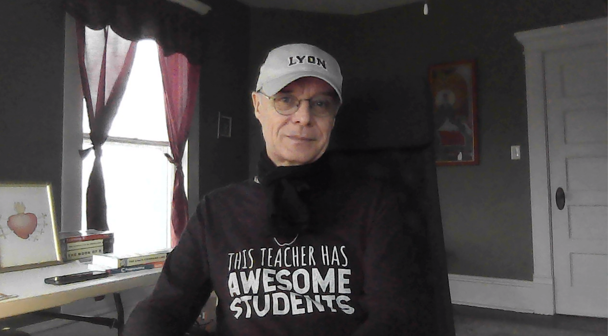

# Table of Contents

1.  [What is this?](#org8ba2dbe)
2.  [Redrawing Google trend chart (07-13-2021)](#orgdc70f51)
    1.  [The original from `trends.google.com`](#orgeb5fc19)
    2.  [Recreated trends from raw data](#orgdcb5b89)
        1.  [Scatterplot](#org1cf8b58)
        2.  [Barplot](#org330d055)
    3.  [Scatterplot code](#org1763410)
        1.  [Download dataset as `csv` file](#orgbe78f6b)
        2.  [Upload as data frame using `read.table`](#org1458ef2)
        3.  [Create line plot](#org2df0edb)
    4.  [Barplot   code](#org602823c)
    5.  [Code summary](#org8e96134)
3.  [Data science process (07-15-2021)](#org894833a)
4.  ["Teaching the tidyverse in 2021" (09-07-2021)](#org7b87a11)
5.  [Data or graph checking projects (10-07-2021)](#org29a3619)
6.  [From the sickbed (11-02-2021)](#org85247f4)
    1.  [Webscraping example](#org54a90cf)
    2.  [New CRAN packages](#org6d8ce74)
    3.  ["Tidyverse" twitter tidbit](#orgd01d31d)
    4.  [The battle between Python and R has been concluded](#org0341586)
7.  [Good-bye (12-17-2021)](#org8b57ad3)
    1.  [What does it all mean?](#orge29f7fb)
    2.  [What about the class? Choices and changes.](#org482256c)
    3.  [What next? Follow-up courses.](#org036c3c9)
    4.  [Final words.](#org8ce577f)
8.  [References](#org320ea87)

# What is this?

A place for irregular articles of possible interest to students of
the DSC 101 course, mostly to avoid lengthy emails and to park
content that I may want to develop later on time permitting.

# Redrawing Google trend chart (07-13-2021)

Spent an afternoon rekindling some skills. Mean to show this during
the introduction to datascience lecture but I probably won't get
to. All of this started with this [infographic](https://trends.google.com/trends/explore?date=all&q=data%20science,machine%20learning) from Google's trend
graph generator. I wanted to reproduce it using R, which took a
couple of hours because I was quite out of shape.<a id="fnr.1" class="footref" href="#fn.1">1</a>

## The original from `trends.google.com`

## Recreated trends from raw data

Here are the results of recreating the graphs using `plot()` from
raw data. The code for each is below.

You can download the raw data from the `trends.google.com`
website. You should look at it first - the format can be
different from what I'm assuming here: there should be three
columns, two numeric (relative interest over time for "data
science", and for "machine learning"), and one character (the
date). In my downloaded file, there was an extra line
(`"Category: All categories"`), which I deleted manually.

### Scatterplot

### Barplot

## Scatterplot code

### Download dataset as `csv` file

Look at dataset: first two lines are spurious. Delete by hand so
that the header line (column names) is the first line of the
table:

    Category: All categories
    
    Month,Data science: (Worldwide),Machine learning: (Worldwide)
    2004-01,12,13
    2004-02,15,24
    2004-03,7,21
    2004-04,5,16
    2004-05,9,22

### Upload as data frame using `read.table`

To use the `Month` column as dates for a time series, turn
`trends$Month` into date format Date conversion: this can be done
with the `anytime` package which must be installed and loaded. I
found out about this via [stack.overflow](https://stackoverflow.com/questions/44488439/format-year-month-to-posixct).

### Create line plot

Here is a [short tutorial](https://www.statology.org/how-to-plot-multiple-lines-data-series-in-one-chart-in-r/) on how to do this using the functions
`points()`, `lines()` and `plot()`. The code is below.

1.  Read data from CSV file

        ## read data from CSV file
        trends <- read.table(
            file="data/multiTimeline.csv",
            header=TRUE,
            sep=",")
        str(trends)
    
        
        'data.frame':	216 obs. of  3 variables:
         $ Month                        : chr  "2004-01" "2004-02" "2004-03" "2004-04" ...
         $ data.science...Worldwide.    : int  9 9 7 1 7 6 6 7 5 5 ...
         $ machine.learning...Worldwide.: int  13 22 16 17 22 16 28 12 22 18 ...

2.  Rename column vectors

    I want the column vectors to have simple names.
    
        colnames(trends) <- c("month","ds","ml")
        str(trends)
    
        
        'data.frame':	216 obs. of  3 variables:
         $ month: chr  "2004-01" "2004-02" "2004-03" "2004-04" ...
         $ ds   : int  9 9 7 1 7 6 6 7 5 5 ...
         $ ml   : int  13 22 16 17 22 16 28 12 22 18 ...

3.  Convert month column to `Date` format

    The `anydate()` function in the `anytime` package parses dates
    and returns a vector of `Date` objects. You have to install
    `anytime`.
    
        library(anytime)
        month <- anydate(trends$month)
        str(month)
    
        
        Date[1:216], format: "2004-01-01" "2004-02-01" "2004-03-01" "2004-04-01" "2004-05-01" ...
    
    Now we substitute `trends$month` by the `Date`-formatted vector
    `month`.
    
        trends <- cbind(trends[,-1], month)
        str(trends)
    
        
        'data.frame':	216 obs. of  3 variables:
         $ ds   : int  9 9 7 1 7 6 6 7 5 5 ...
         $ ml   : int  13 22 16 17 22 16 28 12 22 18 ...
         $ month: Date, format: "2004-01-01" "2004-02-01" ...

4.  Plotting

    First, we plot the values for the "data science" search. The
    plotting window is limited by the maximum search values.
    
    Then we plot the values for the "machine learning" search over
    the existing plot using `lines()`.
    
    Finally, we add a legend in the upper left corner.
    
        plot(x=trends$month,
             y=trends$ds,
             xlab="years",
             ylab="Interest",
             ylim=c(0,max(c(trends$ds,trends$ml))),
             type="l",
             lty=1,
             col="blue",
             main="trends.google.com search history")
        
        lines(x=trends$month,
              y=trends$ml,
              lty=2,
              col="red")
        
        legend(x=month[1],
               y=85,
               legend=c("data science","machine learning"),
               lty=c(1,2),
               col=c("blue","red"))
    
    

## Barplot   code

For some simple examples, see this [short tutorial](http://www.sthda.com/english/wiki/bar-plots-r-base-graphs#basic-bar-plots).

We assume that the code above has already run, and that the data
frame `trends` contains the required values to recreated the Google
barplots.

    barplot(height=c(mean(trends$ds),
    		 mean(trends$ml)),
    	names.arg=c("Data science","Machine learning"),
    	ylab="Average interest (2004-2021)",
    	col=c("blue","red"),
    	main="trends.google.com search history")

## Code summary

<table border="2" cellspacing="0" cellpadding="6" rules="groups" frame="hsides">

<colgroup>
<col  class="org-left" />

<col  class="org-left" />
</colgroup>
<tbody>
<tr>
<td class="org-left"><code>read.table</code></td>
<td class="org-left">upload data as <code>data.frame</code></td>
</tr>

<tr>
<td class="org-left"><code>library()</code></td>
<td class="org-left">load R package</td>
</tr>

<tr>
<td class="org-left"><code>anytime::anydate()</code></td>
<td class="org-left">convert vector to <code>Date</code> format</td>
</tr>

<tr>
<td class="org-left"><code>cbind()</code></td>
<td class="org-left">attach column to <code>data.frame</code></td>
</tr>

<tr>
<td class="org-left"><code>$</code></td>
<td class="org-left">extract vector from <code>data.frame</code></td>
</tr>

<tr>
<td class="org-left"><code>&lt;-</code></td>
<td class="org-left">assign right hand to left hand side</td>
</tr>

<tr>
<td class="org-left"><code>plot()</code></td>
<td class="org-left">draw scatter plot</td>
</tr>

<tr>
<td class="org-left"><code>lines()</code></td>
<td class="org-left">draw line graph</td>
</tr>

<tr>
<td class="org-left"><code>barplot()</code></td>
<td class="org-left">draw barplot</td>
</tr>
</tbody>
</table>

# Data science process (07-15-2021)

I was digging around my notes made for an online test lecture on May
19, on "Exploring data with R" (see [presentation](https://github.com/birkenkrahe/dsc101/blob/main/wiki/talk_presentation.pdf) & [notes](https://github.com/birkenkrahe/dsc101/blob/main/wiki/talk_notes.pdf)), for an
update on a [data science overview lecture](https://github.com/birkenkrahe/dsc101/tree/main/2_datascience). For this talk, I had
developed the model shown in figure [22](#orgab05108): there are two pathways
towards machine learning. One pathway relied more on coding and
algorithms (traditionally taught in CS programs), the other one
relied more on modeling and heuristics (traditionally taught in
maths and statistics programs).

The model suppresses a lot of detail, of course, in order to
emphasize the contrast between coding and modeling, e.g. many
applications outside of CS, e.g. bioinformatics in biology.

It came straight out of two lines of thought: one related to the
experience of a CS professor that some CS students with more than
average interest in mathematics wanted to specialize on data
science. The other one related to my experience with exploratory
data analysis as a way of solving hard, data rich problems for real
clients (see figure [25](#orgd3a155e)).

I added this to the other two data science workflow images that I
already had in the lecture. And I added yet another one (see figure
[27](#org5864e7a)), from a recent book on data analytics<a id="fnr.2" class="footref" href="#fn.2">2</a>. I really like
how everything comes back and returns to the "real world" here, and
the feedback loop provided by the data analysis "pipeline".

This is interesting, because it emphasizes the origin of most data
from (digital) devices and sees EDA as a way of making decisions
using various techniques (discussed in the book). I don't like the
emphasis on "decisions", since "making decisions" as such is not a
priority (there is no alternative). I prefer the old-fashioned way
of looking at **problems** and trying to find **solutions**. I've also
used the trendy term "decision intelligence" (made popular by Google
et al.), but I think it overplays both "decisions" and
"intelligence".

Most data science problems may not lead to decisions, to change or
to anything worth calling "intelligent". This is probably because of
my training as a physicist, though later I worked with business
people, who like the "decisions" and "challenges" lines of argument
more than "problems" and "solutions" - I can't even remember
why. The prejudice back in the day when this lingo came up was that
"problems" sound too much as if you had a problem, with negative
connotations, while "challenges" sounded as if you were worthy of a
challenge, I suppose. Pointless to argue, since everyone know what's
what anyway - except perhaps newbies.

Enough said. I extracted these figures from their context and added
them to the lecture - will see in August if this makes any
difference or not<a id="fnr.3" class="footref" href="#fn.3">3</a>.

# "Teaching the tidyverse in 2021" (09-07-2021)

I've mentioned the "tidyverse" before. This morning, I read an
article (posted in RWeekly, the weekly aggregator of R news that you
should subscribe to) "Teaching the tidyverse in 2021"
([Cetinkaya-Rundel, 2021](#orge19e14e)), which upset me. I will briefly explain
why. The article mentions the 2020 series of the same title, which
begins with the claim that "updates to tidyverse packages are
specifically designed to make it easier for new learners to get
started with doing data science in R." ([Cetinkaya-Rundel, 2020](#org32149ac)).

Instead of a long rant (see Matloff's "TidyverseSceptic" for a
complete picture of the criticism), just look at the first figure,
which shows "the lifecycle stages of functions and packages in the
tidyverse". This is not a bad diagram at all, and it makes my point:
a beginner, a learner of R, someone who wants to do data science,
should not have to learn about package development mechanics:
"experimental" vs. "deprecated" vs. "superseded" vs. "stable" -
What? Exactly.

Reader, R beginner, let me tell you: there is no "tidyverse"
beginner's approach to R. You may like it or leave it (I prefer to
leave it, for a number of reasons, though you may need to know it),
but it's not an alternate R universe, and it's not an alternative to
base R, no matter how many times the creators and contributors of
this package bundle may say so.

# Data or graph checking projects (10-07-2021)

Many of the project proposals by the course participants are still
much too complex for my taste - the research questions need to be
cut down to doable size.

Not simple but highly effective are projects that don't do anything
else but check published data and their interpretation. I mentioned
a student project from last term. This team of Master students
focused on a graph published in The Economist. I have uploaded their
final report "Improve Visualization of Popular Support for Executive
Actions in the U.S." and the data ([Cai, Otlu and Rauenbusch,
2021](#orga59e3e2)). It's a very good piece of work, created with a lot of effort
over a period of three months. Less would easily do for our course.

Here is a more recent data checking example that you might find
interesting, by [Matloff (2021)](#orgc5d56b8). This highly opinionated data
checking post uses statistical arguments to check policy
decisions. From the conclusions:

> "The much-vaunted failure rate reduction from 40% to 8%, is not borne
> out by the data at all. The district cannot or will not show the
> details of those numbers, and they concede the numbers are not
> consistent with the data that the district did provide."

For many more [interesting applications and project ideas](https://github.com/birkenkrahe/ds101/blob/master/ds_bookmarks.md#orgb216e90), see my
2020 data science bookmarks file on GitHub.

And here's a 2020 list of useful sites for [finding free, public
datasets](https://towardsdatascience.com/useful-sites-for-finding-datasets-for-data-analysis-tasks-1edb8f26c34d) for EDA tasks.

# From the sickbed (11-02-2021)

I've been too ill to teach for a couple of days (just a bad cold,
nothing to worry about but still debilitating). This hasn't stopped
me from hunting and gathering R examples. Here are a few recent
captures.

## Webscraping example

> "Webscraping with R was critical to the success of my research."

From a recent Master thesis. The author had to gather data from
many different online curricula and collect them as a table for
further analysis.

Source: [Rauenbusch J (2021)](#org5e44238).

## New CRAN packages

(Via [`RWeekly.org`](https://rweekly.org/2021-W44.html), which you should subscribe to!)

/Image: chaos machine setup - original is clickable ([Wilke, 2021](https://urssblogg.netlify.app/post/2020-11-19-synthesizing-temperature-measurements-into-sound/))

-   `cfbfastR`: Functions to Access College Football Play by Play
    Data (lvl=2
-   [Train in R, run on Android - image segmentation with `torch`](https://blogs.rstudio.com/ai/posts/2021-10-29-segmentation-torch-android/)
    (lvl=3)
-   [Constructing a Chaos Machine](https://urssblogg.netlify.app/post/2020-11-19-synthesizing-temperature-measurements-into-sound/): translating temperature
    measurements into sound in real time ([R notebook](https://gitlab.com/urswilke/chaos_machine_code/-/tree/master/R/preliminary_study/preliminary_study.md)) (lvl=3)

## "Tidyverse" twitter tidbit

> "Evangelist instructors write evangelistic exams."

Comment by [Norman Matloff](#org6efbc77) on Twitter about this tweet:

The `data.table` package, which contains the `fread()` function, is
fantastically fast and overall wonderful. `fread()` is featured in
the introductory data import with R course from DataCamp. You
should also take a look at the full `data.table` course - see this
[introductory blog post](https://www.datacamp.com/community/tutorials/data-table-cheat-sheet) for starters ([Willems, 2021](#org0205a1c)).

## The battle between Python and R has been concluded

I thought this article with the title from the headline ([Valdeleon,
2021](#orgb1d8946)) is spot on - there's no need to pitch one of these languages
against the other. Each of them has its pros and cons, and it
depends on the job which one you should learn and use.

In fact, many projects require knowledge of both R and Python -
compare the project featured above where temperature measurements
are turned into sound ([Wilke 2021](#org42f021f)).

# Good-bye (12-17-2021)

I've just recorded a [short good-bye video](https://youtu.be/IxyqEW9-12s). Here are few parting
notes for this course.

## What does it all mean?

In a recent critique of the proposed California Mathematics
Framework (CMF), Norman Matloff (known to you as a preeminent
author of books on stats and R, and of the "TidyverseSceptic"
essay), writes ([Matloff, 2021](#orgb17c5b8)):

> Open-ended data science fits right in to the CMF desire to teach
> kids that "There is no right answer." There is a grain of truth to
> that, but kids must learn how to get the right answer when there is
> one. As one critic rather sarcastically but in my view aptly put
> it, "&#x2026;if you throw a bunch of data at students, they can group
> it, type it into a spreadsheet, plot graphs and so on. It's pretty
> easy to convince yourself they are doing something called 'Data
> Science'. They don't have to do anything particularly useful with
> the data because there are no right answers."

Contrary to this criticism, the point of our course was that there
are "right answers", and though we may have to work hard to get
them, or never succeed, we need to try.

The purpose of the introductory courses on data science is to give
you some of the insights and tools to tackle data to get right
answers and, ideally, solve relevant problems in a scientific
(i.e. systematic, objective, transparent) way.

We've only begun to do this in the first course, and we'll continue
in the "Introduction to Advanced Data Science" (more about that
later).

The course also included a close encounter with agile data science
project management, with the language R, and with the DataCamp
training platform.

With **Scrum**, the best known agile method, you've worked with with
one of the most innovative, fastest growing project management
methods around. Even with yourself as "project owner", Scrum style
might help you complete more of your personal projects successfully
on time.

With **R**, you've had a taste of one of the best data-focused
programming languages, well suited for beginners, powerful from the
first command onwards. There's a lot more music in R, of course,
and no known limitation. Especially, if you're more in love with
data than with coding, you've likely made a friend for life!

The **DataCamp** platform was praised by some in the evaluations - I
still enjoy working with the platform myself, and I will continue
to use it in future courses. Programmed tutorials like these can,
of course, only cover one aspect of learning, and DataCamp does not
replace spending many hours working independently and on your own.

Put all three on your resume right now! What're you waiting for?

## What about the class? Choices and changes.

In the course of the term, you had to endure quite a few changes of
pace and material - it took me a while to adjust to the level and
specific knowledge of the participants.

The good news: you managed - according to your evaluations (thank
you! Almost 60% responded - not quite as much as I had hoped, but
good enough), you learnt something and you thought I was up to the
job!

There are, of course, a million different ways to design such an
introductory class. I made a few choices, including:

1.  Base R (stick shift) instead of "TidyVerse" (automatic)
2.  Use of interactive notebooks (literate programming!)
3.  Use GitHub as a code and materials repository
4.  Create lots of (ungraded) tests
5.  Use of DataCamp assignments
6.  Avoid mathematics as much as possible
7.  Reuse tests for the final exam
8.  Let students pick their own projects

In the next basic data science course (this course will run once a
year, so this will be Fall 2022), I would stick to all of these
choices, except perhaps (6). It would be useful to repeat or
introduce some basic statistics concepts more formally.

I will also make more use of the Schoology gradebook (though the
college might switch to another LMS), and offer more graded
assignments in class.

I will change the DataCamp assignments and let students complete
the "Data Science for Everyone" and "Data Visualization for
Everyone" courses, instead of the more specialized technical
courses. We can learn R and graphic techniques in class.

I did enjoy seeing what you came up with for the final projects. At
the same time (though nobody complained in the evaluation), I think
I overdid it when I asked you to pick your own topic. Instead, I
may eliminate projects from this class, and only do projects in the
followup course when most of the basics are out of the way.

## What next? Follow-up courses.

Here are a few practical suggestions:

-   Use Scrum (= incremental, prototype-oriented, dialog-rich) in
    your projects at school and outside of school
-   Use R regularly for your computational needs
-   Complete the DataCamp courses that you started in this class
-   Get the mobile DataCamp app and do your (daily) drills

Most importantly, don't let existing skills go to waste. If you are
in the followup class, you're okay for another term, but if not,
you may have to make time yourself to keep your skills fresh.

The best if not easiest way to do this is to use these skills,
especially data visualization and rudimentary analysis, in other
courses. Some examples:

-   When you come across a spreadsheet (CSV format) or another public
    dataset, fire up R, turn it into a data frame (`read.csv()`) and
    analyse and visualize the data using `plot()`, or some of the
    other simple functions
-   Look at public graphs and evaluate the quality of the
    visualization and the validity of the underlying data
-   When you code yourself, consider using an interactive notebook -
    jupyter notebooks don't just exist for Python and R, but for
    other languages as well.
-   Even if you don't go all the way to "interactive", keep the
    lessons of literate programming in mind and make your code
    readable.

All data science courses at Lyon are relevant extensions of this
course, in particular the advanced intro and databases (SQL) in
the [spring 2022](https://github.com/birkenkrahe/org/blob/master/spring22.md#org2e649ce) term.

In the fall 2022, I'll teach "Data Visualization" (DSC 302). This
course will go beyond R and include some other popular frameworks
like D3 or Processing (with JavaScript), perhaps even some Python.

In the spring 2023, data science will enter the "Digital
Humanities" (CSC 105) class. In "Machine Learning" (DSC 305), I
will focus on predictive algorithms - we'll touch upon them already
in DSC 205.

So far, so good, so long!

## Final words.

Thank you from the bottom of my heart for welcoming me to Lyon by
working with me during this last term. I wish you a Merry
Christmas, a restful break, and I'm looking forward to seeing some
of you again next term!

# References

Really? References in a diary? I know that you know that I am not
enjoying referencing: it's tedious, it slows me down, it's
error-prone etc. But it must be done. If you're not convinced, don't
get a university education, or better, don't work with information
at all, because referencing is about (a) intellectual property
rights (you should care about rights!), and (b) the truth (which
must be spoken!).

 Cai Y, Otlu C, Rauenbusch J (28 June 2021). Improve
Visualization of Popular Support for Executive Actions in the
U.S. [Report]. Berlin School of Economics and Law. [Online: GitHub.](https://github.com/birkenkrahe/dsc101/tree/main/projects/examples/cai_et_al_2021)

 Cetinkaya-Rundel M (13 Jul 2020). Teaching the Tidyverse
in 2020 - Part 1: Getting started [Blog]. [Online:
education.rstudio.com.](https://education.rstudio.com/blog/2020/07/teaching-the-tidyverse-in-2020-part-1-getting-started/)

 Cetinkaya-Rundel M (31 Aug 2021). Teaching the Tidyverse
in 2021 [Blog]. [Online: tidyverse.org.](https://www.tidyverse.org/blog/2021/08/teach-tidyverse-2021/)

 Matloff N (2020). TidyverseSceptic - An alternate view
of the Tidyverse "dialect" of the R language, and its promotion by
RStudio. [Online: github.com](https://github.com/matloff/TidyverseSkeptic).

 Matloff N (9 Sept 2021). At Crossroads in California
K-12 Math Education [Blog]. [Online: normsaysno.wordpress.com.](https://normsaysno.wordpress.com/2021/09/09/a-crossroads-in-california-k-12-math-education/)

 Matloff N (2021). The (Academically) Rich Get Richer, the
Poor Get Poorer Tragic Impact on Minority Students of the Proposed
California Math Reform [Blog]. [URL: heather.cs.ucdavis.edu](https://heather.cs.ucdavis.edu/CalMathFrame.html)

 Rauenbusch J (2021). Design in MBA Education in the
U.S. Towards a Design-Integrated Curriculum to Prepare Future
Leaders for a Volatile, Uncertain, Complex, and Ambiguous (VUCA)
World. MA thesis, Berlin School of Economics and Law.

 Valdeleon J (29 Aug 2021). The battle between Python & R
has been concluded [blog]. URL: [medium.com](https://medium.com/codex/the-battle-between-python-r-has-been-concluded-b6ffda4ef87).

 Wilke U (29 Oct 2021). The Chaos Machine - Synthesizing
Temperature Measurements into Sound [Blog]. URL:
[rssblogg.netlify.app](https://urssblogg.netlify.app/post/2020-11-19-synthesizing-temperature-measurements-into-sound/).

 Willems K (July 14th, 2021). The data.table R Package
Cheat Sheet. URL: [datacamp.com](https://www.datacamp.com/community/tutorials/data-table-cheat-sheet).

# Footnotes

<a id="fn.1" href="#fnr.1">1</a> Code updated on December 18, 2021. Interestingly, in this time
the dataset format of the Google CSV file had changed, which broke the
original code (from July).

<a id="fn.2" href="#fnr.2">2</a> Huang S/Deng H. Data analytics: a small data approach. CRC Press
(2021).

<a id="fn.3" href="#fnr.3">3</a> How will I know? Because it is clear from the discussion and the
students' response if I presented a figure or an argument that
resonates with them or not. Negative example: my insistence on base R
vs. Tidyverse, or on Open Source vs. commercial software, which I feel
strongly about - but I haven't been able to transfer my sentiments to
students. So perhaps these conflicts have less power than I thought.
