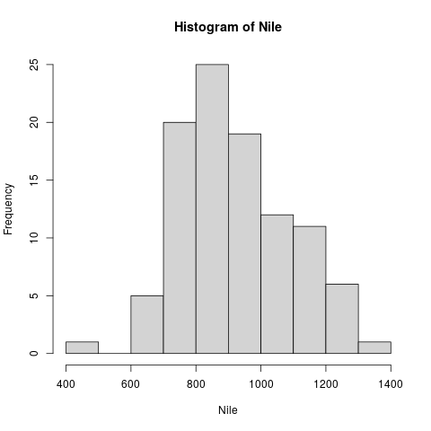

# Midterm exam Fall 2021

-   Read all questions before you begin answering.
-   Write your full name legibly on each page.
-   If a question has numbered sub-questions, write the number before your answer.
-   There are 20 questions altogether.
-   The last 5 questions are bonus questions for extra credit.

## Properties of R (5)

List as many properties of R as you can think of.

Tip: remember the information when you open R from the terminal. I
could think of ten different properties. If you only identify 5
you get full points - any more will get you extra points.

Answers:

1.  Free software (GNU license)
2.  Statistical programming language
3.  Functional programming language
4.  Object-oriented programming language
5.  Successor to S
6.  Collaborative project
7.  Interactive shell language
8.  Graphics oriented
9.  Easy to learn
10. Large user community

## Data structures (5)

Write the commands for each of the following steps:

(1) Assign the number 5 to the object `x`

(2) Create a character vector `y` with four words in it (in this
order): `fall`, `break`, `is`, `coming`

(3) Create a named list from `x` and `y` (in this order), and assign
the list to the object `z`. Give `x` the name `"Jill"`, and `y` the name
`"Jack"`.

(4) What is the length of `z$Jack` ?

(5) What is the length of `z`?

    x <- 5
    y <- c("fall", "break", "is", "coming")
    z <- list("Jill" = x, "Jack" = y)
    length(z$Jack)
    length(z)

    : [1] 4
    : [1] 2

## Printing a subvector (4)

Let `x` be a vector `c(1,2,3,4,5,6)`. List the commands to print
only the first **three** elements of `x`.

Tip: I found ten different ways to do this using functions and the
index operator. If you find four commands, you'll get full
points - any more will get you extra points.

    x <- c(1,2,3,4,5)
    head(x,3)  # function head()
    x[1:3]     # indexing with colon vector
    x[c(1,2,3)] # indexing with vector
    subset(x,x<4) # function subset()
    subset(x,x==1|x==2|x==3) # function subset()
    subset(x,x!=4&x!=5) # function subset()
    x[seq(from=1,to=3)] # indexing with sequence vector
    x[rep(c(1,2,3))] # indexing with repetition vector
    x[(-4):(-5)] # indexing with removing end indices
    x[c(-4,-5)] # indexing with removing end indices

    [1] 1 2 3
    [1] 1 2 3
    [1] 1 2 3
    [1] 1 2 3
    [1] 1 2 3
    [1] 1 2 3
    [1] 1 2 3
    [1] 1 2 3
    [1] 1 2 3
    [1] 1 2 3

## Print last few data set rows (1)

How do you print the last five rows of the data frame mtcars?

Tip: this is easiest done with a function. Remember that this
function has a default value for the number of rows it prints.

    tail(mtcars,5)

    :                 mpg cyl  disp  hp drat    wt qsec vs am gear carb
    : Lotus Europa   30.4   4  95.1 113 3.77 1.513 16.9  1  1    5    2
    : Ford Pantera L 15.8   8 351.0 264 4.22 3.170 14.5  0  1    5    4
    : Ferrari Dino   19.7   6 145.0 175 3.62 2.770 15.5  0  1    5    6
    : Maserati Bora  15.0   8 301.0 335 3.54 3.570 14.6  0  1    5    8
    : Volvo 142E     21.4   4 121.0 109 4.11 2.780 18.6  1  1    4    2

## Working with datasets (3)

`MASS` is a package with statistical datasets. Don't assume that
`MASS` is already installed on your computer.

What do you need to do to use the data set `Boston` from `MASS` in
your current R session?

(1) Give the commands (one per line)

(2) Describe what each command does on the same line as the
command (as a comment after the command)

Tip: the answer has three lines.

    install.packages("MASS") # install MASS
    library(MASS) # load MASS into session
    data(Boston) # load data set from package

## Change display width (1)

How can you change the number of columns displayed on the screen
to `100` characters?

Tip: This option's default is `80` characters.

    head(Nile,20)
    options(width=100) # change width to 100 characters
    head(Nile,20)

    :  [1] 1120 1160  963 1210 1160 1160  813 1230 1370 1140  995  935 1110  994 1020
    : [16]  960 1180  799  958 1140
    :  [1] 1120 1160  963 1210 1160 1160  813 1230 1370 1140  995  935 1110  994 1020  960 1180  799  958
    : [20] 1140

## Logarithm base (2)

One of the built-in R functions is the logarithm.

(1) What is the base of the logarithm function `log10()` in R

(2) How can you print this base value on the screen using `log10()`
and e-notation?

    ## the log10() function has the base 10
    log10(1e+10) # same as log10(10000000000)

    : [1] 10

## Testing for equality (2)

Compare two numeric vectors x and y:

`x <- c(1,2,3)`

`y <- c(1,2,4)`

(1) What is the result of `x==y` ?

(2) Store `x==y` in an object `foo`. What is `mode(foo)`?

    x <- c(1,2,3)
    y <- c(1,2,4)
    x==y
    foo <- y==x
    mode(foo)

    : [1]  TRUE  TRUE FALSE
    : [1] "logical"

## Built-in data sets (1)

Which command gives you a list of all pre-installed and pre-loaded
data sets on your computer?

    data()

    Data sets in package ‘.’:
    
    diabetes
    ...
    Grades
    
    Data sets in package ‘datasets’:
    
    AirPassengers                 Monthly Airline Passenger Numbers 1949-1960
    ...
    women                         Average Heights and Weights for American Women
    
    Data sets in package ‘MASS’:
    
    Aids2                         Australian AIDS Survival Data
    ...
    wtloss                        Weight Loss Data from an Obese Patient

## Accuracy (1)

Explain why the following expression is FALSE:

`identical(sqrt(2)**2,2)`

    identical(sqrt(2)^2,2)

    : [1] FALSE

Answer: the square of the square root of 2 is different from 2 due
to rounding errors, because irrational numbers (like `sqrt(2)`)
are represented internally by finite numbers. In R, as in other
math packages, this problem can be alleviated but not eliminated.

## Mode and data types (4)

The functions `storage.mode()` and `mode()` determine the storage
type and the mode (or data type) of an R object, respectively.

(1) What is `storage.mode(1)` ?

(2) What is `mode(1)` ?

(3) What is `storage.mode(c("Fall break"))` ?

(4) What is `mode(c("Fall break"))` ?

    storage.mode(1)
    mode(1)
    storage.mode(c("Fall", "break"))
    mode(c("Fall", "break"))

    : [1] "double"
    : [1] "numeric"
    : [1] "character"
    : [1] "character"

## Checking data structures (3)

`x`, `A`, `df` are R objects: `x` is a vector. `A` is a
matrix. `df` is a data frame.

Write three function commands to check if it is true that `x` is a
vector, `A` is a matrix, and `df` is a data frame.

    x <- vector(); is.vector(x)
    A <- matrix(); is.matrix(A)
    df <- data.frame(); is.data.frame(df)

    : [1] TRUE
    : [1] TRUE
    : [1] TRUE

## Named vectors (5)

`x` is a vector of three elements: `x <- c(2,25,21)`.

(1) what is the result of `print(x)`?

(2) What is the name of `x[1]`?

(3) Which function is used to name the elements of `x`?

(4) Which command will name the elements of `x` `"Bob's"`,
`"your"`, and `"uncle"` (in this order)?

(5) What is the result of `print(x)` after naming `x` like this?

    x <- c(2,25,21)
    x
    names(x) # x[1] has no name - it's NULL
    names(x) <- c("Bob's", "your", "uncle")
    names(x)
    x

    : [1]  2 25 21
    : NULL
    : [1] "Bob's" "your"  "uncle"
    : Bob's  your uncle
    :     2    25    21

## Binary operators (1)

(1) What happens when you add a number and a character, like `1` and
`"Joe"` ?

(2) Explain the result!

    1 + "Joe"

    : Error in 1 + "Joe" : non-numeric argument to binary operator

## Special numbers (6)

(1) Which special numbers in R do you know and what do they mean?

(2) How do you test for them?

    x <- Inf; is.infinite(x)
    y <- NA; is.na(y)
    z <- NaN; is.nan(z)

    : [1] TRUE
    : [1] TRUE
    : [1] TRUE

## BONUS: Plot and histogram (2)

-   `plot()` and `hist()` are both generic graphical functions
-   `Nile` is a built-in data set, a time series.

What is the difference in output between `plot(Nile)` and
`hist(Nile)`?

Answer: `plot(Nile)` is a line diagram (a scatterplot with lines
drawn through its points), while `hist(Nile)` is a histogram (a type
of barplot).

    plot(Nile)

    hist(Nile)

## BONUS:  Citing software (2)

When do you need to cite R in publications?

Answer: whenever you use R for your research, or to prepare your
publication, you need to reference it - same goes for any other
software that you use in the process of practice or research.

## BONUS: Quitting R (2)

What is the result when you quit R with `q()` and answer 'yes' to
the question `"Do you want to save the workspace image?"`

Answer:

1.  A file `.RData` is created that contains all objects defined
    during the session.
2.  A file `.Rhistory` is created that contains all commands
    entered during the session.

## BONUS: Generic function (2)

`print()`, `plot()` and `summary()` are examples for generic
functions. What does this mean?

Answer: generic functions are functions that can be applied to a
variety of data structures. This is part of the object-orientation
of R. The generic function is actually an object class that
contains different methods, each one for a different data
structure. Examples you've seen include print for a histogram
object `hn`, for a vector `x`, or for a linear model `lma`: it's
always `print()` - `print(hn)`, `print(x)`, `print(lma)` - but
under the hood, `print()` chooses the method appropriate for the
object to be printed, e.g. `print.lm()` etc. You can see all
methods with `methods("print")`.

## BONUS: Structure of a dataset (2)

The function `str()` shows the structure of data sets.

(1) Which output do you expect from `str(1:100)` ?

(2) Which output do you expect from `str(letters)` ?

Tip: remember `str(Nile)`. `letters` is a constant character
vector.

Answer:

    str(1:100) # numerical vector
    str(letters) # character vector
    str(Nile) # time series

    :  int [1:100] 1 2 3 4 5 6 7 8 9 10 ...
    :  chr [1:26] "a" "b" "c" "d" "e" "f" "g" "h" "i" "j" "k" "l" "m" "n" "o" "p" "q" "r" "s" "t" "u" ...
    :  Time-Series [1:100] from 1871 to 1970: 1120 1160 963 1210 1160 1160 813 1230 1370 1140 ...

